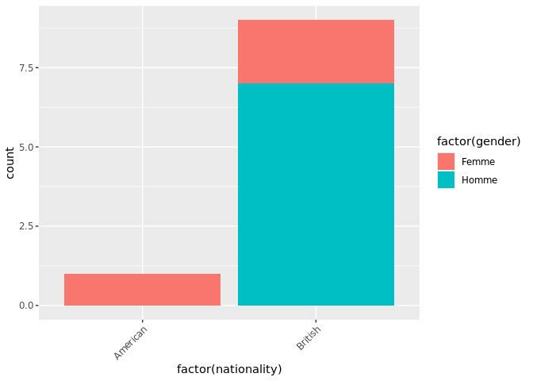

``` r
# Explication sur les 3 couches principales de ggplot et tests pratiques sur chacune des couches.
# https://r-graph-gallery.com/index.html
library(tidyverse)
```

    ## ── Attaching core tidyverse packages ───────────────────────────────────────────────────────────────────────────── tidyverse 2.0.0 ──
    ## ✔ dplyr     1.1.4     ✔ readr     2.1.5
    ## ✔ forcats   1.0.0     ✔ stringr   1.5.1
    ## ✔ ggplot2   3.5.0     ✔ tibble    3.2.1
    ## ✔ lubridate 1.9.3     ✔ tidyr     1.3.1
    ## ✔ purrr     1.0.2     
    ## ── Conflicts ─────────────────────────────────────────────────────────────────────────────────────────────── tidyverse_conflicts() ──
    ## ✖ dplyr::filter() masks stats::filter()
    ## ✖ dplyr::lag()    masks stats::lag()
    ## ℹ Use the conflicted package (<http://conflicted.r-lib.org/>) to force all conflicts to become errors

``` r
personnages <- data.frame(
    name = c("Sherlock Holmes", "Dr. Watson", "Inspector Lestrade", "Mrs. Hudson", "Mycroft Holmes", "Irene Adler", "Professor Moriarty", "Mary Morstan", "James Phillimore", "Charles Augustus Milverton"),
    age = c(42, 35, 45, 60, 47, 30, 50, 25, 40, 50),
    gender = c("Homme", "Homme", "Homme", "Femme", "Homme", "Femme", "Homme", "Femme", "Homme", "Homme"),
    profession = c("Détective", "Médecin", "Police", "Propriétaire", "Fonctionnaire", "Chanteur d'opéra", "Mathématicien", "Veuve", "Banquier", "Maître chanteur"),
    nationality = c("British", "British", "British", "British", "British", "American", "British", "British", "British", "British")
)

# Exemple 1 :
ggplot(data = personnages, aes(x = factor(gender))) +
    geom_bar()
```

<!-- -->

``` r
# Exemple 2 :
ggplot(data = personnages, aes(x = factor(gender), fill = factor(gender))) +
    geom_bar()
```

<!-- -->

``` r
# Exemple 3 :
ggplot(data = personnages, aes(x = factor(gender), fill = factor(nationality))) +
    geom_bar()
```

<!-- -->

``` r
# Exemple 4 :
ggplot(data = personnages, aes(x = factor(nationality), fill = factor(gender))) +
    geom_bar() +
    theme(axis.text.x = element_text(angle = 45, hjust = 1))
```

<!-- -->
