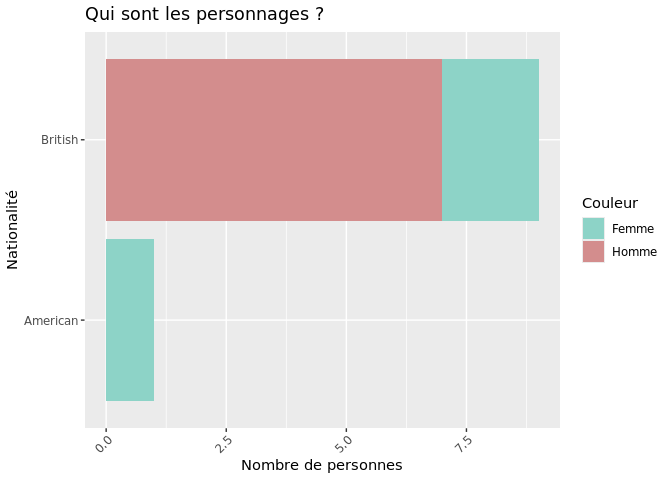

``` r
# Modification des axes, Contrôle des objets géométriques, Changement des libellés des titres
library(tidyverse)
```

    ## ── Attaching core tidyverse packages ───────────────────────────────────────────────────────────────────────────── tidyverse 2.0.0 ──
    ## ✔ dplyr     1.1.4     ✔ readr     2.1.5
    ## ✔ forcats   1.0.0     ✔ stringr   1.5.1
    ## ✔ ggplot2   3.5.0     ✔ tibble    3.2.1
    ## ✔ lubridate 1.9.3     ✔ tidyr     1.3.1
    ## ✔ purrr     1.0.2     
    ## ── Conflicts ─────────────────────────────────────────────────────────────────────────────────────────────── tidyverse_conflicts() ──
    ## ✖ dplyr::filter() masks stats::filter()
    ## ✖ dplyr::lag()    masks stats::lag()
    ## ℹ Use the conflicted package (<http://conflicted.r-lib.org/>) to force all conflicts to become errors

``` r
personnages <- data.frame(
    name = c("Sherlock Holmes", "Dr. Watson", "Inspector Lestrade", "Mrs. Hudson", "Mycroft Holmes", "Irene Adler", "Professor Moriarty", "Mary Morstan", "James Phillimore", "Charles Augustus Milverton"),
    age = c(42, 35, 45, 60, 47, 30, 50, 25, 40, 50),
    gender = c("Homme", "Homme", "Homme", "Femme", "Homme", "Femme", "Homme", "Femme", "Homme", "Homme"),
    profession = c("Détective", "Médecin", "Police", "Propriétaire", "Fonctionnaire", "Chanteur d'opéra", "Mathématicien", "Veuve", "Banquier", "Maître chanteur"),
    nationality = c("British", "British", "British", "British", "British", "American", "British", "British", "British", "British")
)

ggplot(data = personnages, aes(x = factor(nationality), fill = factor(gender))) +
    geom_bar() +
    theme(axis.text.x = element_text(angle = 45, hjust = 1)) +
    coord_flip()
```

<!-- -->

``` r
### Changement des libellés des titres
ggplot(data = personnages, aes(x = factor(nationality), fill = factor(gender))) +
    geom_bar() +
    theme(axis.text.x = element_text(angle = 45, hjust = 1)) +
    coord_flip() +
    ggtitle("Qui sont les personnages ?") +
    xlab("Nationalité") +
    ylab("Nombre de personnes") +
    guides(fill = guide_legend(title = "Couleur"))
```

<!-- -->

``` r
### Contrôle des objets géométriques
ggplot(data = personnages, aes(x = factor(nationality), fill = factor(gender))) +
    geom_bar() +
    theme(axis.text.x = element_text(angle = 45, hjust = 1)) +
    coord_flip() +
    ggtitle("Qui sont les personnages ?") +
    xlab("Nationalité") +
    ylab("Nombre de personnes") +
    guides(fill = guide_legend(title = "Couleur")) +
    scale_fill_manual(values = c("#8dd3c7", "#d38d8d"))
```

<!-- -->

``` r
### Modification du type de ligne
ggplot(data = personnages, aes(x = factor(nationality), fill = factor(gender))) +
    geom_bar() +
    theme(axis.text.x = element_text(angle = 45, hjust = 1)) +
    coord_flip() +
    ggtitle("Qui sont les personnages ?") +
    xlab("Nationalité") +
    ylab("Nombre de personnes") +
    guides(fill = guide_legend(title = "Couleur")) +
    scale_fill_manual(values = c("#8dd3c7", "#d38d8d")) +
    theme(panel.border = element_rect(colour = "black", fill = NA, size = 1)) +
    theme(panel.grid.major = element_line(colour = "grey50"))
```

    ## Warning: The `size` argument of `element_rect()` is deprecated as of ggplot2 3.4.0.
    ## ℹ Please use the `linewidth` argument instead.
    ## This warning is displayed once every 8 hours.
    ## Call `lifecycle::last_lifecycle_warnings()` to see where this warning was generated.

<!-- -->
