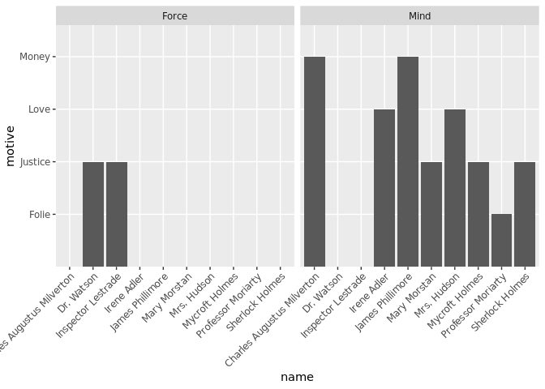
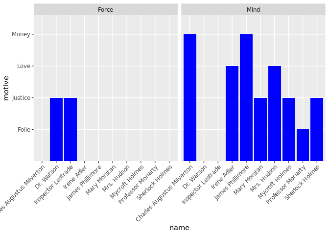
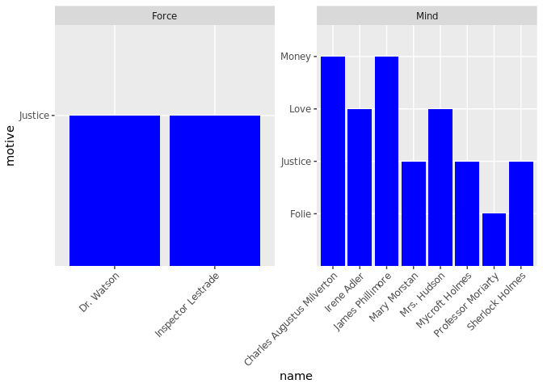
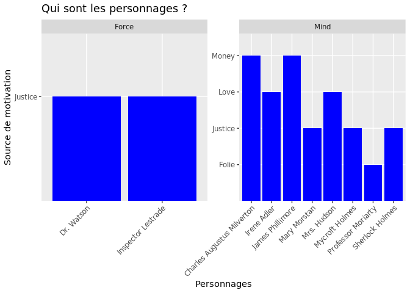

``` r
# Création de plusieurs sous-graphiques avec les facettes
library(tidyverse)
```

    ## ── Attaching core tidyverse packages ───────────────────────────────────────────────────────────────────────────── tidyverse 2.0.0 ──
    ## ✔ dplyr     1.1.4     ✔ readr     2.1.5
    ## ✔ forcats   1.0.0     ✔ stringr   1.5.1
    ## ✔ ggplot2   3.5.0     ✔ tibble    3.2.1
    ## ✔ lubridate 1.9.3     ✔ tidyr     1.3.1
    ## ✔ purrr     1.0.2     
    ## ── Conflicts ─────────────────────────────────────────────────────────────────────────────────────────────── tidyverse_conflicts() ──
    ## ✖ dplyr::filter() masks stats::filter()
    ## ✖ dplyr::lag()    masks stats::lag()
    ## ℹ Use the conflicted package (<http://conflicted.r-lib.org/>) to force all conflicts to become errors

``` r
infos <- data.frame(
    name = c("Sherlock Holmes", "Dr. Watson", "Inspector Lestrade", "Mrs. Hudson", "Mycroft Holmes", "Irene Adler", "Professor Moriarty", "Mary Morstan", "James Phillimore", "Charles Augustus Milverton"),
    residence = c("221B Baker Street", "221B Baker Street", "Scotland Yard", "221B Baker Street", "Diogenes Club", "Briony Lodge", "Unknown", "Unknown", "Unknown", "Unknown"),
    weapon = c("Mind", "Force", "Force", "Mind", "Mind", "Mind", "Mind", "Mind", "Mind", "Mind"),
    motive = c("Justice", "Justice", "Justice", "Love", "Justice", "Love", "Folie", "Justice", "Money", "Money"),
    outcome = c("Vivant", "Vivant", "Vivant", "Vivant", "Vivant", "Vivant", "Vivant", "Vivant", "Vivant", "Vivant"),
    notes = c("Le seul détective consultant au monde", "Le meilleur ami et colocataire de Sherlock Holmes", "Le meilleur détective de Scotland Yard", "La logeuse de Sherlock Holmes", "Le frère aîné de Sherlock Holmes", "Le seul amour de Sherlock Holmes", "La némésis de Sherlock Holmes", "La femme de Sherlock Holmes", "Le client de Sherlock Holmes", "L'ennemi de Sherlock Holmes")
)

##########
ggplot(infos) +
    aes(x = name, y = motive) +
    geom_bar(stat = "identity") +
    facet_wrap(~weapon) +
    theme(axis.text.x = element_text(angle = 45, hjust = 1))
```

<!-- -->

``` r
##########
ggplot(infos) +
    aes(x = name, y = motive) +
    geom_bar(stat = "identity", fill = "blue") +
    facet_grid(~weapon) +
    theme(axis.text.x = element_text(angle = 45, hjust = 1))
```

<!-- -->

``` r
##########
ggplot(infos) +
    aes(x = name, y = motive) +
    geom_bar(stat = "identity", fill = "blue") +
    facet_wrap(~weapon, scales = "free") +
    theme(axis.text.x = element_text(angle = 45, hjust = 1))
```

<!-- -->

``` r
##########
ggplot(infos) +
    aes(x = name, y = motive) +
    geom_bar(stat = "identity", fill = "blue") +
    facet_wrap(~weapon, scales = "free") +
    theme(axis.text.x = element_text(angle = 45, hjust = 1)) +
    ggtitle("Qui sont les personnages ?") +
    xlab("Personnages") +
    ylab("Source de motivation")
```

<!-- -->
