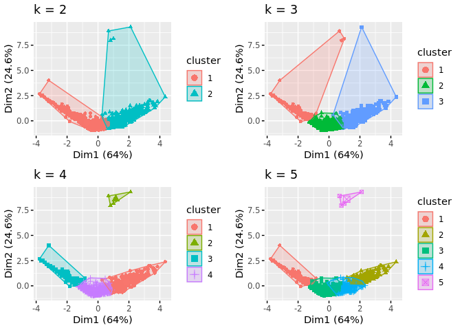

``` r
# Mise en application concrête avec l'utilisation de kmeans et ggplot
library(cluster)
library(factoextra)
```

    ## Loading required package: ggplot2

    ## Welcome! Want to learn more? See two factoextra-related books at https://goo.gl/ve3WBa

``` r
library(gridExtra)
library(readr)
d_frame <- read_delim("perso-potter-vs-sherlock.csv",
    delim = ";", escape_double = FALSE, trim_ws = TRUE
)
```

    ## Rows: 1197 Columns: 4

    ## ── Column specification ─────────────────────────────────────────────────────────────────────────────────────────────────────────────
    ## Delimiter: ";"
    ## chr (1): PERSO
    ## dbl (3): Intelligence, Force, Dangereux
    ## 
    ## ℹ Use `spec()` to retrieve the full column specification for this data.
    ## ℹ Specify the column types or set `show_col_types = FALSE` to quiet this message.

``` r
# Retirer les valeurs manquantes
mean_intelligence <- mean(d_frame$Intelligence, na.rm = TRUE)
mean_force <- mean(d_frame$Force, na.rm = TRUE)
mean_dangereux <- mean(d_frame$Dangereux, na.rm = TRUE)

# On utilise la fonction is.na() pour identifier les valeurs manquantes
d_frame$Intelligence[is.na(d_frame$Intelligence)] <- mean_intelligence
d_frame$Force[is.na(d_frame$Force)] <- mean_force
d_frame$Dangereux[is.na(d_frame$Dangereux)] <- mean_dangereux

# Transformer une colonne en nom de ligne
d_frame_unique <- d_frame
rownames <- d_frame_unique$PERSO
d_frame_unique$PERSO <- NULL
row.names(d_frame_unique) <- rownames
```

    ## Warning: Setting row names on a tibble is deprecated.

``` r
# Normaliser
d_frame_scaled <- scale(d_frame_unique)

# Calculer 2 clusters
kmeans2 <- kmeans(d_frame_scaled, centers = 2, nstart = 25)
str(kmeans2)
```

    ## List of 9
    ##  $ cluster     : Named int [1:1197] 1 1 1 1 1 1 1 1 1 1 ...
    ##   ..- attr(*, "names")= chr [1:1197] "Pansy Malfoy" "Lily Potter" "Lee Weasley" "Angelina Chang" ...
    ##  $ centers     : num [1:2, 1:3] 0.204 -0.475 0.571 -1.328 -0.436 ...
    ##   ..- attr(*, "dimnames")=List of 2
    ##   .. ..$ : chr [1:2] "1" "2"
    ##   .. ..$ : chr [1:3] "Intelligence" "Force" "Dangereux"
    ##  $ totss       : num 3588
    ##  $ withinss    : num [1:2] 1149 886
    ##  $ tot.withinss: num 2034
    ##  $ betweenss   : num 1554
    ##  $ size        : int [1:2] 837 360
    ##  $ iter        : int 1
    ##  $ ifault      : int 0
    ##  - attr(*, "class")= chr "kmeans"

``` r
fviz_cluster(kmeans2, data = d_frame_scaled)
```

<!-- -->

``` r
# Calculer 3, 4, 5 clusters
kmeans3 <- kmeans(d_frame_scaled, centers = 3, nstart = 25) # DataFlair
kmeans4 <- kmeans(d_frame_scaled, centers = 4, nstart = 25)
kmeans5 <- kmeans(d_frame_scaled, centers = 5, nstart = 25)

# Comparer les résultats
plot1 <- fviz_cluster(kmeans2, geom = "point", data = d_frame_scaled) + ggtitle("k = 2")
plot2 <- fviz_cluster(kmeans3, geom = "point", data = d_frame_scaled) + ggtitle("k = 3")
plot3 <- fviz_cluster(kmeans4, geom = "point", data = d_frame_scaled) + ggtitle("k = 4")
plot4 <- fviz_cluster(kmeans5, geom = "point", data = d_frame_scaled) + ggtitle("k = 5")
grid.arrange(plot1, plot2, plot3, plot4, nrow = 2)
```

<!-- -->

``` r
# kmeans 4 ou 5 sont intéressants -> 5 et le groupe 3

# Extraire les points et expliquer les données
print(kmeans5)
```

    ## K-means clustering with 5 clusters of sizes 202, 139, 617, 235, 4
    ## 
    ## Cluster means:
    ##   Intelligence      Force  Dangereux
    ## 1    1.7900954  0.9088285 -0.8343163
    ## 2   -0.5717179 -1.5887944  2.0298069
    ## 3   -0.2999567  0.4988882 -0.3025765
    ## 4   -0.5011317 -1.1719508  0.1773295
    ## 5    5.1771892  1.2133608  7.8515015
    ## 
    ## Clustering vector:
    ##          Pansy Malfoy           Lily Potter           Lee Weasley 
    ##                     1                     1                     1 
    ##        Angelina Chang             Lee Black   Hermione Longbottom 
    ##                     1                     1                     1 
    ##          Alicia Moody       Oliver Lovegood        Neville Potter 
    ##                     1                     1                     1 
    ##     Lucius Longbottom            Wood Black          Alicia Lupin 
    ##                     1                     1                     1 
    ##          Padma Hagrid    Umbridge Lestrange           Lee Diggory 
    ##                     1                     1                     1 
    ##     Charlie Lestrange        Wood Voldemort        Ginny Umbridge 
    ##                     1                     1                     1 
    ##          George Black         Susan Weasley         Ginny Diggory 
    ##                     1                     1                     1 
    ##      Lupin Dumbledore            Bill Chang            Dean Snape 
    ##                     1                     1                     1 
    ##           Draco Fudge      Marge Dumbledore          Tonks Hagrid 
    ##                     1                     1                     1 
    ##         Fudge Granger     Oliver Longbottom       Crabbe Delacour 
    ##                     1                     1                     1 
    ##           Draco Lupin            Lee Potter            Luna Lupin 
    ##                     1                     1                     1 
    ##       Luna Dumbledore         Sirius Malfoy         Neville Evans 
    ##                     1                     1                     1 
    ##        Percy Delacour    Bellatrix Lovegood   Bellatrix Voldemort 
    ##                     1                     1                     1 
    ##           Percy Black          Marge Potter          George Snape 
    ##                     1                     1                     1 
    ##     Kreacher Lovegood        Dennis Granger       George Umbridge 
    ##                     1                     1                     1 
    ##          Crabbe Black         Luna Umbridge      Dennis Voldemort 
    ##                     1                     1                     1 
    ##          Alicia Black        Dennis Weasley        Wood Lestrange 
    ##                     1                     1                     1 
    ##          Gregory Krum  Dumbledore Voldemort   Lavender Dumbledore 
    ##                     1                     1                     1 
    ##          Oliver Evans        Alicia Weasley          Dudley Chang 
    ##                     1                     1                     1 
    ##          Susan Potter        Katie Delacour         Charlie Lupin 
    ##                     1                     1                     1 
    ##        Charlie Potter          James Malfoy          Cedric Tonks 
    ##                     1                     1                     1 
    ##          Colin Potter            Fred Evans       Umbridge Potter 
    ##                     1                     1                     1 
    ##           Harry Tonks        Susan Lovegood           Luna Potter 
    ##                     1                     1                     1 
    ##       Snape Lestrange          Oliver Tonks            Bill Black 
    ##                     1                     1                     1 
    ##          Vernon Lupin     Sirius Longbottom          Viktor Lupin 
    ##                     1                     1                     1 
    ##        Dennis Diggory            Luna Evans         Wood Delacour 
    ##                     1                     1                     1 
    ##        Kreacher Black        Lucius Granger            Bill Lupin 
    ##                     1                     1                     1 
    ##         Lupin Weasley           Susan Evans            Fred Black 
    ##                     1                     1                     1 
    ##         Fred Delacour          Sirius Tonks           Fleur Black 
    ##                     1                     1                     1 
    ##           Padma Chang         Parvati Black      Pansy Dumbledore 
    ##                     1                     1                     1 
    ##           Moody Fudge         Oliver Potter         Dudley Hagrid 
    ##                     1                     1                     1 
    ##          Ginny Potter      Voldemort Malfoy        Gregory Potter 
    ##                     1                     1                     1 
    ##     Kreacher Umbridge           Lily Malfoy        Petunia Potter 
    ##                     1                     1                     1 
    ##        Moody Lovegood        Narcissa Chang           James Black 
    ##                     1                     1                     1 
    ##            Fred Lupin       Neville Weasley     Bellatrix Granger 
    ##                     1                     1                     1 
    ##            James Krum         Neville Lupin          Katie Malfoy 
    ##                     1                     1                     1 
    ##            Wood Snape          Wood Weasley         Neville Tonks 
    ##                     1                     1                     1 
    ##        Neville Malfoy           Snape Black             Lee Lupin 
    ##                     1                     1                     1 
    ##      Padma Dumbledore          Arthur Lupin          Susan Malfoy 
    ##                     1                     1                     1 
    ##   Angelina Longbottom          Fleur Malfoy       George Lovegood 
    ##                     1                     1                     1 
    ##           Susan Black         Percy Diggory           Cho Weasley 
    ##                     1                     1                     1 
    ##        George Weasley         Petunia Fudge       Neville Diggory 
    ##                     1                     1                     1 
    ##          Katie Potter       Gregory Weasley      Ginny Dumbledore 
    ##                     1                     1                     1 
    ##           Molly Fudge           Vernon Krum            Cho Malfoy 
    ##                     1                     1                     1 
    ##            Cho Hagrid          Ron Umbridge           Irene Adler 
    ##                     1                     1                     5 
    ##             Ron Moody          Dudley Snape        Ron Longbottom 
    ##                     1                     1                     1 
    ##    Narcissa Voldemort           Katie Chang         Alicia Hagrid 
    ##                     1                     1                     1 
    ##           Fleur Snape         George Malfoy          Padma Malfoy 
    ##                     1                     1                     1 
    ##           George Krum    Bellatrix Delacour     Angelina Delacour 
    ##                     1                     1                     1 
    ##    Voldemort Lovegood     Dennis Longbottom             Lee Chang 
    ##                     1                     1                     1 
    ##          Draco Malfoy         Remus Diggory  Bellatrix Longbottom 
    ##                     1                     1                     1 
    ##        Dean Lestrange     Narcissa Umbridge          Hagrid Evans 
    ##                     1                     1                     1 
    ##     Angelina Umbridge           Padma Snape         Dobby Diggory 
    ##                     1                     1                     1 
    ##      Lavender Diggory          Wood Diggory        Umbridge Tonks 
    ##                     1                     1                     1 
    ##         Sirius Potter        Angelina Lupin           Bill Potter 
    ##                     1                     1                     1 
    ##         Tonks Diggory        Lavender Chang         Charlie Black 
    ##                     1                     1                     1 
    ##          Alicia Fudge        Katie Umbridge      Angelina Diggory 
    ##                     3                     1                     1 
    ##        James Moriarty          Lucius Evans         Neville Chang 
    ##                     5                     1                     1 
    ##           Susan Lupin        Oliver Weasley         Katie Weasley 
    ##                     1                     1                     1 
    ##       Angelina Potter       Lavender Malfoy         Cedric Hagrid 
    ##                     1                     1                     1 
    ##           Dobby Lupin        Fudge Lovegood          Oliver Black 
    ##                     1                     3                     1 
    ##         Susan Granger         Padma Diggory         George Potter 
    ##                     1                     1                     1 
    ##             Ron Fudge         Pansy Weasley          Alicia Evans 
    ##                     3                     1                     1 
    ##      Parvati Delacour        Cedric Weasley            Wood Chang 
    ##                     1                     1                     3 
    ##           Remus Evans           Tonks Lupin       Fudge Lestrange 
    ##                     1                     1                     4 
    ##            Lee Malfoy          Percy Malfoy          Lucius Lupin 
    ##                     1                     1                     1 
    ##        Oliver Granger          Dudley Fudge          Remus Malfoy 
    ##                     4                     1                     1 
    ##    Kreacher Voldemort            Ron Potter Dumbledore Dumbledore 
    ##                     1                     3                     1 
    ##      Harry Longbottom         Lucius Malfoy           Fred Potter 
    ##                     1                     1                     1 
    ##          Cedric Lupin           Oliver Krum     Arthur Longbottom 
    ##                     1                     1                     1 
    ##        Hermione Lupin           Katie Lupin      Dudley Lestrange 
    ##                     1                     4                     3 
    ##          Sandra Adler          Bob Moriarty        Lavender Moody 
    ##                     5                     5                     3 
    ##         Gregory Chang         Vernon Hagrid           Goyle Snape 
    ##                     3                     3                     3 
    ##      Vernon Voldemort         Crabbe Malfoy          Crabbe Snape 
    ##                     3                     3                     3 
    ##       Bellatrix Black          Oliver Snape          Lily Diggory 
    ##                     3                     3                     3 
    ##          Sirius Chang             Bill Krum        Cedric Granger 
    ##                     3                     3                     3 
    ##    Angelina Lestrange          Cedric Snape           Lupin Black 
    ##                     3                     3                     3 
    ##         Neville Snape          Fleur Potter     Neville Lestrange 
    ##                     3                     3                     4 
    ##     Oliver Dumbledore          George Chang           Remus Black 
    ##                     3                     3                     3 
    ##   Dumbledore Delacour           Cedric Krum           Fred Malfoy 
    ##                     3                     3                     3 
    ##          Lee Umbridge          Marge Malfoy      Molly Longbottom 
    ##                     3                     3                     3 
    ##       Dobby Voldemort          Cho Delacour     George Longbottom 
    ##                     3                     3                     3 
    ##     Hagrid Longbottom          Oliver Chang        Sirius Weasley 
    ##                     3                     3                     3 
    ##            Dobby Krum        Vernon Diggory        Lee Dumbledore 
    ##                     3                     3                     3 
    ##   Narcissa Longbottom          Viktor Tonks         James Weasley 
    ##                     3                     3                     3 
    ##       Narcissa Malfoy          Molly Hagrid     Vernon Dumbledore 
    ##                     3                     3                     3 
    ##            Wood Lupin      Moody Longbottom        Padma Delacour 
    ##                     3                     3                     3 
    ##         Charlie Chang     Vernon Longbottom           Goyle Lupin 
    ##                     3                     3                     3 
    ##      Dobby Longbottom          Oliver Lupin        Hermione Tonks 
    ##                     3                     3                     3 
    ##       Bellatrix Chang          Vernon Tonks          Cedric Chang 
    ##                     3                     3                     3 
    ##      Fudge Longbottom        Lavender Fudge       Angelina Malfoy 
    ##                     3                     3                     3 
    ##        Susan Delacour      Angelina Weasley       Marge Lestrange 
    ##                     4                     3                     3 
    ##        Parvati Potter     Viktor Dumbledore          Lucius Black 
    ##                     3                     3                     3 
    ##        Parvati Malfoy           Goyle Fudge          Vernon Snape 
    ##                     3                     3                     3 
    ##            Dean Lupin      Molly Dumbledore        Remus Lovegood 
    ##                     3                     3                     3 
    ##           Pansy Chang    Gregory Longbottom        Narcissa Tonks 
    ##                     3                     3                     3 
    ##           Marge Tonks           Snape Lupin          Sirius Black 
    ##                     3                     3                     3 
    ##         Fred Lovegood            Bill Tonks          Alicia Chang 
    ##                     3                     3                     3 
    ##             Lee Snape      George Voldemort           Susan Snape 
    ##                     3                     3                     4 
    ##         Percy Granger      Charlie Umbridge           Katie Black 
    ##                     3                     3                     3 
    ##            Katie Krum            Fudge Krum          George Fudge 
    ##                     2                     3                     3 
    ##           Lee Granger          Goyle Potter       Fudge Voldemort 
    ##                     4                     3                     3 
    ##     Petunia Voldemort        Hermione Moody      Katie Dumbledore 
    ##                     3                     3                     3 
    ##         Arthur Hagrid         Snape Weasley          George Lupin 
    ##                     3                     3                     3 
    ##           Marge Chang          Luna Weasley        Harry Lovegood 
    ##                     3                     3                     3 
    ##         Molly Granger            Susan Krum          Viktor Black 
    ##                     3                     3                     3 
    ##  Voldemort Longbottom         Katie Granger         Vernon Malfoy 
    ##                     3                     3                     3 
    ##        Lupin Lovegood           Lupin Tonks       Percy Lestrange 
    ##                     3                     3                     3 
    ##          Dudley Lupin    Petunia Dumbledore         Tonks Weasley 
    ##                     4                     3                     4 
    ##         Hermione Krum        Alicia Diggory       Voldemort Moody 
    ##                     4                     3                     2 
    ##       Umbridge Malfoy            Lupin Krum       Wood Longbottom 
    ##                     3                     3                     3 
    ##          Charlie Krum           Fred Hagrid          Sirius Moody 
    ##                     3                     4                     3 
    ##         Lee Voldemort        Kreacher Evans        Marge Umbridge 
    ##                     3                     3                     3 
    ##          Dudley Moody          Ron Delacour       Draco Voldemort 
    ##                     3                     4                     3 
    ##           James Chang           Susan Fudge           Dean Malfoy 
    ##                     3                     3                     3 
    ##           Bill Malfoy       Snape Voldemort           Wood Potter 
    ##                     3                     3                     2 
    ##      Sirius Lestrange       Molly Lestrange          Fred Weasley 
    ##                     3                     3                     3 
    ##          Seamus Tonks           Katie Tonks        Cho Longbottom 
    ##                     2                     3                     3 
    ##        Hermione Fudge           Dobby Tonks         Harry Weasley 
    ##                     4                     3                     3 
    ##          Hagrid Black           Remus Moody           Goyle Evans 
    ##                     3                     3                     3 
    ##           Arthur Krum            Wood Moody        Molly Lovegood 
    ##                     3                     3                     3 
    ##         Lee Lestrange      Lavender Weasley          Tonks Potter 
    ##                     3                     4                     3 
    ##          Alicia Tonks     Parvati Voldemort          Snape Hagrid 
    ##                     3                     3                     3 
    ##       Fred Dumbledore         Parvati Lupin       Bellatrix Evans 
    ##                     3                     3                     3 
    ##        Fred Lestrange        Lavender Lupin             Ron Evans 
    ##                     3                     3                     3 
    ##            Lily Tonks        Sirius Diggory     Lavender Lovegood 
    ##                     4                     3                     3 
    ##         Ginny Weasley     Umbridge Delacour       Susan Voldemort 
    ##                     3                     3                     4 
    ##     Alicia Longbottom       Tonks Lestrange         Marge Weasley 
    ##                     3                     3                     3 
    ##          Vernon Chang        Katie Lovegood            Cho Potter 
    ##                     4                     3                     3 
    ##             Lee Moody          Dobby Hagrid           Susan Tonks 
    ##                     3                     3                     2 
    ##         Dennis Hagrid            Luna Black             Lee Fudge 
    ##                     4                     3                     3 
    ##            Pansy Krum      Lucius Lestrange        Hermione Black 
    ##                     3                     3                     4 
    ##          Lucius Moody    Charlie Longbottom    Lavender Lestrange 
    ##                     3                     3                     3 
    ##         Petunia Lupin           Percy Snape       George Delacour 
    ##                     3                     3                     3 
    ##       Sirius Delacour       Katie Lestrange          Dean Weasley 
    ##                     3                     3                     2 
    ##        Vernon Weasley       Lavender Potter       Oliver Delacour 
    ##                     3                     3                     3 
    ##        Narcissa Black           Bill Hagrid           Colin Fudge 
    ##                     3                     3                     3 
    ##         Parvati Chang           Katie Moody          Moody Potter 
    ##                     3                     3                     3 
    ##          Colin Hagrid      Snape Longbottom        Moody Delacour 
    ##                     3                     3                     3 
    ##        Umbridge Lupin          Dennis Fudge    Petunia Longbottom 
    ##                     4                     3                     3 
    ##          Susan Hagrid        Seamus Diggory            Fred Snape 
    ##                     3                     3                     3 
    ##           Marge Snape          Oliver Fudge       Fred Longbottom 
    ##                     3                     3                     3 
    ##           Lupin Chang       Harry Lestrange    Hermione Voldemort 
    ##                     3                     4                     3 
    ##         Petunia Black       Dennis Umbridge        George Diggory 
    ##                     3                     3                     3 
    ##         Lily Lovegood          Remus Hagrid         Colin Diggory 
    ##                     3                     3                     4 
    ##      Kreacher Weasley      Draco Longbottom        Marge Lovegood 
    ##                     4                     3                     3 
    ##          James Potter          Fudge Hagrid         Lupin Granger 
    ##                     3                     3                     3 
    ##      Arthur Lestrange       Seamus Lovegood         Viktor Potter 
    ##                     3                     2                     3 
    ## Dumbledore Longbottom          Sirius Lupin   Lavender Longbottom 
    ##                     3                     4                     3 
    ##         Neville Black    Gregory Dumbledore      Hagrid Voldemort 
    ##                     3                     3                     2 
    ##         Oliver Hagrid       Alicia Lovegood      Alicia Voldemort 
    ##                     4                     3                     3 
    ##        Umbridge Evans             Ron Black         Gregory Tonks 
    ##                     4                     4                     3 
    ##       Fleur Lestrange      Narcissa Weasley            Wood Tonks 
    ##                     4                     3                     3 
    ##           Snape Evans         Cedric Malfoy       Alicia Umbridge 
    ##                     3                     3                     4 
    ##            Lily Chang        Dudley Granger        Angelina Black 
    ##                     4                     3                     4 
    ##          Harry Malfoy           Lucius Krum      Pansy Longbottom 
    ##                     4                     3                     3 
    ##        Alicia Granger         Ron Lestrange        Angelina Fudge 
    ##                     3                     4                     4 
    ##      James Dumbledore           Colin Snape        Angelina Moody 
    ##                     2                     3                     3 
    ##       Bill Longbottom          Fleur Hagrid            Harry Krum 
    ##                     3                     4                     4 
    ##        Lavender Snape     George Dumbledore        Parvati Hagrid 
    ##                     3                     3                     3 
    ##           Ron Weasley        Charlie Malfoy             Ron Lupin 
    ##                     3                     3                     3 
    ##         Fleur Granger            Wood Evans      Lavender Granger 
    ##                     3                     3                     3 
    ##           Marge Black         Seamus Potter     Seamus Longbottom 
    ##                     4                     3                     2 
    ##        Lavender Evans      Neville Delacour         Hagrid Malfoy 
    ##                     2                     3                     3 
    ##         Alicia Malfoy           Tonks Black         Alicia Potter 
    ##                     3                     3                     3 
    ##           Fudge Lupin       Pansy Lestrange           Marge Lupin 
    ##                     3                     3                     3 
    ##      Petunia Umbridge           Molly Snape          Dennis Black 
    ##                     3                     4                     3 
    ##          Sirius Evans            Fred Moody      Colin Dumbledore 
    ##                     3                     3                     4 
    ##      Bellatrix Potter       Sirius Umbridge      Dennis Lestrange 
    ##                     4                     4                     3 
    ##             Cho Evans      Dumbledore Evans          Seamus Black 
    ##                     4                     3                     3 
    ##        Draco Delacour        Bellatrix Krum        Angelina Snape 
    ##                     4                     2                     3 
    ##    Neville Longbottom      Dumbledore Lupin         Oliver Malfoy 
    ##                     2                     2                     2 
    ##          Remus Potter           Marge Evans    Parvati Longbottom 
    ##                     4                     4                     3 
    ##          Hagrid Tonks            Moody Krum      Crabbe Voldemort 
    ##                     4                     3                     4 
    ##         George Hagrid            Dean Fudge         Petunia Snape 
    ##                     4                     3                     4 
    ##    Voldemort Delacour            Bill Fudge          Neville Krum 
    ##                     3                     2                     2 
    ##           Wood Malfoy      Alicia Lestrange        Lavender Black 
    ##                     4                     3                     3 
    ##       Hermione Malfoy           Remus Lupin       Dean Dumbledore 
    ##                     3                     3                     4 
    ##    Umbridge Voldemort       Voldemort Lupin             Fred Krum 
    ##                     2                     3                     3 
    ##         Gregory Evans           Ginny Evans        Umbridge Snape 
    ##                     3                     3                     3 
    ##      Dumbledore Black   Kreacher Longbottom           Katie Fudge 
    ##                     3                     3                     3 
    ##          Fred Diggory           Colin Black           Fleur Moody 
    ##                     2                     3                     4 
    ##        Hagrid Granger            Dean Black        Crabbe Weasley 
    ##                     3                     2                     3 
    ##             Cho Black           Tonks Fudge           Harry Moody 
    ##                     3                     3                     3 
    ##         Dobby Weasley          Ginny Hagrid        Percy Umbridge 
    ##                     3                     3                     3 
    ##            Colin Krum  Dumbledore Lestrange           Colin Lupin 
    ##                     4                     3                     4 
    ##          Lupin Malfoy      Umbridge Granger        Susan Umbridge 
    ##                     4                     3                     3 
    ##         Dean Umbridge          Seamus Lupin           Wood Hagrid 
    ##                     3                     3                     3 
    ##           Hagrid Krum           Katie Evans    Hermione Lestrange 
    ##                     3                     4                     3 
    ##      Draco Dumbledore       Ginny Voldemort           Viktor Krum 
    ##                     3                     3                     3 
    ##           Ron Granger         Dobby Granger     Neville Voldemort 
    ##                     3                     3                     4 
    ##        Oliver Diggory       Hermione Potter         Marge Granger 
    ##                     2                     4                     4 
    ##       Narcissa Potter        Angelina Tonks       Arthur Lovegood 
    ##                     4                     3                     4 
    ##      Oliver Voldemort        Tonks Umbridge          Dobby Malfoy 
    ##                     4                     3                     3 
    ##    Neville Dumbledore       Angelina Hagrid          Viktor Chang 
    ##                     3                     4                     3 
    ##       Ginny Lestrange      Dumbledore Chang            Fred Tonks 
    ##                     2                     4                     2 
    ##     Voldemort Granger         Goyle Weasley       Lupin Voldemort 
    ##                     2                     3                     3 
    ##       Crabbe Lovegood            Fred Chang         Angelina Krum 
    ##                     3                     4                     4 
    ##         Fred Umbridge      Umbridge Diggory           Ginny Lupin 
    ##                     3                     3                     4 
    ##         Susan Diggory          Dudley Black              Ron Krum 
    ##                     3                     3                     3 
    ##          Dean Granger        Seamus Weasley          Arthur Moody 
    ##                     3                     3                     3 
    ##      Dumbledore Moody         Percy Weasley        Hermione Evans 
    ##                     3                     3                     3 
    ##       Parvati Weasley          Pansy Potter      Angelina Granger 
    ##                     4                     2                     3 
    ##          George Tonks        Narcissa Lupin         Luna Delacour 
    ##                     4                     3                     3 
    ##       Dobby Lestrange            Ron Hagrid      Ginny Longbottom 
    ##                     2                     3                     3 
    ##         Draco Granger           Alicia Krum          Arthur Evans 
    ##                     3                     2                     3 
    ##         Cho Lestrange             Lee Tonks           Goyle Tonks 
    ##                     3                     4                     3 
    ##       Oliver Umbridge         Lily Delacour        Umbridge Black 
    ##                     3                     4                     2 
    ##          Seamus Evans           Dean Potter           Susan Chang 
    ##                     3                     3                     3 
    ##           Pansy Snape       Lavender Hagrid     Narcissa Delacour 
    ##                     3                     3                     2 
    ##      Katie Longbottom          Sirius Fudge         Charlie Tonks 
    ##                     3                     2                     4 
    ##           Moody Moody         Molly Weasley        Kreacher Moody 
    ##                     3                     4                     4 
    ##    Bellatrix Umbridge      Charlie Lovegood         Snape Diggory 
    ##                     3                     4                     4 
    ##              Lee Krum           Lupin Moody       James Voldemort 
    ##                     3                     4                     3 
    ##           Lily Hagrid          Cho Lovegood    Angelina Voldemort 
    ##                     3                     3                     4 
    ##      Narcissa Diggory         Moody Weasley     Bellatrix Weasley 
    ##                     3                     4                     3 
    ##          Molly Potter        Angelina Evans      Susan Longbottom 
    ##                     3                     4                     4 
    ##             Cho Fudge         Fleur Diggory     Petunia Lestrange 
    ##                     3                     3                     4 
    ##       Narcissa Hagrid           Fleur Fudge           Fudge Moody 
    ##                     3                     3                     2 
    ##        Colin Lovegood        Lee Longbottom           Percy Tonks 
    ##                     3                     3                     4 
    ##        George Granger             Wood Krum            Lee Hagrid 
    ##                     3                     4                     2 
    ##        Narcissa Evans           Percy Lupin       Kreacher Potter 
    ##                     3                     4                     4 
    ##           Draco Snape           Moody Evans         Neville Moody 
    ##                     3                     3                     4 
    ##         Viktor Malfoy       Katie Voldemort         Gregory Black 
    ##                     3                     2                     3 
    ##   Umbridge Longbottom            Lily Black          Goyle Malfoy 
    ##                     3                     2                     2 
    ##        Draco Lovegood       Wood Dumbledore        Pansy Umbridge 
    ##                     3                     2                     3 
    ##         Draco Weasley       Lucius Umbridge       Petunia Granger 
    ##                     4                     3                     3 
    ##       Padma Voldemort           Fudge Chang      Oliver Lestrange 
    ##                     2                     4                     2 
    ##         Fudge Weasley       Sirius Lovegood           Moody Black 
    ##                     3                     2                     3 
    ##          Hagrid Moody     Dudley Dumbledore         Fleur Weasley 
    ##                     3                     2                     4 
    ##            Marge Krum      Tonks Longbottom           Snape Moody 
    ##                     3                     3                     2 
    ##       Cedric Delacour          Lucius Snape       Padma Lestrange 
    ##                     2                     3                     3 
    ##            Remus Krum        Crabbe Diggory          Lucius Tonks 
    ##                     4                     3                     2 
    ##          Molly Malfoy          Lupin Potter           Luna Hagrid 
    ##                     3                     2                     3 
    ##          Seamus Moody           James Evans         Padma Granger 
    ##                     3                     2                     3 
    ##     Alicia Dumbledore       Arthur Delacour      Seamus Lestrange 
    ##                     2                     3                     2 
    ##             Cho Snape        Bill Voldemort       Petunia Weasley 
    ##                     3                     3                     3 
    ##          Moody Malfoy           Dobby Black           Lupin Lupin 
    ##                     3                     3                     3 
    ##          Tonks Malfoy          Snape Potter       Hagrid Lovegood 
    ##                     3                     2                     2 
    ##         Moody Granger       Voldemort Fudge           Seamus Krum 
    ##                     2                     3                     2 
    ##       Lily Dumbledore          Crabbe Chang       Remus Lestrange 
    ##                     4                     3                     3 
    ##          Katie Hagrid           Harry Snape           James Lupin 
    ##                     3                     4                     3 
    ##          Ginny Malfoy            Lily Fudge       Bellatrix Lupin 
    ##                     4                     4                     2 
    ##       Susan Lestrange         Pansy Granger         Dudley Malfoy 
    ##                     3                     2                     4 
    ##         Wood Umbridge          Lucius Chang       Seamus Delacour 
    ##                     4                     3                     3 
    ##           Padma Moody           James Snape      Voldemort Potter 
    ##                     3                     4                     4 
    ##           Susan Moody        Goyle Umbridge       James Lestrange 
    ##                     3                     4                     2 
    ##          Harry Potter      Hermione Weasley           Pansy Black 
    ##                     3                     3                     3 
    ##      Percy Longbottom        Umbridge Chang          Lily Weasley 
    ##                     3                     3                     2 
    ##       Kreacher Hagrid        Sirius Granger           Fudge Evans 
    ##                     4                     3                     3 
    ##       Fleur Voldemort         Dennis Potter      Viktor Voldemort 
    ##                     3                     4                     4 
    ##     Gregory Lestrange            Dean Tonks          Dennis Moody 
    ##                     3                     3                     3 
    ##        Fred Voldemort   Bellatrix Lestrange           Colin Moody 
    ##                     3                     4                     4 
    ##           Lupin Evans        Ginny Lovegood           Tonks Tonks 
    ##                     3                     3                     3 
    ##         Cedric Potter          Arthur Tonks           Moody Lupin 
    ##                     3                     4                     3 
    ##         Parvati Fudge          Cho Umbridge      Percy Dumbledore 
    ##                     4                     4                     3 
    ##        Molly Umbridge         Gregory Lupin           Katie Snape 
    ##                     3                     4                     3 
    ##          Percy Potter           Harry Lupin       Cedric Lovegood 
    ##                     3                     3                     3 
    ##         Gregory Fudge       Voldemort Evans          Oliver Moody 
    ##                     4                     2                     4 
    ##       Neville Granger          Percy Hagrid    Narcissa Lestrange 
    ##                     3                     4                     3 
    ##     Cedric Longbottom       Luna Longbottom          Lily Granger 
    ##                     2                     2                     3 
    ##           Molly Black       Hagrid Delacour        Cedric Diggory 
    ##                     3                     2                     2 
    ##        Lucius Weasley          Bill Diggory         Remus Granger 
    ##                     4                     4                     3 
    ##       Cedric Umbridge            Molly Krum         Goyle Granger 
    ##                     3                     4                     3 
    ##        Harry Delacour         Dennis Malfoy           Remus Snape 
    ##                     3                     2                     3 
    ##         Seamus Malfoy          Alicia Snape     Crabbe Longbottom 
    ##                     3                     3                     2 
    ##        Remus Umbridge       Petunia Diggory           Moody Chang 
    ##                     3                     3                     3 
    ##     Voldemort Weasley      Remus Longbottom           Molly Chang 
    ##                     4                     3                     2 
    ##       Bellatrix Fudge           Fleur Evans          Fudge Potter 
    ##                     2                     2                     2 
    ##           Percy Evans      Sirius Voldemort          Dennis Tonks 
    ##                     3                     3                     4 
    ##        Padma Lovegood            Wood Fudge          Cedric Fudge 
    ##                     2                     4                     3 
    ##    Voldemort Umbridge      Snape Dumbledore     Dumbledore Potter 
    ##                     3                     2                     3 
    ##       Alicia Delacour      Fleur Longbottom          Hagrid Snape 
    ##                     4                     3                     3 
    ##      Goyle Dumbledore          Crabbe Fudge      Marge Longbottom 
    ##                     2                     2                     3 
    ##           Draco Black         Lucius Hagrid          Crabbe Tonks 
    ##                     4                     4                     4 
    ##             Ron Tonks        Cho Dumbledore            Luna Moody 
    ##                     3                     3                     3 
    ##             Dean Krum          Wood Granger       Hermione Hagrid 
    ##                     3                     3                     3 
    ##       Charlie Granger        James Lovegood   Hermione Dumbledore 
    ##                     3                     3                     3 
    ##        Fudge Umbridge           Dobby Evans         Viktor Hagrid 
    ##                     4                     3                     4 
    ##           Dudley Krum           Padma Black           Dobby Chang 
    ##                     4                     4                     3 
    ##        Fleur Delacour    Dumbledore Weasley      Susan Dumbledore 
    ##                     3                     3                     3 
    ##          Viktor Snape         Marge Diggory        Lavender Tonks 
    ##                     3                     4                     3 
    ##        Marge Delacour           Padma Lupin      Fudge Dumbledore 
    ##                     4                     3                     3 
    ##           Moody Snape        Lupin Umbridge      Seamus Voldemort 
    ##                     2                     4                     4 
    ##  Voldemort Dumbledore             Cho Lupin       Crabbe Umbridge 
    ##                     3                     2                     2 
    ##      Crabbe Lestrange       Vernon Umbridge           Padma Fudge 
    ##                     3                     4                     3 
    ##         Harry Granger         Charlie Fudge        Hagrid Diggory 
    ##                     3                     4                     4 
    ##     Lavender Delacour      Dumbledore Snape         Dudley Potter 
    ##                     3                     2                     4 
    ##          Dudley Evans           Goyle Black        Dobby Umbridge 
    ##                     3                     4                     3 
    ##           Fudge Tonks        Petunia Malfoy       Bellatrix Snape 
    ##                     3                     4                     3 
    ##      Charlie Delacour            Lily Evans         Bill Delacour 
    ##                     2                     4                     3 
    ##          Bill Weasley          Lee Lovegood         Crabbe Potter 
    ##                     3                     2                     4 
    ##           Snape Tonks           Pansy Fudge         Dean Lovegood 
    ##                     4                     4                     4 
    ##         Pansy Diggory      Hagrid Lestrange       Charlie Weasley 
    ##                     3                     3                     4 
    ##          Viktor Moody          James Hagrid     Angelina Lovegood 
    ##                     3                     3                     3 
    ##           Percy Fudge        Neville Hagrid         Parvati Snape 
    ##                     3                     3                     4 
    ##       Voldemort Black           Remus Tonks      Gregory Lovegood 
    ##                     4                     3                     3 
    ##             Ron Chang             Luna Krum         Neville Fudge 
    ##                     3                     3                     2 
    ##            Fred Fudge      Parvati Umbridge        James Umbridge 
    ##                     3                     3                     3 
    ##         Colin Weasley     Sirius Dumbledore      Bellatrix Hagrid 
    ##                     4                     4                     3 
    ##      Neville Umbridge             Cho Moody            Dean Evans 
    ##                     4                     3                     3 
    ##            Bill Evans     Dumbledore Hagrid            Bill Moody 
    ##                     3                     3                     3 
    ##           Luna Malfoy       Vernon Delacour           Harry Black 
    ##                     3                     3                     2 
    ##          Seamus Chang          Arthur Black          Petunia Krum 
    ##                     2                     2                     4 
    ##          Dennis Chang     Hermione Delacour    Lavender Voldemort 
    ##                     3                     3                     2 
    ##          Arthur Fudge       Dudley Delacour          Sirius Snape 
    ##                     3                     3                     3 
    ##          Crabbe Lupin      Petunia Delacour          Vernon Black 
    ##                     4                     2                     3 
    ##          Fred Granger      Moody Dumbledore            Dean Moody 
    ##                     4                     3                     2 
    ##   Angelina Dumbledore       Voldemort Tonks           Colin Tonks 
    ##                     4                     3                     3 
    ##           Ginny Tonks          Seamus Fudge           Colin Evans 
    ##                     3                     4                     3 
    ##      Vernon Lestrange      Bellatrix Malfoy           Pansy Evans 
    ##                     3                     4                     3 
    ##          Marge Hagrid      Goyle Longbottom            Lily Snape 
    ##                     3                     2                     3 
    ##         Kreacher Krum        Arthur Weasley            Lily Moody 
    ##                     2                     3                     3 
    ##         Lavender Krum           Fudge Black        Hagrid Weasley 
    ##                     4                     3                     3 
    ##          Draco Potter        Hermione Chang        Draco Umbridge 
    ##                     3                     3                     4 
    ##         Dean Delacour           Sirius Krum      George Lestrange 
    ##                     3                     3                     3 
    ##        Gregory Malfoy      Kreacher Granger     Umbridge Lovegood 
    ##                     2                     2                     2 
    ##        Umbridge Moody         Padma Weasley          George Moody 
    ##                     3                     4                     3 
    ##         Seamus Hagrid       Lupin Lestrange       Umbridge Hagrid 
    ##                     4                     2                     3 
    ##            Tonks Krum           Dobby Snape          Viktor Evans 
    ##                     2                     3                     3 
    ##     Umbridge Umbridge          George Evans           Dobby Moody 
    ##                     3                     4                     3 
    ##           Ginny Black      Cedric Voldemort           Draco Chang 
    ##                     3                     4                     3 
    ##        Viktor Granger        Lupin Delacour       Parvati Diggory 
    ##                     3                     2                     3 
    ##      Kreacher Diggory        Colin Umbridge          Viktor Fudge 
    ##                     2                     4                     3 
    ##     Lucius Dumbledore         Charlie Moody   Dumbledore Umbridge 
    ##                     3                     2                     4 
    ##         Remus Weasley       Charlie Diggory          Moody Hagrid 
    ##                     3                     4                     3 
    ##   Kreacher Dumbledore     Voldemort Diggory           Fleur Lupin 
    ##                     3                     3                     4 
    ##      Gregory Delacour         Bill Umbridge           Ginny Chang 
    ##                     2                     3                     3 
    ##           Cho Granger           Harry Chang         Luna Lovegood 
    ##                     3                     2                     2 
    ##     Cedric Dumbledore        Bill Lestrange           Molly Moody 
    ##                     4                     2                     4 
    ##           Remus Fudge            Dean Chang     Kreacher Delacour 
    ##                     2                     2                     2 
    ##           Pansy Lupin           Ginny Moody       Dennis Lovegood 
    ##                     4                     3                     3 
    ##        Molly Delacour            Percy Krum          Luna Diggory 
    ##                     3                     3                     2 
    ##           Pansy Moody         Vernon Potter          Colin Malfoy 
    ##                     3                     3                     3 
    ##       Percy Voldemort     Charlie Voldemort        Padma Umbridge 
    ##                     3                     2                     3 
    ##           Harry Evans         Gregory Moody      Hermione Granger 
    ##                     4                     2                     4 
    ##      Umbridge Weasley     Hagrid Dumbledore           Goyle Chang 
    ##                     3                     3                     4 
    ##       Viktor Lovegood          Snape Malfoy           Molly Lupin 
    ##                     3                     4                     4 
    ##        Luna Lestrange       Gregory Granger        Dobby Lovegood 
    ##                     3                     4                     2 
    ##       Colin Lestrange        Narcissa Snape    Dumbledore Diggory 
    ##                     3                     3                     4 
    ##     Dumbledore Malfoy        Goyle Lovegood          Hagrid Lupin 
    ##                     2                     3                     3 
    ##           Fudge Fudge        Goyle Delacour        Harry Umbridge 
    ##                     4                     4                     3 
    ##         Katie Diggory      Dudley Voldemort           Tonks Chang 
    ##                     4                     3                     3 
    ##         Narcissa Krum            Luna Chang           Crabbe Krum 
    ##                     4                     3                     3 
    ##          Cedric Black           Percy Chang      Viktor Lestrange 
    ##                     2                     4                     2 
    ##           Snape Snape           Dobby Fudge            Ginny Krum 
    ##                     2                     3                     4 
    ##         Parvati Tonks           Draco Evans         Molly Diggory 
    ##                     3                     2                     4 
    ##           Goyle Moody        Seamus Granger       Seamus Umbridge 
    ##                     3                     3                     4 
    ##           Padma Evans         Ginny Granger           Cho Diggory 
    ##                     4                     3                     3 
    ##           Marge Fudge       Moody Lestrange        Voldemort Krum 
    ##                     4                     4                     4 
    ##      Remus Dumbledore        Viktor Weasley        James Delacour 
    ##                     4                     2                     3 
    ##        Kreacher Chang        Crabbe Granger         Parvati Moody 
    ##                     3                     2                     4 
    ##           Lupin Snape           Draco Moody      Fleur Dumbledore 
    ##                     3                     4                     2 
    ##       Dudley Umbridge        Remus Delacour          Lupin Hagrid 
    ##                     2                     4                     4 
    ##          Crabbe Evans      Gregory Umbridge     Viktor Longbottom 
    ##                     3                     2                     3 
    ##           Padma Tonks           Ron Diggory       Parvati Granger 
    ##                     4                     2                     4 
    ##          Lee Delacour           Tonks Moody             Cho Tonks 
    ##                     4                     4                     3 
    ##       Dean Longbottom            Luna Snape           Remus Chang 
    ##                     2                     4                     3 
    ##          Bill Granger      Dobby Dumbledore           Dennis Krum 
    ##                     2                     2                     3 
    ##             Lee Evans        Percy Lovegood     Arthur Dumbledore 
    ##                     4                     2                     3 
    ##      Lucius Voldemort          Arthur Snape           Ginny Snape 
    ##                     3                     4                     4 
    ##        Dudley Diggory        Dobby Delacour        Arthur Granger 
    ##                     3                     3                     3 
    ##       Voldemort Chang       Bellatrix Tonks      Padma Longbottom 
    ##                     4                     4                     3 
    ##        Dean Voldemort         Umbridge Krum     Hermione Lovegood 
    ##                     4                     3                     4 
    ##         Charlie Snape          Draco Hagrid           Molly Tonks 
    ##                     3                     4                     3 
    ##         Fudge Diggory          Dean Diggory        Fudge Delacour 
    ##                     3                     4                     4 
    ##     Narcissa Lovegood     Parvati Lestrange        Narcissa Moody 
    ##                     4                     3                     3 
    ##          Hagrid Chang           James Tonks        Pansy Lovegood 
    ##                     3                     4                     3 
    ##         Ron Voldemort   Voldemort Voldemort            Bill Snape 
    ##                     3                     3                     2 
    ##           Harry Fudge        Kreacher Lupin       Lucius Lovegood 
    ##                     2                     3                     3 
    ##      Hermione Diggory        Arthur Diggory       Vernon Lovegood 
    ##                     2                     3                     3 
    ##        Vernon Granger     Seamus Dumbledore       Kreacher Malfoy 
    ##                     3                     4                     4 
    ##        Dudley Weasley    Parvati Dumbledore         James Granger 
    ##                     2                     4                     3 
    ##       Viktor Umbridge           Snape Chang        Tonks Lovegood 
    ##                     4                     2                     4 
    ##          Arthur Chang          Padma Potter          Vernon Evans 
    ##                     4                     2                     3 
    ##       Lily Longbottom           Fleur Chang         Goyle Diggory 
    ##                     4                     2                     3 
    ##         Sirius Hagrid  Bellatrix Dumbledore          Vernon Moody 
    ##                     4                     4                     3 
    ##      Parvati Lovegood       Remus Voldemort        Snape Umbridge 
    ##                     4                     2                     2 
    ##            Ron Malfoy           Dean Hagrid       Molly Voldemort 
    ##                     3                     3                     4 
    ##       Viktor Delacour         Bill Lovegood           James Fudge 
    ##                     2                     4                     2 
    ##       Goyle Voldemort           Fudge Snape        Kreacher Tonks 
    ##                     3                     3                     3 
    ##       Bill Dumbledore       Gregory Diggory         Hagrid Potter 
    ##                     2                     3                     4 
    ##          Cedric Evans      Voldemort Hagrid             Cho Chang 
    ##                     3                     3                     3 
    ##         Snape Granger        Colin Delacour      Petunia Lovegood 
    ##                     2                     4                     2 
    ##        Fleur Umbridge        Pansy Delacour            Goyle Krum 
    ##                     4                     3                     3 
    ##        Moody Umbridge           Ginny Fudge           Pansy Tonks 
    ##                     3                     3                     2 
    ##          Seamus Snape           Tonks Snape         Lupin Diggory 
    ##                     3                     3                     3 
    ##         Gregory Snape            Padma Krum         Lucius Potter 
    ##                     2                     4                     4 
    ##        Ron Dumbledore         Draco Diggory         Lily Umbridge 
    ##                     4                     3                     3 
    ##             Ron Snape       Goyle Lestrange            Snape Krum 
    ##                     2                     3                     3 
    ##       Moody Voldemort          Dudley Tonks           Draco Tonks 
    ##                     4                     3                     3 
    ##         James Diggory        Lily Lestrange       Hagrid Umbridge 
    ##                     4                     4                     4 
    ##        Umbridge Fudge         Colin Granger        Fleur Lovegood 
    ##                     3                     3                     3 
    ##          Dennis Snape         Arthur Malfoy      Dumbledore Tonks 
    ##                     4                     3                     3 
    ##    Kreacher Lestrange           Molly Evans           Percy Moody 
    ##                     2                     4                     4 
    ##        Snape Lovegood   Voldemort Lestrange      Arthur Voldemort 
    ##                     3                     3                     3 
    ##      Cedric Lestrange          Dennis Lupin   Narcissa Dumbledore 
    ##                     3                     4                     3 
    ##         Arthur Potter          Pansy Hagrid      Dumbledore Fudge 
    ##                     3                     3                     2 
    ##         Moody Diggory          Crabbe Moody           Snape Fudge 
    ##                     2                     4                     4 
    ## 
    ## Within cluster sum of squares by cluster:
    ## [1] 172.889641 107.075360 210.324513 155.751093   3.780187
    ##  (between_SS / total_SS =  81.9 %)
    ## 
    ## Available components:
    ## 
    ## [1] "cluster"      "centers"      "totss"        "withinss"     "tot.withinss"
    ## [6] "betweenss"    "size"         "iter"         "ifault"

``` r
# Calculer les moyennes par groupe
aggregate(d_frame, by = list(cluster = kmeans5$cluster), mean)
```

    ## Warning in mean.default(X[[i]], ...): argument is not numeric or logical:
    ## returning NA

    ## Warning in mean.default(X[[i]], ...): argument is not numeric or logical:
    ## returning NA
    ## Warning in mean.default(X[[i]], ...): argument is not numeric or logical:
    ## returning NA
    ## Warning in mean.default(X[[i]], ...): argument is not numeric or logical:
    ## returning NA
    ## Warning in mean.default(X[[i]], ...): argument is not numeric or logical:
    ## returning NA

    ##   cluster PERSO Intelligence    Force Dangereux
    ## 1       1    NA     79.81683 91.09153  5.584158
    ## 2       2    NA     70.79856 26.23022 31.194245
    ## 3       3    NA     71.83625 80.44571 10.338808
    ## 4       4    NA     71.06809 37.05532 14.629976
    ## 5       5    NA     92.75000 99.00000 83.250000

``` r
# Ajouter l'info cluster dans le jeu de donnée original
df_frame_cluster <- cbind(d_frame, cluster = kmeans5$cluster)
df_frame_cluster
```

    ##                                       PERSO Intelligence     Force Dangereux
    ## Pansy Malfoy                   Pansy Malfoy     92.00000 100.00000  15.00000
    ## Lily Potter                     Lily Potter     90.00000  98.00000   1.00000
    ## Lee Weasley                     Lee Weasley     89.00000  99.00000   1.00000
    ## Angelina Chang               Angelina Chang     89.00000  98.00000   2.00000
    ## Lee Black                         Lee Black     89.00000  98.00000   1.00000
    ## Hermione Longbottom     Hermione Longbottom     88.00000  99.00000   2.00000
    ## Alicia Moody                   Alicia Moody     88.00000  98.00000   2.00000
    ## Oliver Lovegood             Oliver Lovegood     88.00000  99.00000   2.00000
    ## Neville Potter               Neville Potter     87.00000  98.00000   2.00000
    ## Lucius Longbottom         Lucius Longbottom     87.00000  97.00000   2.00000
    ## Wood Black                       Wood Black     87.00000  96.00000   2.00000
    ## Alicia Lupin                   Alicia Lupin     87.00000  98.00000   2.00000
    ## Padma Hagrid                   Padma Hagrid     86.00000  99.00000   3.00000
    ## Umbridge Lestrange       Umbridge Lestrange     86.00000  97.00000   3.00000
    ## Lee Diggory                     Lee Diggory     86.00000  98.00000   2.00000
    ## Charlie Lestrange         Charlie Lestrange     86.00000  97.00000   2.00000
    ## Wood Voldemort               Wood Voldemort     85.00000  98.00000   3.00000
    ## Ginny Umbridge               Ginny Umbridge     85.00000  98.00000   3.00000
    ## George Black                   George Black     85.00000  97.00000   4.00000
    ## Susan Weasley                 Susan Weasley     85.00000  96.00000   3.00000
    ## Ginny Diggory                 Ginny Diggory     84.00000  95.00000   3.00000
    ## Lupin Dumbledore           Lupin Dumbledore     84.00000  96.00000   4.00000
    ## Bill Chang                       Bill Chang     83.00000  97.00000   4.00000
    ## Dean Snape                       Dean Snape     83.00000  95.00000   4.00000
    ## Draco Fudge                     Draco Fudge     83.00000  96.00000   4.00000
    ## Marge Dumbledore           Marge Dumbledore     83.00000  88.00000   4.00000
    ## Tonks Hagrid                   Tonks Hagrid     83.00000  99.00000   4.00000
    ## Fudge Granger                 Fudge Granger     83.00000  97.00000   4.00000
    ## Oliver Longbottom         Oliver Longbottom     83.00000  95.00000   8.00000
    ## Crabbe Delacour             Crabbe Delacour     83.00000  97.00000   4.00000
    ## Draco Lupin                     Draco Lupin     83.00000  95.00000   4.00000
    ## Lee Potter                       Lee Potter     83.00000  96.00000   4.00000
    ## Luna Lupin                       Luna Lupin     83.00000  96.00000   4.00000
    ## Luna Dumbledore             Luna Dumbledore     83.00000  96.00000   4.00000
    ## Sirius Malfoy                 Sirius Malfoy     83.00000  98.00000   4.00000
    ## Neville Evans                 Neville Evans     83.00000  68.00000   3.00000
    ## Percy Delacour               Percy Delacour     83.00000  95.00000   4.00000
    ## Bellatrix Lovegood       Bellatrix Lovegood     83.00000  95.00000   8.00000
    ## Bellatrix Voldemort     Bellatrix Voldemort     82.00000  96.00000   4.00000
    ## Percy Black                     Percy Black     82.00000  96.00000   4.00000
    ## Marge Potter                   Marge Potter     82.00000  97.00000   4.00000
    ## George Snape                   George Snape     82.00000  97.00000   6.00000
    ## Kreacher Lovegood         Kreacher Lovegood     82.00000  96.00000   4.00000
    ## Dennis Granger               Dennis Granger     82.00000  96.00000   4.00000
    ## George Umbridge             George Umbridge     82.00000  92.00000   7.00000
    ## Crabbe Black                   Crabbe Black     82.00000  96.00000   4.00000
    ## Luna Umbridge                 Luna Umbridge     82.00000  92.00000   5.00000
    ## Dennis Voldemort           Dennis Voldemort     82.00000  96.00000   4.00000
    ## Alicia Black                   Alicia Black     82.00000  91.00000   4.00000
    ## Dennis Weasley               Dennis Weasley     82.00000  96.00000   4.00000
    ## Wood Lestrange               Wood Lestrange     81.00000  88.00000   4.00000
    ## Gregory Krum                   Gregory Krum     81.00000  88.00000   5.00000
    ## Dumbledore Voldemort   Dumbledore Voldemort     81.00000  96.00000   5.00000
    ## Lavender Dumbledore     Lavender Dumbledore     81.00000  92.00000   5.00000
    ## Oliver Evans                   Oliver Evans     81.00000  88.00000   7.00000
    ## Alicia Weasley               Alicia Weasley     81.00000  87.00000   5.00000
    ## Dudley Chang                   Dudley Chang     81.00000  94.00000   6.00000
    ## Susan Potter                   Susan Potter     81.00000  97.00000   4.00000
    ## Katie Delacour               Katie Delacour     81.00000  95.00000   6.00000
    ## Charlie Lupin                 Charlie Lupin     81.00000  95.00000   6.00000
    ## Charlie Potter               Charlie Potter     81.00000  95.00000   5.00000
    ## James Malfoy                   James Malfoy     81.00000  90.00000   5.00000
    ## Cedric Tonks                   Cedric Tonks     81.00000  95.00000   5.00000
    ## Colin Potter                   Colin Potter     81.00000  95.00000   6.00000
    ## Fred Evans                       Fred Evans     81.00000  89.00000   8.00000
    ## Umbridge Potter             Umbridge Potter     81.00000  94.00000   5.00000
    ## Harry Tonks                     Harry Tonks     81.00000  94.00000   6.00000
    ## Susan Lovegood               Susan Lovegood     81.00000  92.00000   4.00000
    ## Luna Potter                     Luna Potter     81.00000  94.00000   5.00000
    ## Snape Lestrange             Snape Lestrange     81.00000  94.00000   5.00000
    ## Oliver Tonks                   Oliver Tonks     81.00000  88.00000   5.00000
    ## Bill Black                       Bill Black     81.00000  94.00000   4.00000
    ## Vernon Lupin                   Vernon Lupin     81.00000  96.00000   5.00000
    ## Sirius Longbottom         Sirius Longbottom     80.00000  94.00000   5.00000
    ## Viktor Lupin                   Viktor Lupin     80.00000  92.00000   5.00000
    ## Dennis Diggory               Dennis Diggory     80.00000  95.00000   5.00000
    ## Luna Evans                       Luna Evans     80.00000  88.00000   5.00000
    ## Wood Delacour                 Wood Delacour     80.00000  95.00000   6.00000
    ## Kreacher Black               Kreacher Black     80.00000  86.00000   5.00000
    ## Lucius Granger               Lucius Granger     80.00000  95.00000   5.00000
    ## Bill Lupin                       Bill Lupin     80.00000  93.00000   5.00000
    ## Lupin Weasley                 Lupin Weasley     80.00000  85.00000   6.00000
    ## Susan Evans                     Susan Evans     80.00000  90.00000   5.00000
    ## Fred Black                       Fred Black     80.00000  88.00000   5.00000
    ## Fred Delacour                 Fred Delacour     80.00000  95.00000   5.00000
    ## Sirius Tonks                   Sirius Tonks     80.00000  88.00000   5.00000
    ## Fleur Black                     Fleur Black     80.00000  95.00000   5.00000
    ## Padma Chang                     Padma Chang     80.00000  95.00000   5.00000
    ## Parvati Black                 Parvati Black     80.00000  90.00000   7.00000
    ## Pansy Dumbledore           Pansy Dumbledore     80.00000  86.00000   5.00000
    ## Moody Fudge                     Moody Fudge     80.00000  92.00000   5.00000
    ## Oliver Potter                 Oliver Potter     80.00000  89.00000   5.00000
    ## Dudley Hagrid                 Dudley Hagrid     80.00000  86.00000   5.00000
    ## Ginny Potter                   Ginny Potter     79.00000  96.00000   6.00000
    ## Voldemort Malfoy           Voldemort Malfoy     79.00000  96.00000   6.00000
    ## Gregory Potter               Gregory Potter     79.00000  87.00000   6.00000
    ## Kreacher Umbridge         Kreacher Umbridge     79.00000  91.00000   6.00000
    ## Lily Malfoy                     Lily Malfoy     79.00000  91.00000   6.00000
    ## Petunia Potter               Petunia Potter     79.00000  84.00000   6.00000
    ## Moody Lovegood               Moody Lovegood     79.00000  90.00000   6.00000
    ## Narcissa Chang               Narcissa Chang     79.00000  86.00000   0.00000
    ## James Black                     James Black     79.00000  92.00000   5.00000
    ## Fred Lupin                       Fred Lupin     79.00000  93.00000   5.00000
    ## Neville Weasley             Neville Weasley     79.00000  88.00000   6.00000
    ## Bellatrix Granger         Bellatrix Granger     79.00000  89.00000   6.00000
    ## James Krum                       James Krum     79.00000  81.00000   6.00000
    ## Neville Lupin                 Neville Lupin     79.00000  87.00000   6.00000
    ## Katie Malfoy                   Katie Malfoy     79.00000  94.00000   6.00000
    ## Wood Snape                       Wood Snape     79.00000  95.00000   5.00000
    ## Wood Weasley                   Wood Weasley     79.00000  95.00000   7.00000
    ## Neville Tonks                 Neville Tonks     79.00000  91.00000   6.00000
    ## Neville Malfoy               Neville Malfoy     79.00000  93.00000   6.00000
    ## Snape Black                     Snape Black     78.00000  87.00000   6.00000
    ## Lee Lupin                         Lee Lupin     78.00000  91.00000   7.00000
    ## Padma Dumbledore           Padma Dumbledore     78.00000  55.00000   5.00000
    ## Arthur Lupin                   Arthur Lupin     78.00000  95.00000   6.00000
    ## Susan Malfoy                   Susan Malfoy     78.00000  92.00000   6.00000
    ## Angelina Longbottom     Angelina Longbottom     78.00000  89.00000   6.00000
    ## Fleur Malfoy                   Fleur Malfoy     78.00000  95.00000   6.00000
    ## George Lovegood             George Lovegood     78.00000  89.00000   6.00000
    ## Susan Black                     Susan Black     78.00000  85.00000   9.00000
    ## Percy Diggory                 Percy Diggory     78.00000  91.00000   6.00000
    ## Cho Weasley                     Cho Weasley     78.00000  93.00000  10.00000
    ## George Weasley               George Weasley     78.00000  86.00000   6.00000
    ## Petunia Fudge                 Petunia Fudge     78.00000  89.00000   6.00000
    ## Neville Diggory             Neville Diggory     78.00000  85.00000   6.00000
    ## Katie Potter                   Katie Potter     78.00000  92.00000   6.00000
    ## Gregory Weasley             Gregory Weasley     78.00000  97.00000   7.00000
    ## Ginny Dumbledore           Ginny Dumbledore     78.00000  92.00000   6.00000
    ## Molly Fudge                     Molly Fudge     78.00000  67.48997   6.00000
    ## Vernon Krum                     Vernon Krum     78.00000  96.00000   6.00000
    ## Cho Malfoy                       Cho Malfoy     78.00000  88.00000   6.00000
    ## Cho Hagrid                       Cho Hagrid     78.00000  85.00000   6.00000
    ## Ron Umbridge                   Ron Umbridge     78.00000  89.00000   6.00000
    ## Irene Adler                     Irene Adler     95.00000 100.00000  81.00000
    ## Ron Moody                         Ron Moody     78.00000  94.00000   6.00000
    ## Dudley Snape                   Dudley Snape     78.00000  90.00000   6.00000
    ## Ron Longbottom               Ron Longbottom     78.00000  88.00000   9.00000
    ## Narcissa Voldemort       Narcissa Voldemort     78.00000  97.00000   6.00000
    ## Katie Chang                     Katie Chang     78.00000  75.00000   7.00000
    ## Alicia Hagrid                 Alicia Hagrid     78.00000  83.00000   6.00000
    ## Fleur Snape                     Fleur Snape     78.00000  88.00000   6.00000
    ## George Malfoy                 George Malfoy     78.00000  92.00000   6.00000
    ## Padma Malfoy                   Padma Malfoy     78.00000  92.00000   7.00000
    ## George Krum                     George Krum     78.00000  91.00000   7.00000
    ## Bellatrix Delacour       Bellatrix Delacour     78.00000  94.00000   7.00000
    ## Angelina Delacour         Angelina Delacour     78.00000  83.00000   6.00000
    ## Voldemort Lovegood       Voldemort Lovegood     77.00000  88.00000   8.00000
    ## Dennis Longbottom         Dennis Longbottom     77.00000  78.00000   6.00000
    ## Lee Chang                         Lee Chang     77.00000  81.00000   6.00000
    ## Draco Malfoy                   Draco Malfoy     77.00000  91.00000   7.00000
    ## Remus Diggory                 Remus Diggory     77.00000  85.00000   6.00000
    ## Bellatrix Longbottom   Bellatrix Longbottom     77.00000  93.00000   8.00000
    ## Dean Lestrange               Dean Lestrange     77.00000  91.00000   6.00000
    ## Narcissa Umbridge         Narcissa Umbridge     77.00000  96.00000   6.00000
    ## Hagrid Evans                   Hagrid Evans     77.00000  95.00000   6.00000
    ## Angelina Umbridge         Angelina Umbridge     77.00000  87.00000   7.00000
    ## Padma Snape                     Padma Snape     77.00000  88.00000   7.00000
    ## Dobby Diggory                 Dobby Diggory     77.00000  92.00000   6.00000
    ## Lavender Diggory           Lavender Diggory     77.00000  92.00000   6.00000
    ## Wood Diggory                   Wood Diggory     77.00000  93.00000   6.00000
    ## Umbridge Tonks               Umbridge Tonks     77.00000  81.00000   6.00000
    ## Sirius Potter                 Sirius Potter     77.00000  92.00000   7.00000
    ## Angelina Lupin               Angelina Lupin     77.00000  92.00000   7.00000
    ## Bill Potter                     Bill Potter     77.00000  77.00000  12.00000
    ## Tonks Diggory                 Tonks Diggory     77.00000  87.00000   7.00000
    ## Lavender Chang               Lavender Chang     77.00000  76.00000   7.00000
    ## Charlie Black                 Charlie Black     77.00000  84.00000   6.00000
    ## Alicia Fudge                   Alicia Fudge     72.98159  90.00000   7.00000
    ## Katie Umbridge               Katie Umbridge     77.00000  86.00000   0.00000
    ## Angelina Diggory           Angelina Diggory     77.00000  90.00000   9.00000
    ## James Moriarty               James Moriarty     92.00000  98.00000  76.00000
    ## Lucius Evans                   Lucius Evans     77.00000  88.00000   7.00000
    ## Neville Chang                 Neville Chang     77.00000  87.00000   7.00000
    ## Susan Lupin                     Susan Lupin     77.00000  91.00000   7.00000
    ## Oliver Weasley               Oliver Weasley     76.00000  89.00000   7.00000
    ## Katie Weasley                 Katie Weasley     76.00000  90.00000   8.00000
    ## Angelina Potter             Angelina Potter     76.00000  96.00000   7.00000
    ## Lavender Malfoy             Lavender Malfoy     76.00000  93.00000   7.00000
    ## Cedric Hagrid                 Cedric Hagrid     76.00000  93.00000   7.00000
    ## Dobby Lupin                     Dobby Lupin     76.00000  95.00000   7.00000
    ## Fudge Lovegood               Fudge Lovegood     76.00000  84.00000  11.00000
    ## Oliver Black                   Oliver Black     76.00000  95.00000   7.00000
    ## Susan Granger                 Susan Granger     76.00000  84.00000   7.00000
    ## Padma Diggory                 Padma Diggory     76.00000  96.00000   7.00000
    ## George Potter                 George Potter     76.00000  89.00000   7.00000
    ## Ron Fudge                         Ron Fudge     76.00000  75.00000   8.00000
    ## Pansy Weasley                 Pansy Weasley     76.00000  92.00000   7.00000
    ## Alicia Evans                   Alicia Evans     76.00000  81.00000   8.00000
    ## Parvati Delacour           Parvati Delacour     76.00000  89.00000   7.00000
    ## Cedric Weasley               Cedric Weasley     76.00000  88.00000   7.00000
    ## Wood Chang                       Wood Chang     76.00000  79.00000  16.00000
    ## Remus Evans                     Remus Evans     76.00000  90.00000   8.00000
    ## Tonks Lupin                     Tonks Lupin     76.00000  88.00000   8.00000
    ## Fudge Lestrange             Fudge Lestrange     76.00000  33.00000  10.00000
    ## Lee Malfoy                       Lee Malfoy     76.00000  86.00000   6.00000
    ## Percy Malfoy                   Percy Malfoy     76.00000  91.00000   7.00000
    ## Lucius Lupin                   Lucius Lupin     76.00000  92.00000   7.00000
    ## Oliver Granger               Oliver Granger     76.00000  39.00000   6.00000
    ## Dudley Fudge                   Dudley Fudge     76.00000  85.00000   8.00000
    ## Remus Malfoy                   Remus Malfoy     76.00000  89.00000   7.00000
    ## Kreacher Voldemort       Kreacher Voldemort     76.00000  84.00000   7.00000
    ## Ron Potter                       Ron Potter     76.00000  71.00000   8.00000
    ## Dumbledore Dumbledore Dumbledore Dumbledore     76.00000  84.00000   7.00000
    ## Harry Longbottom           Harry Longbottom     76.00000  85.00000   8.00000
    ## Lucius Malfoy                 Lucius Malfoy     76.00000  90.00000   7.00000
    ## Fred Potter                     Fred Potter     76.00000  89.00000   7.00000
    ## Cedric Lupin                   Cedric Lupin     76.00000  91.00000   7.00000
    ## Oliver Krum                     Oliver Krum     76.00000  89.00000   8.00000
    ## Arthur Longbottom         Arthur Longbottom     76.00000  84.00000   7.00000
    ## Hermione Lupin               Hermione Lupin     76.00000  78.00000   7.00000
    ## Katie Lupin                     Katie Lupin     76.00000  21.00000  13.04435
    ## Dudley Lestrange           Dudley Lestrange     76.00000  96.00000  13.04435
    ## Sandra Adler                   Sandra Adler     92.00000  98.00000  79.00000
    ## Bob Moriarty                   Bob Moriarty     92.00000 100.00000  97.00000
    ## Lavender Moody               Lavender Moody     75.00000  75.00000   8.00000
    ## Gregory Chang                 Gregory Chang     75.00000  70.00000   6.00000
    ## Vernon Hagrid                 Vernon Hagrid     75.00000  85.00000   7.00000
    ## Goyle Snape                     Goyle Snape     75.00000  89.00000   8.00000
    ## Vernon Voldemort           Vernon Voldemort     75.00000  89.00000   9.00000
    ## Crabbe Malfoy                 Crabbe Malfoy     75.00000  70.00000   7.00000
    ## Crabbe Snape                   Crabbe Snape     75.00000  89.00000   7.00000
    ## Bellatrix Black             Bellatrix Black     75.00000  80.00000   6.00000
    ## Oliver Snape                   Oliver Snape     75.00000  91.00000   7.00000
    ## Lily Diggory                   Lily Diggory     75.00000  85.00000   7.00000
    ## Sirius Chang                   Sirius Chang     75.00000  83.00000   7.00000
    ## Bill Krum                         Bill Krum     75.00000  85.00000   7.00000
    ## Cedric Granger               Cedric Granger     75.00000  79.00000  14.00000
    ## Angelina Lestrange       Angelina Lestrange     75.00000  89.00000   6.00000
    ## Cedric Snape                   Cedric Snape     75.00000  86.00000   7.00000
    ## Lupin Black                     Lupin Black     75.00000  92.00000   7.00000
    ## Neville Snape                 Neville Snape     75.00000  92.00000   7.00000
    ## Fleur Potter                   Fleur Potter     75.00000  80.00000   7.00000
    ## Neville Lestrange         Neville Lestrange     75.00000  35.00000   9.00000
    ## Oliver Dumbledore         Oliver Dumbledore     75.00000  78.00000   8.00000
    ## George Chang                   George Chang     75.00000  91.00000   7.00000
    ## Remus Black                     Remus Black     75.00000  79.00000   7.00000
    ## Dumbledore Delacour     Dumbledore Delacour     75.00000  88.00000   7.00000
    ## Cedric Krum                     Cedric Krum     75.00000  74.00000   7.00000
    ## Fred Malfoy                     Fred Malfoy     75.00000  60.00000  12.00000
    ## Lee Umbridge                   Lee Umbridge     75.00000  83.00000   8.00000
    ## Marge Malfoy                   Marge Malfoy     75.00000  83.00000   8.00000
    ## Molly Longbottom           Molly Longbottom     75.00000  86.00000   8.00000
    ## Dobby Voldemort             Dobby Voldemort     75.00000  89.00000   8.00000
    ## Cho Delacour                   Cho Delacour     75.00000  65.00000   7.00000
    ## George Longbottom         George Longbottom     75.00000  86.00000   7.00000
    ## Hagrid Longbottom         Hagrid Longbottom     75.00000  89.00000   6.00000
    ## Oliver Chang                   Oliver Chang     75.00000  76.00000   6.00000
    ## Sirius Weasley               Sirius Weasley     75.00000  77.00000   7.00000
    ## Dobby Krum                       Dobby Krum     75.00000  82.00000   8.00000
    ## Vernon Diggory               Vernon Diggory     75.00000  91.00000   7.00000
    ## Lee Dumbledore               Lee Dumbledore     75.00000  92.00000   7.00000
    ## Narcissa Longbottom     Narcissa Longbottom     75.00000  87.00000   8.00000
    ## Viktor Tonks                   Viktor Tonks     75.00000  85.00000   8.00000
    ## James Weasley                 James Weasley     75.00000  91.00000   7.00000
    ## Narcissa Malfoy             Narcissa Malfoy     75.00000  86.00000  10.00000
    ## Molly Hagrid                   Molly Hagrid     75.00000  90.00000   7.00000
    ## Vernon Dumbledore         Vernon Dumbledore     75.00000  72.00000   7.00000
    ## Wood Lupin                       Wood Lupin     74.00000  85.00000  10.00000
    ## Moody Longbottom           Moody Longbottom     74.00000  90.00000   9.00000
    ## Padma Delacour               Padma Delacour     74.00000  64.00000  21.00000
    ## Charlie Chang                 Charlie Chang     74.00000  90.00000   8.00000
    ## Vernon Longbottom         Vernon Longbottom     74.00000  89.00000   8.00000
    ## Goyle Lupin                     Goyle Lupin     74.00000  88.00000   7.00000
    ## Dobby Longbottom           Dobby Longbottom     74.00000  65.00000   8.00000
    ## Oliver Lupin                   Oliver Lupin     74.00000  87.00000   8.00000
    ## Hermione Tonks               Hermione Tonks     74.00000  91.00000   9.00000
    ## Bellatrix Chang             Bellatrix Chang     74.00000  91.00000   9.00000
    ## Vernon Tonks                   Vernon Tonks     74.00000  90.00000   8.00000
    ## Cedric Chang                   Cedric Chang     74.00000  80.00000   8.00000
    ## Fudge Longbottom           Fudge Longbottom     74.00000  66.00000  14.00000
    ## Lavender Fudge               Lavender Fudge     74.00000  89.00000   8.00000
    ## Angelina Malfoy             Angelina Malfoy     74.00000  86.00000   8.00000
    ## Susan Delacour               Susan Delacour     74.00000  30.00000  18.00000
    ## Angelina Weasley           Angelina Weasley     74.00000  92.00000   8.00000
    ## Marge Lestrange             Marge Lestrange     74.00000  82.00000   9.00000
    ## Parvati Potter               Parvati Potter     74.00000  84.00000   8.00000
    ## Viktor Dumbledore         Viktor Dumbledore     74.00000  87.00000   8.00000
    ## Lucius Black                   Lucius Black     74.00000  90.00000   7.00000
    ## Parvati Malfoy               Parvati Malfoy     74.00000  83.00000  10.00000
    ## Goyle Fudge                     Goyle Fudge     74.00000  86.00000   8.00000
    ## Vernon Snape                   Vernon Snape     74.00000  94.00000   8.00000
    ## Dean Lupin                       Dean Lupin     72.98159  94.00000  11.00000
    ## Molly Dumbledore           Molly Dumbledore     74.00000  88.00000   8.00000
    ## Remus Lovegood               Remus Lovegood     74.00000  87.00000   8.00000
    ## Pansy Chang                     Pansy Chang     74.00000  83.00000   8.00000
    ## Gregory Longbottom       Gregory Longbottom     74.00000  89.00000   9.00000
    ## Narcissa Tonks               Narcissa Tonks     74.00000  62.00000  11.00000
    ## Marge Tonks                     Marge Tonks     74.00000  91.00000   9.00000
    ## Snape Lupin                     Snape Lupin     74.00000  81.00000   8.00000
    ## Sirius Black                   Sirius Black     74.00000  63.00000  12.00000
    ## Fred Lovegood                 Fred Lovegood     74.00000  78.00000   8.00000
    ## Bill Tonks                       Bill Tonks     74.00000  77.00000   8.00000
    ## Alicia Chang                   Alicia Chang     74.00000  91.00000   8.00000
    ## Lee Snape                         Lee Snape     74.00000  95.00000   8.00000
    ## George Voldemort           George Voldemort     74.00000  88.00000   8.00000
    ## Susan Snape                     Susan Snape     74.00000  47.00000   8.00000
    ## Percy Granger                 Percy Granger     74.00000  88.00000   9.00000
    ## Charlie Umbridge           Charlie Umbridge     74.00000  90.00000   7.00000
    ## Katie Black                     Katie Black     74.00000  81.00000   8.00000
    ## Katie Krum                       Katie Krum     74.00000  15.00000  23.00000
    ## Fudge Krum                       Fudge Krum     74.00000  81.00000   8.00000
    ## George Fudge                   George Fudge     74.00000  89.00000   8.00000
    ## Lee Granger                     Lee Granger     74.00000  46.00000   9.00000
    ## Goyle Potter                   Goyle Potter     74.00000  71.00000   7.00000
    ## Fudge Voldemort             Fudge Voldemort     74.00000  89.00000  11.00000
    ## Petunia Voldemort         Petunia Voldemort     74.00000  91.00000   9.00000
    ## Hermione Moody               Hermione Moody     74.00000  82.00000   8.00000
    ## Katie Dumbledore           Katie Dumbledore     74.00000  94.00000  11.00000
    ## Arthur Hagrid                 Arthur Hagrid     74.00000  88.00000   9.00000
    ## Snape Weasley                 Snape Weasley     74.00000  89.00000   8.00000
    ## George Lupin                   George Lupin     74.00000  85.00000   9.00000
    ## Marge Chang                     Marge Chang     74.00000  88.00000   9.00000
    ## Luna Weasley                   Luna Weasley     74.00000  88.00000   9.00000
    ## Harry Lovegood               Harry Lovegood     74.00000  82.00000   8.00000
    ## Molly Granger                 Molly Granger     74.00000  80.00000   8.00000
    ## Susan Krum                       Susan Krum     74.00000  94.00000   8.00000
    ## Viktor Black                   Viktor Black     73.00000  84.00000   9.00000
    ## Voldemort Longbottom   Voldemort Longbottom     73.00000  69.00000   9.00000
    ## Katie Granger                 Katie Granger     73.00000  87.00000  16.00000
    ## Vernon Malfoy                 Vernon Malfoy     73.00000  77.00000   8.00000
    ## Lupin Lovegood               Lupin Lovegood     73.00000  81.00000  10.00000
    ## Lupin Tonks                     Lupin Tonks     73.00000  93.00000   9.00000
    ## Percy Lestrange             Percy Lestrange     73.00000  78.00000  10.00000
    ## Dudley Lupin                   Dudley Lupin     73.00000  17.00000  18.00000
    ## Petunia Dumbledore       Petunia Dumbledore     73.00000  85.00000   9.00000
    ## Tonks Weasley                 Tonks Weasley     73.00000  39.00000  12.00000
    ## Hermione Krum                 Hermione Krum     73.00000  48.00000  11.00000
    ## Alicia Diggory               Alicia Diggory     73.00000  91.00000   9.00000
    ## Voldemort Moody             Voldemort Moody     73.00000  19.00000  33.00000
    ## Umbridge Malfoy             Umbridge Malfoy     73.00000  82.00000   9.00000
    ## Lupin Krum                       Lupin Krum     73.00000  86.00000   9.00000
    ## Wood Longbottom             Wood Longbottom     73.00000  85.00000   9.00000
    ## Charlie Krum                   Charlie Krum     73.00000  60.00000  12.00000
    ## Fred Hagrid                     Fred Hagrid     73.00000  51.00000   9.00000
    ## Sirius Moody                   Sirius Moody     73.00000  65.00000   8.00000
    ## Lee Voldemort                 Lee Voldemort     73.00000  88.00000   9.00000
    ## Kreacher Evans               Kreacher Evans     73.00000  86.00000   9.00000
    ## Marge Umbridge               Marge Umbridge     73.00000  91.00000  14.00000
    ## Dudley Moody                   Dudley Moody     73.00000  87.00000  11.00000
    ## Ron Delacour                   Ron Delacour     73.00000  55.00000  22.00000
    ## Draco Voldemort             Draco Voldemort     73.00000  86.00000  10.00000
    ## James Chang                     James Chang     73.00000  80.00000   9.00000
    ## Susan Fudge                     Susan Fudge     73.00000  82.00000   9.00000
    ## Dean Malfoy                     Dean Malfoy     73.00000  90.00000   9.00000
    ## Bill Malfoy                     Bill Malfoy     73.00000  80.00000   8.00000
    ## Snape Voldemort             Snape Voldemort     73.00000  84.00000   8.00000
    ## Wood Potter                     Wood Potter     73.00000  38.00000  34.00000
    ## Sirius Lestrange           Sirius Lestrange     73.00000  90.00000   9.00000
    ## Molly Lestrange             Molly Lestrange     73.00000  88.00000   9.00000
    ## Fred Weasley                   Fred Weasley     73.00000  83.00000   9.00000
    ## Seamus Tonks                   Seamus Tonks     73.00000  40.00000  27.00000
    ## Katie Tonks                     Katie Tonks     73.00000  87.00000   9.00000
    ## Cho Longbottom               Cho Longbottom     73.00000  87.00000   9.00000
    ## Hermione Fudge               Hermione Fudge     73.00000  21.00000  11.00000
    ## Dobby Tonks                     Dobby Tonks     73.00000  85.00000   8.00000
    ## Harry Weasley                 Harry Weasley     73.00000  80.00000   9.00000
    ## Hagrid Black                   Hagrid Black     73.00000  72.00000  10.00000
    ## Remus Moody                     Remus Moody     73.00000  86.00000   8.00000
    ## Goyle Evans                     Goyle Evans     73.00000  88.00000   9.00000
    ## Arthur Krum                     Arthur Krum     73.00000  84.00000   9.00000
    ## Wood Moody                       Wood Moody     73.00000  86.00000   9.00000
    ## Molly Lovegood               Molly Lovegood     73.00000  72.00000  11.00000
    ## Lee Lestrange                 Lee Lestrange     73.00000  77.00000  10.00000
    ## Lavender Weasley           Lavender Weasley     73.00000  55.00000  23.00000
    ## Tonks Potter                   Tonks Potter     73.00000  84.00000   8.00000
    ## Alicia Tonks                   Alicia Tonks     73.00000  89.00000   9.00000
    ## Parvati Voldemort         Parvati Voldemort     73.00000  93.00000   9.00000
    ## Snape Hagrid                   Snape Hagrid     73.00000  81.00000   9.00000
    ## Fred Dumbledore             Fred Dumbledore     73.00000  80.00000  14.00000
    ## Parvati Lupin                 Parvati Lupin     73.00000  84.00000   8.00000
    ## Bellatrix Evans             Bellatrix Evans     73.00000  79.00000   8.00000
    ## Fred Lestrange               Fred Lestrange     73.00000  83.00000   8.00000
    ## Lavender Lupin               Lavender Lupin     73.00000  85.00000   8.00000
    ## Ron Evans                         Ron Evans     73.00000  82.00000  10.00000
    ## Lily Tonks                       Lily Tonks     73.00000   7.00000   9.00000
    ## Sirius Diggory               Sirius Diggory     73.00000  77.00000   8.00000
    ## Lavender Lovegood         Lavender Lovegood     73.00000  85.00000   8.00000
    ## Ginny Weasley                 Ginny Weasley     73.00000  83.00000   8.00000
    ## Umbridge Delacour         Umbridge Delacour     73.00000  93.00000   8.00000
    ## Susan Voldemort             Susan Voldemort     73.00000  31.00000  23.00000
    ## Alicia Longbottom         Alicia Longbottom     73.00000  85.00000   8.00000
    ## Tonks Lestrange             Tonks Lestrange     73.00000  84.00000   9.00000
    ## Marge Weasley                 Marge Weasley     73.00000  92.00000  10.00000
    ## Vernon Chang                   Vernon Chang     73.00000  42.00000  10.00000
    ## Katie Lovegood               Katie Lovegood     73.00000  83.00000   9.00000
    ## Cho Potter                       Cho Potter     73.00000  79.00000  10.00000
    ## Lee Moody                         Lee Moody     73.00000  86.00000   8.00000
    ## Dobby Hagrid                   Dobby Hagrid     73.00000  89.00000   8.00000
    ## Susan Tonks                     Susan Tonks     73.00000   8.00000  32.00000
    ## Dennis Hagrid                 Dennis Hagrid     73.00000  50.00000  12.00000
    ## Luna Black                       Luna Black     73.00000  83.00000   8.00000
    ## Lee Fudge                         Lee Fudge     73.00000  89.00000  12.00000
    ## Pansy Krum                       Pansy Krum     73.00000  83.00000  10.00000
    ## Lucius Lestrange           Lucius Lestrange     73.00000  90.00000   9.00000
    ## Hermione Black               Hermione Black     73.00000  55.00000  11.00000
    ## Lucius Moody                   Lucius Moody     73.00000  86.00000  11.00000
    ## Charlie Longbottom       Charlie Longbottom     73.00000  90.00000  10.00000
    ## Lavender Lestrange       Lavender Lestrange     73.00000  87.00000  11.00000
    ## Petunia Lupin                 Petunia Lupin     73.00000  80.00000  10.00000
    ## Percy Snape                     Percy Snape     73.00000  84.00000   8.00000
    ## George Delacour             George Delacour     73.00000  90.00000   8.00000
    ## Sirius Delacour             Sirius Delacour     73.00000  88.00000   9.00000
    ## Katie Lestrange             Katie Lestrange     73.00000  87.00000   8.00000
    ## Dean Weasley                   Dean Weasley     73.00000  16.00000  25.00000
    ## Vernon Weasley               Vernon Weasley     73.00000  75.00000   8.00000
    ## Lavender Potter             Lavender Potter     73.00000  84.00000   9.00000
    ## Oliver Delacour             Oliver Delacour     73.00000  89.00000   9.00000
    ## Narcissa Black               Narcissa Black     73.00000  62.00000  10.00000
    ## Bill Hagrid                     Bill Hagrid     73.00000  80.00000   8.00000
    ## Colin Fudge                     Colin Fudge     73.00000  78.00000   9.00000
    ## Parvati Chang                 Parvati Chang     73.00000  90.00000   8.00000
    ## Katie Moody                     Katie Moody     73.00000  79.00000  10.00000
    ## Moody Potter                   Moody Potter     73.00000  86.00000   8.00000
    ## Colin Hagrid                   Colin Hagrid     73.00000  89.00000   9.00000
    ## Snape Longbottom           Snape Longbottom     72.00000  68.00000   8.00000
    ## Moody Delacour               Moody Delacour     72.00000  87.00000   9.00000
    ## Umbridge Lupin               Umbridge Lupin     72.00000  30.00000  10.00000
    ## Dennis Fudge                   Dennis Fudge     72.00000  81.00000  10.00000
    ## Petunia Longbottom       Petunia Longbottom     72.00000  65.00000  13.00000
    ## Susan Hagrid                   Susan Hagrid     72.00000  85.00000  10.00000
    ## Seamus Diggory               Seamus Diggory     72.00000  68.00000  11.00000
    ## Fred Snape                       Fred Snape     72.00000  86.00000  10.00000
    ## Marge Snape                     Marge Snape     72.00000  72.00000  14.00000
    ## Oliver Fudge                   Oliver Fudge     72.00000  95.00000  10.00000
    ## Fred Longbottom             Fred Longbottom     72.00000  90.00000   9.00000
    ## Lupin Chang                     Lupin Chang     72.00000  80.00000  10.00000
    ## Harry Lestrange             Harry Lestrange     72.00000  29.00000  10.00000
    ## Hermione Voldemort       Hermione Voldemort     72.00000  70.00000   8.00000
    ## Petunia Black                 Petunia Black     72.00000  78.00000  11.00000
    ## Dennis Umbridge             Dennis Umbridge     72.00000  78.00000  10.00000
    ## George Diggory               George Diggory     72.00000  84.00000  12.00000
    ## Lily Lovegood                 Lily Lovegood     72.00000  77.00000  10.00000
    ## Remus Hagrid                   Remus Hagrid     72.00000  91.00000   9.00000
    ## Colin Diggory                 Colin Diggory     72.00000  55.00000  15.00000
    ## Kreacher Weasley           Kreacher Weasley     72.00000  21.00000   9.00000
    ## Draco Longbottom           Draco Longbottom     72.00000  77.00000   9.00000
    ## Marge Lovegood               Marge Lovegood     72.00000  80.00000   9.00000
    ## James Potter                   James Potter     72.00000  93.00000   9.00000
    ## Fudge Hagrid                   Fudge Hagrid     72.00000  94.00000   9.00000
    ## Lupin Granger                 Lupin Granger     72.00000  96.00000   9.00000
    ## Arthur Lestrange           Arthur Lestrange     72.00000  80.00000  11.00000
    ## Seamus Lovegood             Seamus Lovegood     72.00000   7.00000  38.00000
    ## Viktor Potter                 Viktor Potter     72.00000  94.00000  11.00000
    ## Dumbledore Longbottom Dumbledore Longbottom     72.00000  83.00000  21.00000
    ## Sirius Lupin                   Sirius Lupin     72.00000   6.00000  16.00000
    ## Lavender Longbottom     Lavender Longbottom     72.00000  86.00000  10.00000
    ## Neville Black                 Neville Black     72.00000  81.00000  10.00000
    ## Gregory Dumbledore       Gregory Dumbledore     72.00000  79.00000  11.00000
    ## Hagrid Voldemort           Hagrid Voldemort     72.00000  37.00000  27.00000
    ## Oliver Hagrid                 Oliver Hagrid     72.00000  45.00000  17.00000
    ## Alicia Lovegood             Alicia Lovegood     72.00000  73.00000   9.00000
    ## Alicia Voldemort           Alicia Voldemort     72.00000  86.00000   9.00000
    ## Umbridge Evans               Umbridge Evans     72.00000  42.00000   9.00000
    ## Ron Black                         Ron Black     72.00000  53.00000   9.00000
    ## Gregory Tonks                 Gregory Tonks     72.00000  88.00000   9.00000
    ## Fleur Lestrange             Fleur Lestrange     72.00000  51.00000  13.00000
    ## Narcissa Weasley           Narcissa Weasley     72.00000  90.00000  10.00000
    ## Wood Tonks                       Wood Tonks     72.00000  83.00000   9.00000
    ## Snape Evans                     Snape Evans     72.00000  87.00000   9.00000
    ## Cedric Malfoy                 Cedric Malfoy     72.00000  80.00000  11.00000
    ## Alicia Umbridge             Alicia Umbridge     72.00000  45.00000  12.00000
    ## Lily Chang                       Lily Chang     72.00000  55.00000  20.00000
    ## Dudley Granger               Dudley Granger     72.00000  66.00000  11.00000
    ## Angelina Black               Angelina Black     72.00000  24.00000  11.00000
    ## Harry Malfoy                   Harry Malfoy     72.00000  26.00000  15.00000
    ## Lucius Krum                     Lucius Krum     72.00000  85.00000   9.00000
    ## Pansy Longbottom           Pansy Longbottom     72.00000  84.00000   9.00000
    ## Alicia Granger               Alicia Granger     72.00000  66.00000  18.00000
    ## Ron Lestrange                 Ron Lestrange     72.00000  38.00000  18.00000
    ## Angelina Fudge               Angelina Fudge     72.00000  41.00000  15.00000
    ## James Dumbledore           James Dumbledore     72.00000  17.00000  35.00000
    ## Colin Snape                     Colin Snape     72.00000  76.00000  10.00000
    ## Angelina Moody               Angelina Moody     72.00000  82.00000  10.00000
    ## Bill Longbottom             Bill Longbottom     72.00000  83.00000  10.00000
    ## Fleur Hagrid                   Fleur Hagrid     72.00000  38.00000  16.00000
    ## Harry Krum                       Harry Krum     72.00000  45.00000  10.00000
    ## Lavender Snape               Lavender Snape     72.00000  72.00000  11.00000
    ## George Dumbledore         George Dumbledore     72.00000  63.00000   9.00000
    ## Parvati Hagrid               Parvati Hagrid     72.00000  72.00000   9.00000
    ## Ron Weasley                     Ron Weasley     72.00000  85.00000  11.00000
    ## Charlie Malfoy               Charlie Malfoy     72.00000  82.00000  11.00000
    ## Ron Lupin                         Ron Lupin     72.00000  83.00000   9.00000
    ## Fleur Granger                 Fleur Granger     72.00000  88.00000  10.00000
    ## Wood Evans                       Wood Evans     72.00000  65.00000   9.00000
    ## Lavender Granger           Lavender Granger     72.00000  78.00000   9.00000
    ## Marge Black                     Marge Black     72.00000  57.00000  21.00000
    ## Seamus Potter                 Seamus Potter     72.00000  78.00000  11.00000
    ## Seamus Longbottom         Seamus Longbottom     72.00000  14.00000  35.00000
    ## Lavender Evans               Lavender Evans     72.00000  33.00000  25.00000
    ## Neville Delacour           Neville Delacour     72.00000  78.00000  19.00000
    ## Hagrid Malfoy                 Hagrid Malfoy     72.00000  71.00000   9.00000
    ## Alicia Malfoy                 Alicia Malfoy     72.00000  81.00000   9.00000
    ## Tonks Black                     Tonks Black     72.00000  89.00000   9.00000
    ## Alicia Potter                 Alicia Potter     72.00000  77.00000  11.00000
    ## Fudge Lupin                     Fudge Lupin     72.00000  88.00000   8.00000
    ## Pansy Lestrange             Pansy Lestrange     72.00000  91.00000  10.00000
    ## Marge Lupin                     Marge Lupin     72.00000  69.00000  10.00000
    ## Petunia Umbridge           Petunia Umbridge     72.00000  91.00000   9.00000
    ## Molly Snape                     Molly Snape     72.00000  54.00000  13.00000
    ## Dennis Black                   Dennis Black     72.00000  90.00000   9.00000
    ## Sirius Evans                   Sirius Evans     72.00000  63.00000  10.00000
    ## Fred Moody                       Fred Moody     72.00000  83.00000   9.00000
    ## Colin Dumbledore           Colin Dumbledore     72.00000  46.00000  17.00000
    ## Bellatrix Potter           Bellatrix Potter     72.00000  52.00000  20.00000
    ## Sirius Umbridge             Sirius Umbridge     72.00000  19.00000  13.00000
    ## Dennis Lestrange           Dennis Lestrange     72.00000  86.00000   9.00000
    ## Cho Evans                         Cho Evans     72.00000   8.00000  18.00000
    ## Dumbledore Evans           Dumbledore Evans     72.00000  80.00000   9.00000
    ## Seamus Black                   Seamus Black     72.00000  63.00000  10.00000
    ## Draco Delacour               Draco Delacour     72.00000  38.00000  11.00000
    ## Bellatrix Krum               Bellatrix Krum     72.00000  53.00000  29.00000
    ## Angelina Snape               Angelina Snape     72.00000  84.00000   9.00000
    ## Neville Longbottom       Neville Longbottom     72.00000  16.00000  38.00000
    ## Dumbledore Lupin           Dumbledore Lupin     72.00000  44.00000  30.00000
    ## Oliver Malfoy                 Oliver Malfoy     72.00000  21.00000  30.00000
    ## Remus Potter                   Remus Potter     72.00000  39.00000  14.00000
    ## Marge Evans                     Marge Evans     72.00000  41.00000  14.00000
    ## Parvati Longbottom       Parvati Longbottom     72.00000  82.00000   9.00000
    ## Hagrid Tonks                   Hagrid Tonks     72.00000  19.00000  17.00000
    ## Moody Krum                       Moody Krum     72.00000  90.00000  10.00000
    ## Crabbe Voldemort           Crabbe Voldemort     72.00000  64.00000  20.00000
    ## George Hagrid                 George Hagrid     72.00000  47.00000  22.00000
    ## Dean Fudge                       Dean Fudge     72.00000  89.00000   9.00000
    ## Petunia Snape                 Petunia Snape     72.00000  13.00000   9.00000
    ## Voldemort Delacour       Voldemort Delacour     72.00000  82.00000   9.00000
    ## Bill Fudge                       Bill Fudge     72.00000  37.00000  31.00000
    ## Neville Krum                   Neville Krum     72.00000  27.00000  28.00000
    ## Wood Malfoy                     Wood Malfoy     72.00000  33.00000  15.00000
    ## Alicia Lestrange           Alicia Lestrange     72.00000  85.00000  10.00000
    ## Lavender Black               Lavender Black     72.00000  87.00000   9.00000
    ## Hermione Malfoy             Hermione Malfoy     72.00000  72.00000  17.00000
    ## Remus Lupin                     Remus Lupin     72.00000  83.00000  11.00000
    ## Dean Dumbledore             Dean Dumbledore     72.00000  42.00000  16.00000
    ## Umbridge Voldemort       Umbridge Voldemort     72.00000  31.00000  31.00000
    ## Voldemort Lupin             Voldemort Lupin     72.00000  88.00000  10.00000
    ## Fred Krum                         Fred Krum     72.00000  71.00000  11.00000
    ## Gregory Evans                 Gregory Evans     72.00000  75.00000  12.00000
    ## Ginny Evans                     Ginny Evans     72.00000  96.00000  10.00000
    ## Umbridge Snape               Umbridge Snape     72.00000  88.00000   9.00000
    ## Dumbledore Black           Dumbledore Black     72.00000  71.00000  14.00000
    ## Kreacher Longbottom     Kreacher Longbottom     72.00000  83.00000   9.00000
    ## Katie Fudge                     Katie Fudge     72.00000  74.00000   9.00000
    ## Fred Diggory                   Fred Diggory     72.00000  67.00000  29.00000
    ## Colin Black                     Colin Black     72.00000  85.00000  11.00000
    ## Fleur Moody                     Fleur Moody     72.00000  29.00000  15.00000
    ## Hagrid Granger               Hagrid Granger     72.00000  87.00000   9.00000
    ## Dean Black                       Dean Black     72.00000  19.00000  29.00000
    ## Crabbe Weasley               Crabbe Weasley     72.00000  89.00000  10.00000
    ## Cho Black                         Cho Black     72.00000  93.00000  10.00000
    ## Tonks Fudge                     Tonks Fudge     72.00000  84.00000  10.00000
    ## Harry Moody                     Harry Moody     72.00000  82.00000  11.00000
    ## Dobby Weasley                 Dobby Weasley     72.00000  84.00000   9.00000
    ## Ginny Hagrid                   Ginny Hagrid     72.00000  85.00000   9.00000
    ## Percy Umbridge               Percy Umbridge     72.00000  91.00000   9.00000
    ## Colin Krum                       Colin Krum     72.00000  45.00000  11.00000
    ## Dumbledore Lestrange   Dumbledore Lestrange     72.00000  84.00000  10.00000
    ## Colin Lupin                     Colin Lupin     72.00000  19.00000   9.00000
    ## Lupin Malfoy                   Lupin Malfoy     72.00000  10.00000  12.00000
    ## Umbridge Granger           Umbridge Granger     72.00000  86.00000  10.00000
    ## Susan Umbridge               Susan Umbridge     72.00000  71.00000  10.00000
    ## Dean Umbridge                 Dean Umbridge     72.00000  89.00000   9.00000
    ## Seamus Lupin                   Seamus Lupin     72.00000  62.00000   8.00000
    ## Wood Hagrid                     Wood Hagrid     72.00000  86.00000   9.00000
    ## Hagrid Krum                     Hagrid Krum     72.00000  79.00000   9.00000
    ## Katie Evans                     Katie Evans     72.00000  49.00000  24.00000
    ## Hermione Lestrange       Hermione Lestrange     72.00000  70.00000   8.00000
    ## Draco Dumbledore           Draco Dumbledore     72.00000  87.00000   9.00000
    ## Ginny Voldemort             Ginny Voldemort     72.00000  83.00000  10.00000
    ## Viktor Krum                     Viktor Krum     72.00000  87.00000  10.00000
    ## Ron Granger                     Ron Granger     72.00000  84.00000  10.00000
    ## Dobby Granger                 Dobby Granger     72.00000  78.00000   9.00000
    ## Neville Voldemort         Neville Voldemort     72.00000  14.00000  10.00000
    ## Oliver Diggory               Oliver Diggory     72.00000  26.00000  31.00000
    ## Hermione Potter             Hermione Potter     72.00000  41.00000  22.00000
    ## Marge Granger                 Marge Granger     72.00000  51.00000  15.00000
    ## Narcissa Potter             Narcissa Potter     72.00000  19.00000  11.00000
    ## Angelina Tonks               Angelina Tonks     72.00000  73.00000   8.00000
    ## Arthur Lovegood             Arthur Lovegood     72.00000  37.00000   9.00000
    ## Oliver Voldemort           Oliver Voldemort     72.00000  49.00000   9.00000
    ## Tonks Umbridge               Tonks Umbridge     72.00000  83.00000  10.00000
    ## Dobby Malfoy                   Dobby Malfoy     72.00000  84.00000  10.00000
    ## Neville Dumbledore       Neville Dumbledore     72.00000  86.00000   9.00000
    ## Angelina Hagrid             Angelina Hagrid     72.00000  58.00000  14.00000
    ## Viktor Chang                   Viktor Chang     72.00000  86.00000  12.00000
    ## Ginny Lestrange             Ginny Lestrange     72.00000  19.00000  26.00000
    ## Dumbledore Chang           Dumbledore Chang     72.00000  48.00000  24.00000
    ## Fred Tonks                       Fred Tonks     72.00000  17.00000  26.00000
    ## Voldemort Granger         Voldemort Granger     72.00000  14.00000  43.00000
    ## Goyle Weasley                 Goyle Weasley     72.00000  88.00000   9.00000
    ## Lupin Voldemort             Lupin Voldemort     72.00000  79.00000  12.00000
    ## Crabbe Lovegood             Crabbe Lovegood     72.00000  81.00000  13.00000
    ## Fred Chang                       Fred Chang     72.00000  33.00000  12.00000
    ## Angelina Krum                 Angelina Krum     72.00000  49.00000  22.00000
    ## Fred Umbridge                 Fred Umbridge     72.00000  74.00000   9.00000
    ## Umbridge Diggory           Umbridge Diggory     72.00000  86.00000   9.00000
    ## Ginny Lupin                     Ginny Lupin     72.00000  19.00000  18.00000
    ## Susan Diggory                 Susan Diggory     72.00000  83.00000   9.00000
    ## Dudley Black                   Dudley Black     72.00000  84.00000   9.00000
    ## Ron Krum                           Ron Krum     72.00000  74.00000  12.00000
    ## Dean Granger                   Dean Granger     72.00000  90.00000   9.00000
    ## Seamus Weasley               Seamus Weasley     72.00000  65.00000  18.00000
    ## Arthur Moody                   Arthur Moody     72.00000  86.00000  10.00000
    ## Dumbledore Moody           Dumbledore Moody     72.00000  94.00000  11.00000
    ## Percy Weasley                 Percy Weasley     72.00000  82.00000   9.00000
    ## Hermione Evans               Hermione Evans     72.00000  85.00000  11.00000
    ## Parvati Weasley             Parvati Weasley     72.00000  32.00000  22.00000
    ## Pansy Potter                   Pansy Potter     72.00000  20.00000  44.00000
    ## Angelina Granger           Angelina Granger     72.00000  75.00000  10.00000
    ## George Tonks                   George Tonks     72.00000   1.00000  19.00000
    ## Narcissa Lupin               Narcissa Lupin     72.00000  88.00000  10.00000
    ## Luna Delacour                 Luna Delacour     72.00000  92.00000   9.00000
    ## Dobby Lestrange             Dobby Lestrange     72.00000  14.00000  30.00000
    ## Ron Hagrid                       Ron Hagrid     72.00000  80.00000  11.00000
    ## Ginny Longbottom           Ginny Longbottom     72.00000  81.00000   9.00000
    ## Draco Granger                 Draco Granger     72.00000  88.00000  10.00000
    ## Alicia Krum                     Alicia Krum     72.00000  25.00000  36.00000
    ## Arthur Evans                   Arthur Evans     72.00000  77.00000  10.00000
    ## Cho Lestrange                 Cho Lestrange     72.00000  87.00000   9.00000
    ## Lee Tonks                         Lee Tonks     72.00000  34.00000  13.00000
    ## Goyle Tonks                     Goyle Tonks     72.00000  86.00000  10.00000
    ## Oliver Umbridge             Oliver Umbridge     72.00000  90.00000   9.00000
    ## Lily Delacour                 Lily Delacour     72.00000   3.00000  15.00000
    ## Umbridge Black               Umbridge Black     71.00000  33.00000  26.00000
    ## Seamus Evans                   Seamus Evans     71.00000  86.00000  10.00000
    ## Dean Potter                     Dean Potter     71.00000  83.00000   9.00000
    ## Susan Chang                     Susan Chang     71.00000  80.00000  11.00000
    ## Pansy Snape                     Pansy Snape     71.00000  82.00000   9.00000
    ## Lavender Hagrid             Lavender Hagrid     71.00000  85.00000  10.00000
    ## Narcissa Delacour         Narcissa Delacour     71.00000  19.00000  33.00000
    ## Katie Longbottom           Katie Longbottom     71.00000  84.00000   9.00000
    ## Sirius Fudge                   Sirius Fudge     71.00000  44.00000  25.00000
    ## Charlie Tonks                 Charlie Tonks     71.00000  50.00000  20.00000
    ## Moody Moody                     Moody Moody     71.00000  80.00000   9.00000
    ## Molly Weasley                 Molly Weasley     71.00000  28.00000  13.00000
    ## Kreacher Moody               Kreacher Moody     71.00000  16.00000  15.00000
    ## Bellatrix Umbridge       Bellatrix Umbridge     71.00000  84.00000  11.00000
    ## Charlie Lovegood           Charlie Lovegood     71.00000  44.00000  13.00000
    ## Snape Diggory                 Snape Diggory     71.00000  56.00000  21.00000
    ## Lee Krum                           Lee Krum     71.00000  82.00000  11.00000
    ## Lupin Moody                     Lupin Moody     71.00000  48.00000  18.00000
    ## James Voldemort             James Voldemort     71.00000  69.00000  12.00000
    ## Lily Hagrid                     Lily Hagrid     71.00000  74.00000  13.00000
    ## Cho Lovegood                   Cho Lovegood     71.00000  67.00000  15.00000
    ## Angelina Voldemort       Angelina Voldemort     71.00000  56.00000  14.00000
    ## Narcissa Diggory           Narcissa Diggory     71.00000  80.00000  11.00000
    ## Moody Weasley                 Moody Weasley     71.00000   7.00000  17.00000
    ## Bellatrix Weasley         Bellatrix Weasley     71.00000  71.00000   9.00000
    ## Molly Potter                   Molly Potter     71.00000  71.00000  12.00000
    ## Angelina Evans               Angelina Evans     71.00000  42.00000  18.00000
    ## Susan Longbottom           Susan Longbottom     71.00000  49.00000  22.00000
    ## Cho Fudge                         Cho Fudge     71.00000  94.00000  16.00000
    ## Fleur Diggory                 Fleur Diggory     71.00000  69.00000  11.00000
    ## Petunia Lestrange         Petunia Lestrange     71.00000  43.00000  10.00000
    ## Narcissa Hagrid             Narcissa Hagrid     71.00000  77.00000  11.00000
    ## Fleur Fudge                     Fleur Fudge     71.00000  81.00000  10.00000
    ## Fudge Moody                     Fudge Moody     71.00000  24.00000  32.00000
    ## Colin Lovegood               Colin Lovegood     71.00000  89.00000   9.00000
    ## Lee Longbottom               Lee Longbottom     71.00000  71.00000  10.00000
    ## Percy Tonks                     Percy Tonks     71.00000  56.00000  23.00000
    ## George Granger               George Granger     71.00000  86.00000  11.00000
    ## Wood Krum                         Wood Krum     71.00000  42.00000   8.00000
    ## Lee Hagrid                       Lee Hagrid     71.00000  32.00000  45.00000
    ## Narcissa Evans               Narcissa Evans     71.00000  69.00000  14.00000
    ## Percy Lupin                     Percy Lupin     71.00000  54.00000  10.00000
    ## Kreacher Potter             Kreacher Potter     71.00000  50.00000  10.00000
    ## Draco Snape                     Draco Snape     71.00000  81.00000  10.00000
    ## Moody Evans                     Moody Evans     71.00000  69.00000  11.00000
    ## Neville Moody                 Neville Moody     71.00000  52.00000  11.00000
    ## Viktor Malfoy                 Viktor Malfoy     71.00000  71.00000  10.00000
    ## Katie Voldemort             Katie Voldemort     71.00000   7.00000  34.00000
    ## Gregory Black                 Gregory Black     71.00000  83.00000   9.00000
    ## Umbridge Longbottom     Umbridge Longbottom     71.00000  75.00000  10.00000
    ## Lily Black                       Lily Black     71.00000  26.00000  43.00000
    ## Goyle Malfoy                   Goyle Malfoy     71.00000  21.00000  29.00000
    ## Draco Lovegood               Draco Lovegood     71.00000  72.00000   9.00000
    ## Wood Dumbledore             Wood Dumbledore     71.00000  57.00000  30.00000
    ## Pansy Umbridge               Pansy Umbridge     71.00000  86.00000   9.00000
    ## Draco Weasley                 Draco Weasley     71.00000  22.00000  19.00000
    ## Lucius Umbridge             Lucius Umbridge     71.00000  71.00000   9.00000
    ## Petunia Granger             Petunia Granger     71.00000  79.00000  14.00000
    ## Padma Voldemort             Padma Voldemort     71.00000  11.00000  43.00000
    ## Fudge Chang                     Fudge Chang     71.00000  47.00000  12.00000
    ## Oliver Lestrange           Oliver Lestrange     71.00000  31.00000  25.00000
    ## Fudge Weasley                 Fudge Weasley     71.00000  63.00000  16.00000
    ## Sirius Lovegood             Sirius Lovegood     71.00000  28.00000  27.00000
    ## Moody Black                     Moody Black     71.00000  75.00000  10.00000
    ## Hagrid Moody                   Hagrid Moody     71.00000  90.00000  10.00000
    ## Dudley Dumbledore         Dudley Dumbledore     71.00000   4.00000  24.00000
    ## Fleur Weasley                 Fleur Weasley     71.00000  49.00000  12.00000
    ## Marge Krum                       Marge Krum     71.00000  78.00000   9.00000
    ## Tonks Longbottom           Tonks Longbottom     71.00000  80.00000  11.00000
    ## Snape Moody                     Snape Moody     71.00000  13.00000  38.00000
    ## Cedric Delacour             Cedric Delacour     71.00000  49.00000  28.00000
    ## Lucius Snape                   Lucius Snape     71.00000  77.00000  13.00000
    ## Padma Lestrange             Padma Lestrange     71.00000  71.00000  10.00000
    ## Remus Krum                       Remus Krum     71.00000  48.00000  16.00000
    ## Crabbe Diggory               Crabbe Diggory     71.00000  87.00000  15.00000
    ## Lucius Tonks                   Lucius Tonks     71.00000  14.00000  33.00000
    ## Molly Malfoy                   Molly Malfoy     71.00000  76.00000  24.00000
    ## Lupin Potter                   Lupin Potter     71.00000  33.00000  30.00000
    ## Luna Hagrid                     Luna Hagrid     71.00000  69.00000  14.00000
    ## Seamus Moody                   Seamus Moody     71.00000  76.00000   9.00000
    ## James Evans                     James Evans     71.00000   0.00000  26.00000
    ## Padma Granger                 Padma Granger     71.00000  75.00000  10.00000
    ## Alicia Dumbledore         Alicia Dumbledore     71.00000  13.00000  43.00000
    ## Arthur Delacour             Arthur Delacour     71.00000  69.00000  10.00000
    ## Seamus Lestrange           Seamus Lestrange     71.00000  32.00000  31.00000
    ## Cho Snape                         Cho Snape     71.00000  82.00000  10.00000
    ## Bill Voldemort               Bill Voldemort     71.00000  72.00000  10.00000
    ## Petunia Weasley             Petunia Weasley     71.00000  75.00000   9.00000
    ## Moody Malfoy                   Moody Malfoy     71.00000  92.00000  12.00000
    ## Dobby Black                     Dobby Black     71.00000  78.00000   9.00000
    ## Lupin Lupin                     Lupin Lupin     71.00000  71.00000  10.00000
    ## Tonks Malfoy                   Tonks Malfoy     71.00000  65.00000  17.00000
    ## Snape Potter                   Snape Potter     71.00000  27.00000  37.00000
    ## Hagrid Lovegood             Hagrid Lovegood     71.00000  30.00000  30.00000
    ## Moody Granger                 Moody Granger     71.00000   1.00000  39.00000
    ## Voldemort Fudge             Voldemort Fudge     71.00000  82.00000  11.00000
    ## Seamus Krum                     Seamus Krum     71.00000  44.00000  39.00000
    ## Lily Dumbledore             Lily Dumbledore     71.00000  42.00000  11.00000
    ## Crabbe Chang                   Crabbe Chang     71.00000  88.00000  19.00000
    ## Remus Lestrange             Remus Lestrange     71.00000  62.00000  13.00000
    ## Katie Hagrid                   Katie Hagrid     71.00000  89.00000  10.00000
    ## Harry Snape                     Harry Snape     71.00000  24.00000  10.00000
    ## James Lupin                     James Lupin     71.00000  79.00000  13.00000
    ## Ginny Malfoy                   Ginny Malfoy     71.00000  50.00000  11.00000
    ## Lily Fudge                       Lily Fudge     71.00000  30.00000  11.00000
    ## Bellatrix Lupin             Bellatrix Lupin     71.00000  17.00000  31.00000
    ## Susan Lestrange             Susan Lestrange     71.00000  90.00000  11.00000
    ## Pansy Granger                 Pansy Granger     71.00000  29.00000  29.00000
    ## Dudley Malfoy                 Dudley Malfoy     71.00000  29.00000  18.00000
    ## Wood Umbridge                 Wood Umbridge     71.00000  55.00000  14.00000
    ## Lucius Chang                   Lucius Chang     71.00000  87.00000  10.00000
    ## Seamus Delacour             Seamus Delacour     71.00000  87.00000  10.00000
    ## Padma Moody                     Padma Moody     71.00000  85.00000  10.00000
    ## James Snape                     James Snape     71.00000  36.00000  19.00000
    ## Voldemort Potter           Voldemort Potter     71.00000  25.00000  11.00000
    ## Susan Moody                     Susan Moody     71.00000  80.00000  10.00000
    ## Goyle Umbridge               Goyle Umbridge     71.00000  54.00000  10.00000
    ## James Lestrange             James Lestrange     71.00000   1.00000  39.00000
    ## Harry Potter                   Harry Potter     71.00000  80.00000  12.00000
    ## Hermione Weasley           Hermione Weasley     71.00000  67.00000  10.00000
    ## Pansy Black                     Pansy Black     71.00000  79.00000  11.00000
    ## Percy Longbottom           Percy Longbottom     71.00000  75.00000  11.00000
    ## Umbridge Chang               Umbridge Chang     71.00000  70.00000  10.00000
    ## Lily Weasley                   Lily Weasley     71.00000  62.00000  27.00000
    ## Kreacher Hagrid             Kreacher Hagrid     71.00000  48.00000  24.00000
    ## Sirius Granger               Sirius Granger     71.00000  78.00000  16.00000
    ## Fudge Evans                     Fudge Evans     71.00000  87.00000  10.00000
    ## Fleur Voldemort             Fleur Voldemort     71.00000  87.00000  10.00000
    ## Dennis Potter                 Dennis Potter     71.00000  32.00000  10.00000
    ## Viktor Voldemort           Viktor Voldemort     71.00000  26.00000  13.00000
    ## Gregory Lestrange         Gregory Lestrange     71.00000  78.00000  16.00000
    ## Dean Tonks                       Dean Tonks     71.00000  83.00000  10.00000
    ## Dennis Moody                   Dennis Moody     71.00000  78.00000  12.00000
    ## Fred Voldemort               Fred Voldemort     71.00000  87.00000  12.00000
    ## Bellatrix Lestrange     Bellatrix Lestrange     71.00000  40.00000  22.00000
    ## Colin Moody                     Colin Moody     71.00000  19.00000  12.00000
    ## Lupin Evans                     Lupin Evans     71.00000  74.00000   9.00000
    ## Ginny Lovegood               Ginny Lovegood     71.00000  89.00000  10.00000
    ## Tonks Tonks                     Tonks Tonks     71.00000  86.00000  11.00000
    ## Cedric Potter                 Cedric Potter     71.00000  75.00000  23.00000
    ## Arthur Tonks                   Arthur Tonks     71.00000  54.00000  13.00000
    ## Moody Lupin                     Moody Lupin     71.00000  90.00000  10.00000
    ## Parvati Fudge                 Parvati Fudge     71.00000  25.00000  18.00000
    ## Cho Umbridge                   Cho Umbridge     71.00000  16.00000  12.00000
    ## Percy Dumbledore           Percy Dumbledore     71.00000  85.00000   9.00000
    ## Molly Umbridge               Molly Umbridge     71.00000  72.00000  10.00000
    ## Gregory Lupin                 Gregory Lupin     71.00000  55.00000  19.00000
    ## Katie Snape                     Katie Snape     71.00000  91.00000   9.00000
    ## Percy Potter                   Percy Potter     71.00000  83.00000   9.00000
    ## Harry Lupin                     Harry Lupin     71.00000  83.00000  11.00000
    ## Cedric Lovegood             Cedric Lovegood     71.00000  73.00000  10.00000
    ## Gregory Fudge                 Gregory Fudge     71.00000  10.00000  13.00000
    ## Voldemort Evans             Voldemort Evans     71.00000  30.00000  30.00000
    ## Oliver Moody                   Oliver Moody     71.00000  40.00000  12.00000
    ## Neville Granger             Neville Granger     71.00000  82.00000  10.00000
    ## Percy Hagrid                   Percy Hagrid     71.00000  37.00000  12.00000
    ## Narcissa Lestrange       Narcissa Lestrange     71.00000  82.00000  10.00000
    ## Cedric Longbottom         Cedric Longbottom     71.00000  41.00000  32.00000
    ## Luna Longbottom             Luna Longbottom     71.00000  26.00000  29.00000
    ## Lily Granger                   Lily Granger     71.00000  73.00000  11.00000
    ## Molly Black                     Molly Black     71.00000  79.00000   9.00000
    ## Hagrid Delacour             Hagrid Delacour     71.00000  24.00000  28.00000
    ## Cedric Diggory               Cedric Diggory     71.00000  28.00000  29.00000
    ## Lucius Weasley               Lucius Weasley     71.00000  36.00000  21.00000
    ## Bill Diggory                   Bill Diggory     71.00000  26.00000  18.00000
    ## Remus Granger                 Remus Granger     71.00000  68.00000  17.00000
    ## Cedric Umbridge             Cedric Umbridge     71.00000  73.00000  10.00000
    ## Molly Krum                       Molly Krum     71.00000  37.00000  11.00000
    ## Goyle Granger                 Goyle Granger     71.00000  88.00000  10.00000
    ## Harry Delacour               Harry Delacour     71.00000  82.00000  10.00000
    ## Dennis Malfoy                 Dennis Malfoy     71.00000  18.00000  32.00000
    ## Remus Snape                     Remus Snape     71.00000  80.00000  10.00000
    ## Seamus Malfoy                 Seamus Malfoy     71.00000  88.00000  10.00000
    ## Alicia Snape                   Alicia Snape     71.00000  68.00000  10.00000
    ## Crabbe Longbottom         Crabbe Longbottom     71.00000  12.00000  32.00000
    ## Remus Umbridge               Remus Umbridge     71.00000  75.00000  10.00000
    ## Petunia Diggory             Petunia Diggory     71.00000  80.00000   9.00000
    ## Moody Chang                     Moody Chang     71.00000  79.00000   9.00000
    ## Voldemort Weasley         Voldemort Weasley     71.00000  25.00000  12.00000
    ## Remus Longbottom           Remus Longbottom     71.00000  75.00000  10.00000
    ## Molly Chang                     Molly Chang     71.00000  15.00000  33.00000
    ## Bellatrix Fudge             Bellatrix Fudge     71.00000  21.00000  29.00000
    ## Fleur Evans                     Fleur Evans     71.00000  45.00000  27.00000
    ## Fudge Potter                   Fudge Potter     71.00000   2.00000  34.00000
    ## Percy Evans                     Percy Evans     71.00000  70.00000   9.00000
    ## Sirius Voldemort           Sirius Voldemort     71.00000  93.00000   9.00000
    ## Dennis Tonks                   Dennis Tonks     71.00000  50.00000  18.00000
    ## Padma Lovegood               Padma Lovegood     71.00000  32.00000  34.00000
    ## Wood Fudge                       Wood Fudge     71.00000  42.00000  13.00000
    ## Cedric Fudge                   Cedric Fudge     71.00000  87.00000   9.00000
    ## Voldemort Umbridge       Voldemort Umbridge     71.00000  82.00000  10.00000
    ## Snape Dumbledore           Snape Dumbledore     71.00000   6.00000  45.00000
    ## Dumbledore Potter         Dumbledore Potter     71.00000  63.00000  12.00000
    ## Alicia Delacour             Alicia Delacour     71.00000  43.00000  17.00000
    ## Fleur Longbottom           Fleur Longbottom     71.00000  76.00000   9.00000
    ## Hagrid Snape                   Hagrid Snape     71.00000  64.00000  10.00000
    ## Goyle Dumbledore           Goyle Dumbledore     71.00000  32.00000  26.00000
    ## Crabbe Fudge                   Crabbe Fudge     71.00000   4.00000  41.00000
    ## Marge Longbottom           Marge Longbottom     71.00000  83.00000  10.00000
    ## Draco Black                     Draco Black     71.00000  26.00000  19.00000
    ## Lucius Hagrid                 Lucius Hagrid     71.00000  51.00000  10.00000
    ## Crabbe Tonks                   Crabbe Tonks     71.00000  61.00000  16.00000
    ## Ron Tonks                         Ron Tonks     71.00000  86.00000  11.00000
    ## Cho Dumbledore               Cho Dumbledore     71.00000  77.00000   9.00000
    ## Luna Moody                       Luna Moody     71.00000  70.00000  10.00000
    ## Dean Krum                         Dean Krum     71.00000  68.00000  17.00000
    ## Wood Granger                   Wood Granger     71.00000  87.00000  12.00000
    ## Hermione Hagrid             Hermione Hagrid     71.00000  76.00000  10.00000
    ## Charlie Granger             Charlie Granger     71.00000  76.00000  12.00000
    ## James Lovegood               James Lovegood     71.00000  79.00000  10.00000
    ## Hermione Dumbledore     Hermione Dumbledore     71.00000  76.00000  11.00000
    ## Fudge Umbridge               Fudge Umbridge     71.00000  37.00000  13.00000
    ## Dobby Evans                     Dobby Evans     71.00000  60.00000   9.00000
    ## Viktor Hagrid                 Viktor Hagrid     71.00000  60.00000  18.00000
    ## Dudley Krum                     Dudley Krum     71.00000  29.00000  18.00000
    ## Padma Black                     Padma Black     71.00000  47.00000  10.00000
    ## Dobby Chang                     Dobby Chang     71.00000  81.00000   9.00000
    ## Fleur Delacour               Fleur Delacour     71.00000  72.00000  10.00000
    ## Dumbledore Weasley       Dumbledore Weasley     71.00000  76.00000  12.00000
    ## Susan Dumbledore           Susan Dumbledore     71.00000  84.00000  11.00000
    ## Viktor Snape                   Viktor Snape     71.00000  82.00000   9.00000
    ## Marge Diggory                 Marge Diggory     71.00000  48.00000  10.00000
    ## Lavender Tonks               Lavender Tonks     71.00000  59.00000   9.00000
    ## Marge Delacour               Marge Delacour     71.00000  33.00000  10.00000
    ## Padma Lupin                     Padma Lupin     71.00000  91.00000  10.00000
    ## Fudge Dumbledore           Fudge Dumbledore     71.00000  61.00000  13.00000
    ## Moody Snape                     Moody Snape     71.00000  28.00000  29.00000
    ## Lupin Umbridge               Lupin Umbridge     71.00000  47.00000  10.00000
    ## Seamus Voldemort           Seamus Voldemort     71.00000  40.00000  10.00000
    ## Voldemort Dumbledore   Voldemort Dumbledore     71.00000  83.00000  12.00000
    ## Cho Lupin                         Cho Lupin     71.00000  21.00000  33.00000
    ## Crabbe Umbridge             Crabbe Umbridge     71.00000  19.00000  24.00000
    ## Crabbe Lestrange           Crabbe Lestrange     71.00000  82.00000  10.00000
    ## Vernon Umbridge             Vernon Umbridge     71.00000  30.00000  17.00000
    ## Padma Fudge                     Padma Fudge     71.00000  76.00000  11.00000
    ## Harry Granger                 Harry Granger     71.00000  78.00000  10.00000
    ## Charlie Fudge                 Charlie Fudge     71.00000  11.00000  10.00000
    ## Hagrid Diggory               Hagrid Diggory     71.00000  34.00000  15.00000
    ## Lavender Delacour         Lavender Delacour     71.00000  88.00000  10.00000
    ## Dumbledore Snape           Dumbledore Snape     71.00000   4.00000  52.00000
    ## Dudley Potter                 Dudley Potter     71.00000  40.00000  23.00000
    ## Dudley Evans                   Dudley Evans     71.00000  84.00000  11.00000
    ## Goyle Black                     Goyle Black     71.00000  52.00000  12.00000
    ## Dobby Umbridge               Dobby Umbridge     71.00000  88.00000  13.00000
    ## Fudge Tonks                     Fudge Tonks     71.00000  83.00000  10.00000
    ## Petunia Malfoy               Petunia Malfoy     71.00000  36.00000  10.00000
    ## Bellatrix Snape             Bellatrix Snape     71.00000  77.00000   9.00000
    ## Charlie Delacour           Charlie Delacour     71.00000  45.00000  36.00000
    ## Lily Evans                       Lily Evans     71.00000  33.00000  12.00000
    ## Bill Delacour                 Bill Delacour     71.00000  83.00000  10.00000
    ## Bill Weasley                   Bill Weasley     71.00000  61.00000  13.00000
    ## Lee Lovegood                   Lee Lovegood     71.00000  16.00000  44.00000
    ## Crabbe Potter                 Crabbe Potter     71.00000  18.00000  16.00000
    ## Snape Tonks                     Snape Tonks     71.00000  20.00000  10.00000
    ## Pansy Fudge                     Pansy Fudge     71.00000  32.00000  16.00000
    ## Dean Lovegood                 Dean Lovegood     71.00000  11.00000  12.00000
    ## Pansy Diggory                 Pansy Diggory     71.00000  76.00000   9.00000
    ## Hagrid Lestrange           Hagrid Lestrange     71.00000  98.00000  10.00000
    ## Charlie Weasley             Charlie Weasley     71.00000  42.00000   9.00000
    ## Viktor Moody                   Viktor Moody     71.00000  84.00000  11.00000
    ## James Hagrid                   James Hagrid     71.00000  80.00000  10.00000
    ## Angelina Lovegood         Angelina Lovegood     71.00000  78.00000   9.00000
    ## Percy Fudge                     Percy Fudge     71.00000  73.00000   9.00000
    ## Neville Hagrid               Neville Hagrid     71.00000  75.00000  10.00000
    ## Parvati Snape                 Parvati Snape     71.00000  39.00000  21.00000
    ## Voldemort Black             Voldemort Black     71.00000  31.00000   9.00000
    ## Remus Tonks                     Remus Tonks     71.00000  83.00000   9.00000
    ## Gregory Lovegood           Gregory Lovegood     71.00000  73.00000  13.00000
    ## Ron Chang                         Ron Chang     71.00000  84.00000  10.00000
    ## Luna Krum                         Luna Krum     71.00000  85.00000  10.00000
    ## Neville Fudge                 Neville Fudge     71.00000  50.00000  27.00000
    ## Fred Fudge                       Fred Fudge     71.00000  67.00000  13.00000
    ## Parvati Umbridge           Parvati Umbridge     71.00000  82.00000  10.00000
    ## James Umbridge               James Umbridge     71.00000  85.00000  14.00000
    ## Colin Weasley                 Colin Weasley     71.00000  38.00000  11.00000
    ## Sirius Dumbledore         Sirius Dumbledore     71.00000  53.00000  18.00000
    ## Bellatrix Hagrid           Bellatrix Hagrid     71.00000  78.00000  10.00000
    ## Neville Umbridge           Neville Umbridge     71.00000  48.00000  13.00000
    ## Cho Moody                         Cho Moody     71.00000  91.00000  10.00000
    ## Dean Evans                       Dean Evans     71.00000  70.00000  12.00000
    ## Bill Evans                       Bill Evans     71.00000  83.00000   9.00000
    ## Dumbledore Hagrid         Dumbledore Hagrid     71.00000  77.00000   9.00000
    ## Bill Moody                       Bill Moody     71.00000  86.00000  11.00000
    ## Luna Malfoy                     Luna Malfoy     71.00000  76.00000  11.00000
    ## Vernon Delacour             Vernon Delacour     70.00000  76.00000  12.00000
    ## Harry Black                     Harry Black     70.00000  51.00000  25.00000
    ## Seamus Chang                   Seamus Chang     70.00000   7.00000  31.00000
    ## Arthur Black                   Arthur Black     70.00000  42.00000  25.00000
    ## Petunia Krum                   Petunia Krum     70.00000  12.00000  13.00000
    ## Dennis Chang                   Dennis Chang     70.00000  78.00000  21.00000
    ## Hermione Delacour         Hermione Delacour     70.00000  88.00000  10.00000
    ## Lavender Voldemort       Lavender Voldemort     70.00000  39.00000  27.00000
    ## Arthur Fudge                   Arthur Fudge     70.00000  84.00000  11.00000
    ## Dudley Delacour             Dudley Delacour     70.00000  67.00000  13.00000
    ## Sirius Snape                   Sirius Snape     70.00000  74.00000  19.00000
    ## Crabbe Lupin                   Crabbe Lupin     70.00000  42.00000  13.00000
    ## Petunia Delacour           Petunia Delacour     70.00000  22.00000  29.00000
    ## Vernon Black                   Vernon Black     70.00000  62.00000  13.00000
    ## Fred Granger                   Fred Granger     70.00000  19.00000  14.00000
    ## Moody Dumbledore           Moody Dumbledore     70.00000  81.00000  14.00000
    ## Dean Moody                       Dean Moody     70.00000  47.00000  27.00000
    ## Angelina Dumbledore     Angelina Dumbledore     70.00000  44.00000  21.00000
    ## Voldemort Tonks             Voldemort Tonks     70.00000  85.00000  11.00000
    ## Colin Tonks                     Colin Tonks     70.00000  70.00000   9.00000
    ## Ginny Tonks                     Ginny Tonks     70.00000  81.00000  11.00000
    ## Seamus Fudge                   Seamus Fudge     70.00000  49.00000  23.00000
    ## Colin Evans                     Colin Evans     70.00000  67.00000  13.00000
    ## Vernon Lestrange           Vernon Lestrange     70.00000  84.00000   9.00000
    ## Bellatrix Malfoy           Bellatrix Malfoy     70.00000  50.00000  12.00000
    ## Pansy Evans                     Pansy Evans     70.00000  87.00000  10.00000
    ## Marge Hagrid                   Marge Hagrid     70.00000  85.00000   9.00000
    ## Goyle Longbottom           Goyle Longbottom     70.00000  24.00000  24.00000
    ## Lily Snape                       Lily Snape     70.00000  79.00000  11.00000
    ## Kreacher Krum                 Kreacher Krum     70.00000  23.00000  38.00000
    ## Arthur Weasley               Arthur Weasley     70.00000  74.00000  10.00000
    ## Lily Moody                       Lily Moody     70.00000  92.00000  10.00000
    ## Lavender Krum                 Lavender Krum     70.00000   9.00000  17.00000
    ## Fudge Black                     Fudge Black     70.00000  81.00000  12.00000
    ## Hagrid Weasley               Hagrid Weasley     70.00000  69.00000  17.00000
    ## Draco Potter                   Draco Potter     70.00000  84.00000  10.00000
    ## Hermione Chang               Hermione Chang     70.00000  87.00000  12.00000
    ## Draco Umbridge               Draco Umbridge     70.00000  42.00000  19.00000
    ## Dean Delacour                 Dean Delacour     70.00000  67.00000  16.00000
    ## Sirius Krum                     Sirius Krum     70.00000  83.00000  12.00000
    ## George Lestrange           George Lestrange     70.00000  77.00000  10.00000
    ## Gregory Malfoy               Gregory Malfoy     70.00000  22.00000  31.00000
    ## Kreacher Granger           Kreacher Granger     70.00000  32.00000  36.00000
    ## Umbridge Lovegood         Umbridge Lovegood     70.00000  12.00000  33.00000
    ## Umbridge Moody               Umbridge Moody     70.00000  70.00000  11.00000
    ## Padma Weasley                 Padma Weasley     70.00000  12.00000  11.00000
    ## George Moody                   George Moody     70.00000  58.00000   9.00000
    ## Seamus Hagrid                 Seamus Hagrid     70.00000  49.00000  10.00000
    ## Lupin Lestrange             Lupin Lestrange     70.00000  47.00000  31.00000
    ## Umbridge Hagrid             Umbridge Hagrid     70.00000  90.00000  11.00000
    ## Tonks Krum                       Tonks Krum     70.00000  16.00000  22.00000
    ## Dobby Snape                     Dobby Snape     70.00000  85.00000  11.00000
    ## Viktor Evans                   Viktor Evans     70.00000  76.00000  12.00000
    ## Umbridge Umbridge         Umbridge Umbridge     70.00000  77.00000  10.00000
    ## George Evans                   George Evans     70.00000  28.00000  12.00000
    ## Dobby Moody                     Dobby Moody     70.00000  60.00000  10.00000
    ## Ginny Black                     Ginny Black     70.00000  61.00000  11.00000
    ## Cedric Voldemort           Cedric Voldemort     70.00000  31.00000  14.00000
    ## Draco Chang                     Draco Chang     70.00000  75.00000  18.00000
    ## Viktor Granger               Viktor Granger     70.00000  68.00000  10.00000
    ## Lupin Delacour               Lupin Delacour     70.00000  14.00000  24.00000
    ## Parvati Diggory             Parvati Diggory     70.00000  86.00000  10.00000
    ## Kreacher Diggory           Kreacher Diggory     70.00000  56.00000  25.00000
    ## Colin Umbridge               Colin Umbridge     70.00000  22.00000  10.00000
    ## Viktor Fudge                   Viktor Fudge     70.00000  84.00000  15.00000
    ## Lucius Dumbledore         Lucius Dumbledore     70.00000  89.00000  10.00000
    ## Charlie Moody                 Charlie Moody     70.00000   8.00000  42.00000
    ## Dumbledore Umbridge     Dumbledore Umbridge     70.00000  41.00000  23.00000
    ## Remus Weasley                 Remus Weasley     70.00000  80.00000  11.00000
    ## Charlie Diggory             Charlie Diggory     70.00000  48.00000  15.00000
    ## Moody Hagrid                   Moody Hagrid     70.00000  76.00000  10.00000
    ## Kreacher Dumbledore     Kreacher Dumbledore     70.00000  76.00000  13.00000
    ## Voldemort Diggory         Voldemort Diggory     70.00000  76.00000  17.00000
    ## Fleur Lupin                     Fleur Lupin     70.00000  35.00000  13.00000
    ## Gregory Delacour           Gregory Delacour     70.00000  63.00000  35.00000
    ## Bill Umbridge                 Bill Umbridge     70.00000  88.00000  11.00000
    ## Ginny Chang                     Ginny Chang     70.00000  84.00000  11.00000
    ## Cho Granger                     Cho Granger     70.00000  78.00000  13.00000
    ## Harry Chang                     Harry Chang     70.00000  23.00000  33.00000
    ## Luna Lovegood                 Luna Lovegood     70.00000   0.00000  38.00000
    ## Cedric Dumbledore         Cedric Dumbledore     70.00000  17.00000  10.00000
    ## Bill Lestrange               Bill Lestrange     70.00000  13.00000  26.00000
    ## Molly Moody                     Molly Moody     70.00000   9.00000  11.00000
    ## Remus Fudge                     Remus Fudge     70.00000   8.00000  29.00000
    ## Dean Chang                       Dean Chang     70.00000  14.00000  27.00000
    ## Kreacher Delacour         Kreacher Delacour     70.00000  28.00000  29.00000
    ## Pansy Lupin                     Pansy Lupin     70.00000  32.00000  21.00000
    ## Ginny Moody                     Ginny Moody     70.00000  77.00000  10.00000
    ## Dennis Lovegood             Dennis Lovegood     70.00000  76.00000  10.00000
    ## Molly Delacour               Molly Delacour     70.00000  88.00000  12.00000
    ## Percy Krum                       Percy Krum     70.00000  70.00000  10.00000
    ## Luna Diggory                   Luna Diggory     70.00000  60.00000  30.00000
    ## Pansy Moody                     Pansy Moody     70.00000  80.00000  10.00000
    ## Vernon Potter                 Vernon Potter     70.00000  70.00000  11.00000
    ## Colin Malfoy                   Colin Malfoy     70.00000  84.00000   9.00000
    ## Percy Voldemort             Percy Voldemort     70.00000  72.00000  13.00000
    ## Charlie Voldemort         Charlie Voldemort     70.00000  16.00000  31.00000
    ## Padma Umbridge               Padma Umbridge     70.00000  86.00000  11.00000
    ## Harry Evans                     Harry Evans     70.00000  28.00000  13.00000
    ## Gregory Moody                 Gregory Moody     70.00000  33.00000  24.00000
    ## Hermione Granger           Hermione Granger     70.00000  43.00000  17.00000
    ## Umbridge Weasley           Umbridge Weasley     70.00000  76.00000  12.00000
    ## Hagrid Dumbledore         Hagrid Dumbledore     70.00000  65.00000  10.00000
    ## Goyle Chang                     Goyle Chang     70.00000  40.00000  14.00000
    ## Viktor Lovegood             Viktor Lovegood     70.00000  82.00000  10.00000
    ## Snape Malfoy                   Snape Malfoy     70.00000  12.00000  11.00000
    ## Molly Lupin                     Molly Lupin     70.00000  65.00000  19.00000
    ## Luna Lestrange               Luna Lestrange     70.00000  80.00000  15.00000
    ## Gregory Granger             Gregory Granger     70.00000  42.00000  12.00000
    ## Dobby Lovegood               Dobby Lovegood     70.00000   9.00000  33.00000
    ## Colin Lestrange             Colin Lestrange     70.00000  76.00000  10.00000
    ## Narcissa Snape               Narcissa Snape     70.00000  87.00000  14.00000
    ## Dumbledore Diggory       Dumbledore Diggory     70.00000  46.00000  23.00000
    ## Dumbledore Malfoy         Dumbledore Malfoy     70.00000  24.00000  30.00000
    ## Goyle Lovegood               Goyle Lovegood     70.00000  75.00000  11.00000
    ## Hagrid Lupin                   Hagrid Lupin     70.00000  81.00000  10.00000
    ## Fudge Fudge                     Fudge Fudge     70.00000  22.00000  20.00000
    ## Goyle Delacour               Goyle Delacour     70.00000  36.00000  14.00000
    ## Harry Umbridge               Harry Umbridge     70.00000  83.00000  10.00000
    ## Katie Diggory                 Katie Diggory     70.00000  43.00000  10.00000
    ## Dudley Voldemort           Dudley Voldemort     70.00000  68.00000  12.00000
    ## Tonks Chang                     Tonks Chang     70.00000  75.00000  15.00000
    ## Narcissa Krum                 Narcissa Krum     70.00000  51.00000  10.00000
    ## Luna Chang                       Luna Chang     70.00000  87.00000  12.00000
    ## Crabbe Krum                     Crabbe Krum     70.00000  83.00000  10.00000
    ## Cedric Black                   Cedric Black     70.00000  30.00000  25.00000
    ## Percy Chang                     Percy Chang     70.00000  55.00000  17.00000
    ## Viktor Lestrange           Viktor Lestrange     70.00000  28.00000  25.00000
    ## Snape Snape                     Snape Snape     70.00000  24.00000  32.00000
    ## Dobby Fudge                     Dobby Fudge     70.00000  84.00000  11.00000
    ## Ginny Krum                       Ginny Krum     70.00000  45.00000  10.00000
    ## Parvati Tonks                 Parvati Tonks     70.00000  98.00000  11.00000
    ## Draco Evans                     Draco Evans     70.00000  18.00000  30.00000
    ## Molly Diggory                 Molly Diggory     70.00000  43.00000  19.00000
    ## Goyle Moody                     Goyle Moody     70.00000  67.00000   9.00000
    ## Seamus Granger               Seamus Granger     70.00000  90.00000  12.00000
    ## Seamus Umbridge             Seamus Umbridge     70.00000  55.00000  15.00000
    ## Padma Evans                     Padma Evans     70.00000  33.00000  22.00000
    ## Ginny Granger                 Ginny Granger     70.00000  86.00000  11.00000
    ## Cho Diggory                     Cho Diggory     70.00000  81.00000  11.00000
    ## Marge Fudge                     Marge Fudge     70.00000   9.00000  17.00000
    ## Moody Lestrange             Moody Lestrange     70.00000  15.00000  13.00000
    ## Voldemort Krum               Voldemort Krum     70.00000  65.00000  24.00000
    ## Remus Dumbledore           Remus Dumbledore     70.00000   6.00000  17.00000
    ## Viktor Weasley               Viktor Weasley     70.00000  33.00000  28.00000
    ## James Delacour               James Delacour     70.00000  84.00000  11.00000
    ## Kreacher Chang               Kreacher Chang     70.00000  83.00000  10.00000
    ## Crabbe Granger               Crabbe Granger     70.00000   7.00000  31.00000
    ## Parvati Moody                 Parvati Moody     70.00000  47.00000  12.00000
    ## Lupin Snape                     Lupin Snape     70.00000  79.00000  11.00000
    ## Draco Moody                     Draco Moody     70.00000   5.00000  17.00000
    ## Fleur Dumbledore           Fleur Dumbledore     70.00000  11.00000  30.00000
    ## Dudley Umbridge             Dudley Umbridge     70.00000  49.00000  28.00000
    ## Remus Delacour               Remus Delacour     70.00000  39.00000  23.00000
    ## Lupin Hagrid                   Lupin Hagrid     70.00000  34.00000  11.00000
    ## Crabbe Evans                   Crabbe Evans     70.00000  66.00000  13.00000
    ## Gregory Umbridge           Gregory Umbridge     70.00000  43.00000  28.00000
    ## Viktor Longbottom         Viktor Longbottom     70.00000  83.00000  12.00000
    ## Padma Tonks                     Padma Tonks     70.00000  18.00000  11.00000
    ## Ron Diggory                     Ron Diggory     70.00000  22.00000  34.00000
    ## Parvati Granger             Parvati Granger     70.00000  47.00000  10.00000
    ## Lee Delacour                   Lee Delacour     70.00000  40.00000  10.00000
    ## Tonks Moody                     Tonks Moody     70.00000  47.00000  17.00000
    ## Cho Tonks                         Cho Tonks     70.00000  73.00000  19.00000
    ## Dean Longbottom             Dean Longbottom     70.00000  16.00000  35.00000
    ## Luna Snape                       Luna Snape     70.00000  49.00000  19.00000
    ## Remus Chang                     Remus Chang     70.00000  83.00000  10.00000
    ## Bill Granger                   Bill Granger     70.00000  41.00000  25.00000
    ## Dobby Dumbledore           Dobby Dumbledore     70.00000  12.00000  33.00000
    ## Dennis Krum                     Dennis Krum     70.00000  88.00000  11.00000
    ## Lee Evans                         Lee Evans     70.00000  31.00000  14.00000
    ## Percy Lovegood               Percy Lovegood     70.00000  22.00000  25.00000
    ## Arthur Dumbledore         Arthur Dumbledore     70.00000  93.00000  10.00000
    ## Lucius Voldemort           Lucius Voldemort     70.00000  78.00000  10.00000
    ## Arthur Snape                   Arthur Snape     70.00000  38.00000  16.00000
    ## Ginny Snape                     Ginny Snape     70.00000  40.00000  23.00000
    ## Dudley Diggory               Dudley Diggory     70.00000  83.00000  13.00000
    ## Dobby Delacour               Dobby Delacour     70.00000  72.00000  11.00000
    ## Arthur Granger               Arthur Granger     70.00000  69.00000  17.00000
    ## Voldemort Chang             Voldemort Chang     70.00000  59.00000  21.00000
    ## Bellatrix Tonks             Bellatrix Tonks     70.00000  58.00000  14.00000
    ## Padma Longbottom           Padma Longbottom     70.00000  76.00000  16.00000
    ## Dean Voldemort               Dean Voldemort     70.00000  55.00000  11.00000
    ## Umbridge Krum                 Umbridge Krum     70.00000  70.00000  16.00000
    ## Hermione Lovegood         Hermione Lovegood     70.00000  55.00000  11.00000
    ## Charlie Snape                 Charlie Snape     70.00000  76.00000  10.00000
    ## Draco Hagrid                   Draco Hagrid     70.00000  17.00000  10.00000
    ## Molly Tonks                     Molly Tonks     70.00000  63.00000  12.00000
    ## Fudge Diggory                 Fudge Diggory     70.00000  72.00000  17.00000
    ## Dean Diggory                   Dean Diggory     70.00000  13.00000  18.00000
    ## Fudge Delacour               Fudge Delacour     70.00000  43.00000  20.00000
    ## Narcissa Lovegood         Narcissa Lovegood     70.00000  45.00000  22.00000
    ## Parvati Lestrange         Parvati Lestrange     70.00000  79.00000  10.00000
    ## Narcissa Moody               Narcissa Moody     70.00000  74.00000  12.00000
    ## Hagrid Chang                   Hagrid Chang     70.00000  61.00000  10.00000
    ## James Tonks                     James Tonks     70.00000  49.00000  19.00000
    ## Pansy Lovegood               Pansy Lovegood     70.00000  73.00000  11.00000
    ## Ron Voldemort                 Ron Voldemort     70.00000  67.00000  13.00000
    ## Voldemort Voldemort     Voldemort Voldemort     70.00000  83.00000  13.00000
    ## Bill Snape                       Bill Snape     70.00000  11.00000  32.00000
    ## Harry Fudge                     Harry Fudge     70.00000  46.00000  25.00000
    ## Kreacher Lupin               Kreacher Lupin     70.00000  69.00000   9.00000
    ## Lucius Lovegood             Lucius Lovegood     70.00000  72.00000   9.00000
    ## Hermione Diggory           Hermione Diggory     70.00000  34.00000  29.00000
    ## Arthur Diggory               Arthur Diggory     70.00000  79.00000  10.00000
    ## Vernon Lovegood             Vernon Lovegood     70.00000  80.00000  11.00000
    ## Vernon Granger               Vernon Granger     70.00000  74.00000  14.00000
    ## Seamus Dumbledore         Seamus Dumbledore     70.00000  39.00000  17.00000
    ## Kreacher Malfoy             Kreacher Malfoy     70.00000  48.00000  15.00000
    ## Dudley Weasley               Dudley Weasley     70.00000  59.00000  27.00000
    ## Parvati Dumbledore       Parvati Dumbledore     70.00000  37.00000  23.00000
    ## James Granger                 James Granger     70.00000  85.00000  10.00000
    ## Viktor Umbridge             Viktor Umbridge     70.00000  35.00000  15.00000
    ## Snape Chang                     Snape Chang     70.00000  33.00000  28.00000
    ## Tonks Lovegood               Tonks Lovegood     70.00000  55.00000  23.00000
    ## Arthur Chang                   Arthur Chang     70.00000  39.00000  10.00000
    ## Padma Potter                   Padma Potter     70.00000  18.00000  30.00000
    ## Vernon Evans                   Vernon Evans     70.00000  81.00000  11.00000
    ## Lily Longbottom             Lily Longbottom     70.00000  50.00000  14.00000
    ## Fleur Chang                     Fleur Chang     70.00000  40.00000  25.00000
    ## Goyle Diggory                 Goyle Diggory     70.00000  67.00000  17.00000
    ## Sirius Hagrid                 Sirius Hagrid     70.00000  57.00000  21.00000
    ## Bellatrix Dumbledore   Bellatrix Dumbledore     70.00000  37.00000  22.00000
    ## Vernon Moody                   Vernon Moody     70.00000  58.00000  10.00000
    ## Parvati Lovegood           Parvati Lovegood     70.00000  59.00000  13.00000
    ## Remus Voldemort             Remus Voldemort     70.00000  32.00000  25.00000
    ## Snape Umbridge               Snape Umbridge     70.00000  44.00000  27.00000
    ## Ron Malfoy                       Ron Malfoy     70.00000  69.00000  11.00000
    ## Dean Hagrid                     Dean Hagrid     70.00000  76.00000  11.00000
    ## Molly Voldemort             Molly Voldemort     70.00000  35.00000  22.00000
    ## Viktor Delacour             Viktor Delacour     70.00000   3.00000  39.00000
    ## Bill Lovegood                 Bill Lovegood     70.00000  19.00000  16.00000
    ## James Fudge                     James Fudge     70.00000  40.00000  36.00000
    ## Goyle Voldemort             Goyle Voldemort     70.00000  77.00000  14.00000
    ## Fudge Snape                     Fudge Snape     70.00000  69.00000  18.00000
    ## Kreacher Tonks               Kreacher Tonks     70.00000  84.00000  12.00000
    ## Bill Dumbledore             Bill Dumbledore     70.00000  41.00000  28.00000
    ## Gregory Diggory             Gregory Diggory     70.00000  65.00000   9.00000
    ## Hagrid Potter                 Hagrid Potter     70.00000  36.00000  10.00000
    ## Cedric Evans                   Cedric Evans     70.00000  80.00000  11.00000
    ## Voldemort Hagrid           Voldemort Hagrid     70.00000  81.00000   9.00000
    ## Cho Chang                         Cho Chang     70.00000  71.00000  11.00000
    ## Snape Granger                 Snape Granger     70.00000  19.00000  30.00000
    ## Colin Delacour               Colin Delacour     70.00000  52.00000  10.00000
    ## Petunia Lovegood           Petunia Lovegood     70.00000  18.00000  32.00000
    ## Fleur Umbridge               Fleur Umbridge     70.00000  54.00000   9.00000
    ## Pansy Delacour               Pansy Delacour     70.00000  66.00000  10.00000
    ## Goyle Krum                       Goyle Krum     70.00000  83.00000  11.00000
    ## Moody Umbridge               Moody Umbridge     70.00000  75.00000  14.00000
    ## Ginny Fudge                     Ginny Fudge     70.00000  77.00000  18.00000
    ## Pansy Tonks                     Pansy Tonks     70.00000  11.00000  36.00000
    ## Seamus Snape                   Seamus Snape     70.00000  67.00000  11.00000
    ## Tonks Snape                     Tonks Snape     70.00000  63.00000  12.00000
    ## Lupin Diggory                 Lupin Diggory     70.00000  66.00000  15.00000
    ## Gregory Snape                 Gregory Snape     70.00000  55.00000  33.00000
    ## Padma Krum                       Padma Krum     70.00000  20.00000  10.00000
    ## Lucius Potter                 Lucius Potter     70.00000  54.00000  16.00000
    ## Ron Dumbledore               Ron Dumbledore     70.00000  35.00000  17.00000
    ## Draco Diggory                 Draco Diggory     70.00000  71.00000  13.00000
    ## Lily Umbridge                 Lily Umbridge     70.00000  71.00000  14.00000
    ## Ron Snape                         Ron Snape     70.00000  20.00000  33.00000
    ## Goyle Lestrange             Goyle Lestrange     70.00000  81.00000  19.00000
    ## Snape Krum                       Snape Krum     70.00000  79.00000  11.00000
    ## Moody Voldemort             Moody Voldemort     70.00000  29.00000  20.00000
    ## Dudley Tonks                   Dudley Tonks     70.00000  81.00000  11.00000
    ## Draco Tonks                     Draco Tonks     70.00000  70.00000  13.00000
    ## James Diggory                 James Diggory     70.00000  17.00000  12.00000
    ## Lily Lestrange               Lily Lestrange     70.00000  19.00000  10.00000
    ## Hagrid Umbridge             Hagrid Umbridge     70.00000  41.00000  10.00000
    ## Umbridge Fudge               Umbridge Fudge     70.00000  84.00000  10.00000
    ## Colin Granger                 Colin Granger     70.00000  77.00000  10.00000
    ## Fleur Lovegood               Fleur Lovegood     70.00000  72.00000  17.00000
    ## Dennis Snape                   Dennis Snape     70.00000  13.00000  12.00000
    ## Arthur Malfoy                 Arthur Malfoy     70.00000  69.00000  10.00000
    ## Dumbledore Tonks           Dumbledore Tonks     70.00000  81.00000  10.00000
    ## Kreacher Lestrange       Kreacher Lestrange     70.00000  31.00000  26.00000
    ## Molly Evans                     Molly Evans     70.00000   9.00000   9.00000
    ## Percy Moody                     Percy Moody     70.00000  50.00000  10.00000
    ## Snape Lovegood               Snape Lovegood     70.00000  99.00000  17.00000
    ## Voldemort Lestrange     Voldemort Lestrange     70.00000  75.00000  12.00000
    ## Arthur Voldemort           Arthur Voldemort     70.00000  77.00000  11.00000
    ## Cedric Lestrange           Cedric Lestrange     70.00000  85.00000  12.00000
    ## Dennis Lupin                   Dennis Lupin     70.00000  48.00000  14.00000
    ## Narcissa Dumbledore     Narcissa Dumbledore     70.00000  76.00000  10.00000
    ## Arthur Potter                 Arthur Potter     70.00000  69.00000  11.00000
    ## Pansy Hagrid                   Pansy Hagrid     70.00000  68.00000  16.00000
    ## Dumbledore Fudge           Dumbledore Fudge     70.00000  29.00000  36.00000
    ## Moody Diggory                 Moody Diggory     70.00000  38.00000  28.00000
    ## Crabbe Moody                   Crabbe Moody     70.00000  53.00000  11.00000
    ## Snape Fudge                     Snape Fudge     70.00000   4.00000  19.00000
    ##                       cluster
    ## Pansy Malfoy                1
    ## Lily Potter                 1
    ## Lee Weasley                 1
    ## Angelina Chang              1
    ## Lee Black                   1
    ## Hermione Longbottom         1
    ## Alicia Moody                1
    ## Oliver Lovegood             1
    ## Neville Potter              1
    ## Lucius Longbottom           1
    ## Wood Black                  1
    ## Alicia Lupin                1
    ## Padma Hagrid                1
    ## Umbridge Lestrange          1
    ## Lee Diggory                 1
    ## Charlie Lestrange           1
    ## Wood Voldemort              1
    ## Ginny Umbridge              1
    ## George Black                1
    ## Susan Weasley               1
    ## Ginny Diggory               1
    ## Lupin Dumbledore            1
    ## Bill Chang                  1
    ## Dean Snape                  1
    ## Draco Fudge                 1
    ## Marge Dumbledore            1
    ## Tonks Hagrid                1
    ## Fudge Granger               1
    ## Oliver Longbottom           1
    ## Crabbe Delacour             1
    ## Draco Lupin                 1
    ## Lee Potter                  1
    ## Luna Lupin                  1
    ## Luna Dumbledore             1
    ## Sirius Malfoy               1
    ## Neville Evans               1
    ## Percy Delacour              1
    ## Bellatrix Lovegood          1
    ## Bellatrix Voldemort         1
    ## Percy Black                 1
    ## Marge Potter                1
    ## George Snape                1
    ## Kreacher Lovegood           1
    ## Dennis Granger              1
    ## George Umbridge             1
    ## Crabbe Black                1
    ## Luna Umbridge               1
    ## Dennis Voldemort            1
    ## Alicia Black                1
    ## Dennis Weasley              1
    ## Wood Lestrange              1
    ## Gregory Krum                1
    ## Dumbledore Voldemort        1
    ## Lavender Dumbledore         1
    ## Oliver Evans                1
    ## Alicia Weasley              1
    ## Dudley Chang                1
    ## Susan Potter                1
    ## Katie Delacour              1
    ## Charlie Lupin               1
    ## Charlie Potter              1
    ## James Malfoy                1
    ## Cedric Tonks                1
    ## Colin Potter                1
    ## Fred Evans                  1
    ## Umbridge Potter             1
    ## Harry Tonks                 1
    ## Susan Lovegood              1
    ## Luna Potter                 1
    ## Snape Lestrange             1
    ## Oliver Tonks                1
    ## Bill Black                  1
    ## Vernon Lupin                1
    ## Sirius Longbottom           1
    ## Viktor Lupin                1
    ## Dennis Diggory              1
    ## Luna Evans                  1
    ## Wood Delacour               1
    ## Kreacher Black              1
    ## Lucius Granger              1
    ## Bill Lupin                  1
    ## Lupin Weasley               1
    ## Susan Evans                 1
    ## Fred Black                  1
    ## Fred Delacour               1
    ## Sirius Tonks                1
    ## Fleur Black                 1
    ## Padma Chang                 1
    ## Parvati Black               1
    ## Pansy Dumbledore            1
    ## Moody Fudge                 1
    ## Oliver Potter               1
    ## Dudley Hagrid               1
    ## Ginny Potter                1
    ## Voldemort Malfoy            1
    ## Gregory Potter              1
    ## Kreacher Umbridge           1
    ## Lily Malfoy                 1
    ## Petunia Potter              1
    ## Moody Lovegood              1
    ## Narcissa Chang              1
    ## James Black                 1
    ## Fred Lupin                  1
    ## Neville Weasley             1
    ## Bellatrix Granger           1
    ## James Krum                  1
    ## Neville Lupin               1
    ## Katie Malfoy                1
    ## Wood Snape                  1
    ## Wood Weasley                1
    ## Neville Tonks               1
    ## Neville Malfoy              1
    ## Snape Black                 1
    ## Lee Lupin                   1
    ## Padma Dumbledore            1
    ## Arthur Lupin                1
    ## Susan Malfoy                1
    ## Angelina Longbottom         1
    ## Fleur Malfoy                1
    ## George Lovegood             1
    ## Susan Black                 1
    ## Percy Diggory               1
    ## Cho Weasley                 1
    ## George Weasley              1
    ## Petunia Fudge               1
    ## Neville Diggory             1
    ## Katie Potter                1
    ## Gregory Weasley             1
    ## Ginny Dumbledore            1
    ## Molly Fudge                 1
    ## Vernon Krum                 1
    ## Cho Malfoy                  1
    ## Cho Hagrid                  1
    ## Ron Umbridge                1
    ## Irene Adler                 5
    ## Ron Moody                   1
    ## Dudley Snape                1
    ## Ron Longbottom              1
    ## Narcissa Voldemort          1
    ## Katie Chang                 1
    ## Alicia Hagrid               1
    ## Fleur Snape                 1
    ## George Malfoy               1
    ## Padma Malfoy                1
    ## George Krum                 1
    ## Bellatrix Delacour          1
    ## Angelina Delacour           1
    ## Voldemort Lovegood          1
    ## Dennis Longbottom           1
    ## Lee Chang                   1
    ## Draco Malfoy                1
    ## Remus Diggory               1
    ## Bellatrix Longbottom        1
    ## Dean Lestrange              1
    ## Narcissa Umbridge           1
    ## Hagrid Evans                1
    ## Angelina Umbridge           1
    ## Padma Snape                 1
    ## Dobby Diggory               1
    ## Lavender Diggory            1
    ## Wood Diggory                1
    ## Umbridge Tonks              1
    ## Sirius Potter               1
    ## Angelina Lupin              1
    ## Bill Potter                 1
    ## Tonks Diggory               1
    ## Lavender Chang              1
    ## Charlie Black               1
    ## Alicia Fudge                3
    ## Katie Umbridge              1
    ## Angelina Diggory            1
    ## James Moriarty              5
    ## Lucius Evans                1
    ## Neville Chang               1
    ## Susan Lupin                 1
    ## Oliver Weasley              1
    ## Katie Weasley               1
    ## Angelina Potter             1
    ## Lavender Malfoy             1
    ## Cedric Hagrid               1
    ## Dobby Lupin                 1
    ## Fudge Lovegood              3
    ## Oliver Black                1
    ## Susan Granger               1
    ## Padma Diggory               1
    ## George Potter               1
    ## Ron Fudge                   3
    ## Pansy Weasley               1
    ## Alicia Evans                1
    ## Parvati Delacour            1
    ## Cedric Weasley              1
    ## Wood Chang                  3
    ## Remus Evans                 1
    ## Tonks Lupin                 1
    ## Fudge Lestrange             4
    ## Lee Malfoy                  1
    ## Percy Malfoy                1
    ## Lucius Lupin                1
    ## Oliver Granger              4
    ## Dudley Fudge                1
    ## Remus Malfoy                1
    ## Kreacher Voldemort          1
    ## Ron Potter                  3
    ## Dumbledore Dumbledore       1
    ## Harry Longbottom            1
    ## Lucius Malfoy               1
    ## Fred Potter                 1
    ## Cedric Lupin                1
    ## Oliver Krum                 1
    ## Arthur Longbottom           1
    ## Hermione Lupin              1
    ## Katie Lupin                 4
    ## Dudley Lestrange            3
    ## Sandra Adler                5
    ## Bob Moriarty                5
    ## Lavender Moody              3
    ## Gregory Chang               3
    ## Vernon Hagrid               3
    ## Goyle Snape                 3
    ## Vernon Voldemort            3
    ## Crabbe Malfoy               3
    ## Crabbe Snape                3
    ## Bellatrix Black             3
    ## Oliver Snape                3
    ## Lily Diggory                3
    ## Sirius Chang                3
    ## Bill Krum                   3
    ## Cedric Granger              3
    ## Angelina Lestrange          3
    ## Cedric Snape                3
    ## Lupin Black                 3
    ## Neville Snape               3
    ## Fleur Potter                3
    ## Neville Lestrange           4
    ## Oliver Dumbledore           3
    ## George Chang                3
    ## Remus Black                 3
    ## Dumbledore Delacour         3
    ## Cedric Krum                 3
    ## Fred Malfoy                 3
    ## Lee Umbridge                3
    ## Marge Malfoy                3
    ## Molly Longbottom            3
    ## Dobby Voldemort             3
    ## Cho Delacour                3
    ## George Longbottom           3
    ## Hagrid Longbottom           3
    ## Oliver Chang                3
    ## Sirius Weasley              3
    ## Dobby Krum                  3
    ## Vernon Diggory              3
    ## Lee Dumbledore              3
    ## Narcissa Longbottom         3
    ## Viktor Tonks                3
    ## James Weasley               3
    ## Narcissa Malfoy             3
    ## Molly Hagrid                3
    ## Vernon Dumbledore           3
    ## Wood Lupin                  3
    ## Moody Longbottom            3
    ## Padma Delacour              3
    ## Charlie Chang               3
    ## Vernon Longbottom           3
    ## Goyle Lupin                 3
    ## Dobby Longbottom            3
    ## Oliver Lupin                3
    ## Hermione Tonks              3
    ## Bellatrix Chang             3
    ## Vernon Tonks                3
    ## Cedric Chang                3
    ## Fudge Longbottom            3
    ## Lavender Fudge              3
    ## Angelina Malfoy             3
    ## Susan Delacour              4
    ## Angelina Weasley            3
    ## Marge Lestrange             3
    ## Parvati Potter              3
    ## Viktor Dumbledore           3
    ## Lucius Black                3
    ## Parvati Malfoy              3
    ## Goyle Fudge                 3
    ## Vernon Snape                3
    ## Dean Lupin                  3
    ## Molly Dumbledore            3
    ## Remus Lovegood              3
    ## Pansy Chang                 3
    ## Gregory Longbottom          3
    ## Narcissa Tonks              3
    ## Marge Tonks                 3
    ## Snape Lupin                 3
    ## Sirius Black                3
    ## Fred Lovegood               3
    ## Bill Tonks                  3
    ## Alicia Chang                3
    ## Lee Snape                   3
    ## George Voldemort            3
    ## Susan Snape                 4
    ## Percy Granger               3
    ## Charlie Umbridge            3
    ## Katie Black                 3
    ## Katie Krum                  2
    ## Fudge Krum                  3
    ## George Fudge                3
    ## Lee Granger                 4
    ## Goyle Potter                3
    ## Fudge Voldemort             3
    ## Petunia Voldemort           3
    ## Hermione Moody              3
    ## Katie Dumbledore            3
    ## Arthur Hagrid               3
    ## Snape Weasley               3
    ## George Lupin                3
    ## Marge Chang                 3
    ## Luna Weasley                3
    ## Harry Lovegood              3
    ## Molly Granger               3
    ## Susan Krum                  3
    ## Viktor Black                3
    ## Voldemort Longbottom        3
    ## Katie Granger               3
    ## Vernon Malfoy               3
    ## Lupin Lovegood              3
    ## Lupin Tonks                 3
    ## Percy Lestrange             3
    ## Dudley Lupin                4
    ## Petunia Dumbledore          3
    ## Tonks Weasley               4
    ## Hermione Krum               4
    ## Alicia Diggory              3
    ## Voldemort Moody             2
    ## Umbridge Malfoy             3
    ## Lupin Krum                  3
    ## Wood Longbottom             3
    ## Charlie Krum                3
    ## Fred Hagrid                 4
    ## Sirius Moody                3
    ## Lee Voldemort               3
    ## Kreacher Evans              3
    ## Marge Umbridge              3
    ## Dudley Moody                3
    ## Ron Delacour                4
    ## Draco Voldemort             3
    ## James Chang                 3
    ## Susan Fudge                 3
    ## Dean Malfoy                 3
    ## Bill Malfoy                 3
    ## Snape Voldemort             3
    ## Wood Potter                 2
    ## Sirius Lestrange            3
    ## Molly Lestrange             3
    ## Fred Weasley                3
    ## Seamus Tonks                2
    ## Katie Tonks                 3
    ## Cho Longbottom              3
    ## Hermione Fudge              4
    ## Dobby Tonks                 3
    ## Harry Weasley               3
    ## Hagrid Black                3
    ## Remus Moody                 3
    ## Goyle Evans                 3
    ## Arthur Krum                 3
    ## Wood Moody                  3
    ## Molly Lovegood              3
    ## Lee Lestrange               3
    ## Lavender Weasley            4
    ## Tonks Potter                3
    ## Alicia Tonks                3
    ## Parvati Voldemort           3
    ## Snape Hagrid                3
    ## Fred Dumbledore             3
    ## Parvati Lupin               3
    ## Bellatrix Evans             3
    ## Fred Lestrange              3
    ## Lavender Lupin              3
    ## Ron Evans                   3
    ## Lily Tonks                  4
    ## Sirius Diggory              3
    ## Lavender Lovegood           3
    ## Ginny Weasley               3
    ## Umbridge Delacour           3
    ## Susan Voldemort             4
    ## Alicia Longbottom           3
    ## Tonks Lestrange             3
    ## Marge Weasley               3
    ## Vernon Chang                4
    ## Katie Lovegood              3
    ## Cho Potter                  3
    ## Lee Moody                   3
    ## Dobby Hagrid                3
    ## Susan Tonks                 2
    ## Dennis Hagrid               4
    ## Luna Black                  3
    ## Lee Fudge                   3
    ## Pansy Krum                  3
    ## Lucius Lestrange            3
    ## Hermione Black              4
    ## Lucius Moody                3
    ## Charlie Longbottom          3
    ## Lavender Lestrange          3
    ## Petunia Lupin               3
    ## Percy Snape                 3
    ## George Delacour             3
    ## Sirius Delacour             3
    ## Katie Lestrange             3
    ## Dean Weasley                2
    ## Vernon Weasley              3
    ## Lavender Potter             3
    ## Oliver Delacour             3
    ## Narcissa Black              3
    ## Bill Hagrid                 3
    ## Colin Fudge                 3
    ## Parvati Chang               3
    ## Katie Moody                 3
    ## Moody Potter                3
    ## Colin Hagrid                3
    ## Snape Longbottom            3
    ## Moody Delacour              3
    ## Umbridge Lupin              4
    ## Dennis Fudge                3
    ## Petunia Longbottom          3
    ## Susan Hagrid                3
    ## Seamus Diggory              3
    ## Fred Snape                  3
    ## Marge Snape                 3
    ## Oliver Fudge                3
    ## Fred Longbottom             3
    ## Lupin Chang                 3
    ## Harry Lestrange             4
    ## Hermione Voldemort          3
    ## Petunia Black               3
    ## Dennis Umbridge             3
    ## George Diggory              3
    ## Lily Lovegood               3
    ## Remus Hagrid                3
    ## Colin Diggory               4
    ## Kreacher Weasley            4
    ## Draco Longbottom            3
    ## Marge Lovegood              3
    ## James Potter                3
    ## Fudge Hagrid                3
    ## Lupin Granger               3
    ## Arthur Lestrange            3
    ## Seamus Lovegood             2
    ## Viktor Potter               3
    ## Dumbledore Longbottom       3
    ## Sirius Lupin                4
    ## Lavender Longbottom         3
    ## Neville Black               3
    ## Gregory Dumbledore          3
    ## Hagrid Voldemort            2
    ## Oliver Hagrid               4
    ## Alicia Lovegood             3
    ## Alicia Voldemort            3
    ## Umbridge Evans              4
    ## Ron Black                   4
    ## Gregory Tonks               3
    ## Fleur Lestrange             4
    ## Narcissa Weasley            3
    ## Wood Tonks                  3
    ## Snape Evans                 3
    ## Cedric Malfoy               3
    ## Alicia Umbridge             4
    ## Lily Chang                  4
    ## Dudley Granger              3
    ## Angelina Black              4
    ## Harry Malfoy                4
    ## Lucius Krum                 3
    ## Pansy Longbottom            3
    ## Alicia Granger              3
    ## Ron Lestrange               4
    ## Angelina Fudge              4
    ## James Dumbledore            2
    ## Colin Snape                 3
    ## Angelina Moody              3
    ## Bill Longbottom             3
    ## Fleur Hagrid                4
    ## Harry Krum                  4
    ## Lavender Snape              3
    ## George Dumbledore           3
    ## Parvati Hagrid              3
    ## Ron Weasley                 3
    ## Charlie Malfoy              3
    ## Ron Lupin                   3
    ## Fleur Granger               3
    ## Wood Evans                  3
    ## Lavender Granger            3
    ## Marge Black                 4
    ## Seamus Potter               3
    ## Seamus Longbottom           2
    ## Lavender Evans              2
    ## Neville Delacour            3
    ## Hagrid Malfoy               3
    ## Alicia Malfoy               3
    ## Tonks Black                 3
    ## Alicia Potter               3
    ## Fudge Lupin                 3
    ## Pansy Lestrange             3
    ## Marge Lupin                 3
    ## Petunia Umbridge            3
    ## Molly Snape                 4
    ## Dennis Black                3
    ## Sirius Evans                3
    ## Fred Moody                  3
    ## Colin Dumbledore            4
    ## Bellatrix Potter            4
    ## Sirius Umbridge             4
    ## Dennis Lestrange            3
    ## Cho Evans                   4
    ## Dumbledore Evans            3
    ## Seamus Black                3
    ## Draco Delacour              4
    ## Bellatrix Krum              2
    ## Angelina Snape              3
    ## Neville Longbottom          2
    ## Dumbledore Lupin            2
    ## Oliver Malfoy               2
    ## Remus Potter                4
    ## Marge Evans                 4
    ## Parvati Longbottom          3
    ## Hagrid Tonks                4
    ## Moody Krum                  3
    ## Crabbe Voldemort            4
    ## George Hagrid               4
    ## Dean Fudge                  3
    ## Petunia Snape               4
    ## Voldemort Delacour          3
    ## Bill Fudge                  2
    ## Neville Krum                2
    ## Wood Malfoy                 4
    ## Alicia Lestrange            3
    ## Lavender Black              3
    ## Hermione Malfoy             3
    ## Remus Lupin                 3
    ## Dean Dumbledore             4
    ## Umbridge Voldemort          2
    ## Voldemort Lupin             3
    ## Fred Krum                   3
    ## Gregory Evans               3
    ## Ginny Evans                 3
    ## Umbridge Snape              3
    ## Dumbledore Black            3
    ## Kreacher Longbottom         3
    ## Katie Fudge                 3
    ## Fred Diggory                2
    ## Colin Black                 3
    ## Fleur Moody                 4
    ## Hagrid Granger              3
    ## Dean Black                  2
    ## Crabbe Weasley              3
    ## Cho Black                   3
    ## Tonks Fudge                 3
    ## Harry Moody                 3
    ## Dobby Weasley               3
    ## Ginny Hagrid                3
    ## Percy Umbridge              3
    ## Colin Krum                  4
    ## Dumbledore Lestrange        3
    ## Colin Lupin                 4
    ## Lupin Malfoy                4
    ## Umbridge Granger            3
    ## Susan Umbridge              3
    ## Dean Umbridge               3
    ## Seamus Lupin                3
    ## Wood Hagrid                 3
    ## Hagrid Krum                 3
    ## Katie Evans                 4
    ## Hermione Lestrange          3
    ## Draco Dumbledore            3
    ## Ginny Voldemort             3
    ## Viktor Krum                 3
    ## Ron Granger                 3
    ## Dobby Granger               3
    ## Neville Voldemort           4
    ## Oliver Diggory              2
    ## Hermione Potter             4
    ## Marge Granger               4
    ## Narcissa Potter             4
    ## Angelina Tonks              3
    ## Arthur Lovegood             4
    ## Oliver Voldemort            4
    ## Tonks Umbridge              3
    ## Dobby Malfoy                3
    ## Neville Dumbledore          3
    ## Angelina Hagrid             4
    ## Viktor Chang                3
    ## Ginny Lestrange             2
    ## Dumbledore Chang            4
    ## Fred Tonks                  2
    ## Voldemort Granger           2
    ## Goyle Weasley               3
    ## Lupin Voldemort             3
    ## Crabbe Lovegood             3
    ## Fred Chang                  4
    ## Angelina Krum               4
    ## Fred Umbridge               3
    ## Umbridge Diggory            3
    ## Ginny Lupin                 4
    ## Susan Diggory               3
    ## Dudley Black                3
    ## Ron Krum                    3
    ## Dean Granger                3
    ## Seamus Weasley              3
    ## Arthur Moody                3
    ## Dumbledore Moody            3
    ## Percy Weasley               3
    ## Hermione Evans              3
    ## Parvati Weasley             4
    ## Pansy Potter                2
    ## Angelina Granger            3
    ## George Tonks                4
    ## Narcissa Lupin              3
    ## Luna Delacour               3
    ## Dobby Lestrange             2
    ## Ron Hagrid                  3
    ## Ginny Longbottom            3
    ## Draco Granger               3
    ## Alicia Krum                 2
    ## Arthur Evans                3
    ## Cho Lestrange               3
    ## Lee Tonks                   4
    ## Goyle Tonks                 3
    ## Oliver Umbridge             3
    ## Lily Delacour               4
    ## Umbridge Black              2
    ## Seamus Evans                3
    ## Dean Potter                 3
    ## Susan Chang                 3
    ## Pansy Snape                 3
    ## Lavender Hagrid             3
    ## Narcissa Delacour           2
    ## Katie Longbottom            3
    ## Sirius Fudge                2
    ## Charlie Tonks               4
    ## Moody Moody                 3
    ## Molly Weasley               4
    ## Kreacher Moody              4
    ## Bellatrix Umbridge          3
    ## Charlie Lovegood            4
    ## Snape Diggory               4
    ## Lee Krum                    3
    ## Lupin Moody                 4
    ## James Voldemort             3
    ## Lily Hagrid                 3
    ## Cho Lovegood                3
    ## Angelina Voldemort          4
    ## Narcissa Diggory            3
    ## Moody Weasley               4
    ## Bellatrix Weasley           3
    ## Molly Potter                3
    ## Angelina Evans              4
    ## Susan Longbottom            4
    ## Cho Fudge                   3
    ## Fleur Diggory               3
    ## Petunia Lestrange           4
    ## Narcissa Hagrid             3
    ## Fleur Fudge                 3
    ## Fudge Moody                 2
    ## Colin Lovegood              3
    ## Lee Longbottom              3
    ## Percy Tonks                 4
    ## George Granger              3
    ## Wood Krum                   4
    ## Lee Hagrid                  2
    ## Narcissa Evans              3
    ## Percy Lupin                 4
    ## Kreacher Potter             4
    ## Draco Snape                 3
    ## Moody Evans                 3
    ## Neville Moody               4
    ## Viktor Malfoy               3
    ## Katie Voldemort             2
    ## Gregory Black               3
    ## Umbridge Longbottom         3
    ## Lily Black                  2
    ## Goyle Malfoy                2
    ## Draco Lovegood              3
    ## Wood Dumbledore             2
    ## Pansy Umbridge              3
    ## Draco Weasley               4
    ## Lucius Umbridge             3
    ## Petunia Granger             3
    ## Padma Voldemort             2
    ## Fudge Chang                 4
    ## Oliver Lestrange            2
    ## Fudge Weasley               3
    ## Sirius Lovegood             2
    ## Moody Black                 3
    ## Hagrid Moody                3
    ## Dudley Dumbledore           2
    ## Fleur Weasley               4
    ## Marge Krum                  3
    ## Tonks Longbottom            3
    ## Snape Moody                 2
    ## Cedric Delacour             2
    ## Lucius Snape                3
    ## Padma Lestrange             3
    ## Remus Krum                  4
    ## Crabbe Diggory              3
    ## Lucius Tonks                2
    ## Molly Malfoy                3
    ## Lupin Potter                2
    ## Luna Hagrid                 3
    ## Seamus Moody                3
    ## James Evans                 2
    ## Padma Granger               3
    ## Alicia Dumbledore           2
    ## Arthur Delacour             3
    ## Seamus Lestrange            2
    ## Cho Snape                   3
    ## Bill Voldemort              3
    ## Petunia Weasley             3
    ## Moody Malfoy                3
    ## Dobby Black                 3
    ## Lupin Lupin                 3
    ## Tonks Malfoy                3
    ## Snape Potter                2
    ## Hagrid Lovegood             2
    ## Moody Granger               2
    ## Voldemort Fudge             3
    ## Seamus Krum                 2
    ## Lily Dumbledore             4
    ## Crabbe Chang                3
    ## Remus Lestrange             3
    ## Katie Hagrid                3
    ## Harry Snape                 4
    ## James Lupin                 3
    ## Ginny Malfoy                4
    ## Lily Fudge                  4
    ## Bellatrix Lupin             2
    ## Susan Lestrange             3
    ## Pansy Granger               2
    ## Dudley Malfoy               4
    ## Wood Umbridge               4
    ## Lucius Chang                3
    ## Seamus Delacour             3
    ## Padma Moody                 3
    ## James Snape                 4
    ## Voldemort Potter            4
    ## Susan Moody                 3
    ## Goyle Umbridge              4
    ## James Lestrange             2
    ## Harry Potter                3
    ## Hermione Weasley            3
    ## Pansy Black                 3
    ## Percy Longbottom            3
    ## Umbridge Chang              3
    ## Lily Weasley                2
    ## Kreacher Hagrid             4
    ## Sirius Granger              3
    ## Fudge Evans                 3
    ## Fleur Voldemort             3
    ## Dennis Potter               4
    ## Viktor Voldemort            4
    ## Gregory Lestrange           3
    ## Dean Tonks                  3
    ## Dennis Moody                3
    ## Fred Voldemort              3
    ## Bellatrix Lestrange         4
    ## Colin Moody                 4
    ## Lupin Evans                 3
    ## Ginny Lovegood              3
    ## Tonks Tonks                 3
    ## Cedric Potter               3
    ## Arthur Tonks                4
    ## Moody Lupin                 3
    ## Parvati Fudge               4
    ## Cho Umbridge                4
    ## Percy Dumbledore            3
    ## Molly Umbridge              3
    ## Gregory Lupin               4
    ## Katie Snape                 3
    ## Percy Potter                3
    ## Harry Lupin                 3
    ## Cedric Lovegood             3
    ## Gregory Fudge               4
    ## Voldemort Evans             2
    ## Oliver Moody                4
    ## Neville Granger             3
    ## Percy Hagrid                4
    ## Narcissa Lestrange          3
    ## Cedric Longbottom           2
    ## Luna Longbottom             2
    ## Lily Granger                3
    ## Molly Black                 3
    ## Hagrid Delacour             2
    ## Cedric Diggory              2
    ## Lucius Weasley              4
    ## Bill Diggory                4
    ## Remus Granger               3
    ## Cedric Umbridge             3
    ## Molly Krum                  4
    ## Goyle Granger               3
    ## Harry Delacour              3
    ## Dennis Malfoy               2
    ## Remus Snape                 3
    ## Seamus Malfoy               3
    ## Alicia Snape                3
    ## Crabbe Longbottom           2
    ## Remus Umbridge              3
    ## Petunia Diggory             3
    ## Moody Chang                 3
    ## Voldemort Weasley           4
    ## Remus Longbottom            3
    ## Molly Chang                 2
    ## Bellatrix Fudge             2
    ## Fleur Evans                 2
    ## Fudge Potter                2
    ## Percy Evans                 3
    ## Sirius Voldemort            3
    ## Dennis Tonks                4
    ## Padma Lovegood              2
    ## Wood Fudge                  4
    ## Cedric Fudge                3
    ## Voldemort Umbridge          3
    ## Snape Dumbledore            2
    ## Dumbledore Potter           3
    ## Alicia Delacour             4
    ## Fleur Longbottom            3
    ## Hagrid Snape                3
    ## Goyle Dumbledore            2
    ## Crabbe Fudge                2
    ## Marge Longbottom            3
    ## Draco Black                 4
    ## Lucius Hagrid               4
    ## Crabbe Tonks                4
    ## Ron Tonks                   3
    ## Cho Dumbledore              3
    ## Luna Moody                  3
    ## Dean Krum                   3
    ## Wood Granger                3
    ## Hermione Hagrid             3
    ## Charlie Granger             3
    ## James Lovegood              3
    ## Hermione Dumbledore         3
    ## Fudge Umbridge              4
    ## Dobby Evans                 3
    ## Viktor Hagrid               4
    ## Dudley Krum                 4
    ## Padma Black                 4
    ## Dobby Chang                 3
    ## Fleur Delacour              3
    ## Dumbledore Weasley          3
    ## Susan Dumbledore            3
    ## Viktor Snape                3
    ## Marge Diggory               4
    ## Lavender Tonks              3
    ## Marge Delacour              4
    ## Padma Lupin                 3
    ## Fudge Dumbledore            3
    ## Moody Snape                 2
    ## Lupin Umbridge              4
    ## Seamus Voldemort            4
    ## Voldemort Dumbledore        3
    ## Cho Lupin                   2
    ## Crabbe Umbridge             2
    ## Crabbe Lestrange            3
    ## Vernon Umbridge             4
    ## Padma Fudge                 3
    ## Harry Granger               3
    ## Charlie Fudge               4
    ## Hagrid Diggory              4
    ## Lavender Delacour           3
    ## Dumbledore Snape            2
    ## Dudley Potter               4
    ## Dudley Evans                3
    ## Goyle Black                 4
    ## Dobby Umbridge              3
    ## Fudge Tonks                 3
    ## Petunia Malfoy              4
    ## Bellatrix Snape             3
    ## Charlie Delacour            2
    ## Lily Evans                  4
    ## Bill Delacour               3
    ## Bill Weasley                3
    ## Lee Lovegood                2
    ## Crabbe Potter               4
    ## Snape Tonks                 4
    ## Pansy Fudge                 4
    ## Dean Lovegood               4
    ## Pansy Diggory               3
    ## Hagrid Lestrange            3
    ## Charlie Weasley             4
    ## Viktor Moody                3
    ## James Hagrid                3
    ## Angelina Lovegood           3
    ## Percy Fudge                 3
    ## Neville Hagrid              3
    ## Parvati Snape               4
    ## Voldemort Black             4
    ## Remus Tonks                 3
    ## Gregory Lovegood            3
    ## Ron Chang                   3
    ## Luna Krum                   3
    ## Neville Fudge               2
    ## Fred Fudge                  3
    ## Parvati Umbridge            3
    ## James Umbridge              3
    ## Colin Weasley               4
    ## Sirius Dumbledore           4
    ## Bellatrix Hagrid            3
    ## Neville Umbridge            4
    ## Cho Moody                   3
    ## Dean Evans                  3
    ## Bill Evans                  3
    ## Dumbledore Hagrid           3
    ## Bill Moody                  3
    ## Luna Malfoy                 3
    ## Vernon Delacour             3
    ## Harry Black                 2
    ## Seamus Chang                2
    ## Arthur Black                2
    ## Petunia Krum                4
    ## Dennis Chang                3
    ## Hermione Delacour           3
    ## Lavender Voldemort          2
    ## Arthur Fudge                3
    ## Dudley Delacour             3
    ## Sirius Snape                3
    ## Crabbe Lupin                4
    ## Petunia Delacour            2
    ## Vernon Black                3
    ## Fred Granger                4
    ## Moody Dumbledore            3
    ## Dean Moody                  2
    ## Angelina Dumbledore         4
    ## Voldemort Tonks             3
    ## Colin Tonks                 3
    ## Ginny Tonks                 3
    ## Seamus Fudge                4
    ## Colin Evans                 3
    ## Vernon Lestrange            3
    ## Bellatrix Malfoy            4
    ## Pansy Evans                 3
    ## Marge Hagrid                3
    ## Goyle Longbottom            2
    ## Lily Snape                  3
    ## Kreacher Krum               2
    ## Arthur Weasley              3
    ## Lily Moody                  3
    ## Lavender Krum               4
    ## Fudge Black                 3
    ## Hagrid Weasley              3
    ## Draco Potter                3
    ## Hermione Chang              3
    ## Draco Umbridge              4
    ## Dean Delacour               3
    ## Sirius Krum                 3
    ## George Lestrange            3
    ## Gregory Malfoy              2
    ## Kreacher Granger            2
    ## Umbridge Lovegood           2
    ## Umbridge Moody              3
    ## Padma Weasley               4
    ## George Moody                3
    ## Seamus Hagrid               4
    ## Lupin Lestrange             2
    ## Umbridge Hagrid             3
    ## Tonks Krum                  2
    ## Dobby Snape                 3
    ## Viktor Evans                3
    ## Umbridge Umbridge           3
    ## George Evans                4
    ## Dobby Moody                 3
    ## Ginny Black                 3
    ## Cedric Voldemort            4
    ## Draco Chang                 3
    ## Viktor Granger              3
    ## Lupin Delacour              2
    ## Parvati Diggory             3
    ## Kreacher Diggory            2
    ## Colin Umbridge              4
    ## Viktor Fudge                3
    ## Lucius Dumbledore           3
    ## Charlie Moody               2
    ## Dumbledore Umbridge         4
    ## Remus Weasley               3
    ## Charlie Diggory             4
    ## Moody Hagrid                3
    ## Kreacher Dumbledore         3
    ## Voldemort Diggory           3
    ## Fleur Lupin                 4
    ## Gregory Delacour            2
    ## Bill Umbridge               3
    ## Ginny Chang                 3
    ## Cho Granger                 3
    ## Harry Chang                 2
    ## Luna Lovegood               2
    ## Cedric Dumbledore           4
    ## Bill Lestrange              2
    ## Molly Moody                 4
    ## Remus Fudge                 2
    ## Dean Chang                  2
    ## Kreacher Delacour           2
    ## Pansy Lupin                 4
    ## Ginny Moody                 3
    ## Dennis Lovegood             3
    ## Molly Delacour              3
    ## Percy Krum                  3
    ## Luna Diggory                2
    ## Pansy Moody                 3
    ## Vernon Potter               3
    ## Colin Malfoy                3
    ## Percy Voldemort             3
    ## Charlie Voldemort           2
    ## Padma Umbridge              3
    ## Harry Evans                 4
    ## Gregory Moody               2
    ## Hermione Granger            4
    ## Umbridge Weasley            3
    ## Hagrid Dumbledore           3
    ## Goyle Chang                 4
    ## Viktor Lovegood             3
    ## Snape Malfoy                4
    ## Molly Lupin                 4
    ## Luna Lestrange              3
    ## Gregory Granger             4
    ## Dobby Lovegood              2
    ## Colin Lestrange             3
    ## Narcissa Snape              3
    ## Dumbledore Diggory          4
    ## Dumbledore Malfoy           2
    ## Goyle Lovegood              3
    ## Hagrid Lupin                3
    ## Fudge Fudge                 4
    ## Goyle Delacour              4
    ## Harry Umbridge              3
    ## Katie Diggory               4
    ## Dudley Voldemort            3
    ## Tonks Chang                 3
    ## Narcissa Krum               4
    ## Luna Chang                  3
    ## Crabbe Krum                 3
    ## Cedric Black                2
    ## Percy Chang                 4
    ## Viktor Lestrange            2
    ## Snape Snape                 2
    ## Dobby Fudge                 3
    ## Ginny Krum                  4
    ## Parvati Tonks               3
    ## Draco Evans                 2
    ## Molly Diggory               4
    ## Goyle Moody                 3
    ## Seamus Granger              3
    ## Seamus Umbridge             4
    ## Padma Evans                 4
    ## Ginny Granger               3
    ## Cho Diggory                 3
    ## Marge Fudge                 4
    ## Moody Lestrange             4
    ## Voldemort Krum              4
    ## Remus Dumbledore            4
    ## Viktor Weasley              2
    ## James Delacour              3
    ## Kreacher Chang              3
    ## Crabbe Granger              2
    ## Parvati Moody               4
    ## Lupin Snape                 3
    ## Draco Moody                 4
    ## Fleur Dumbledore            2
    ## Dudley Umbridge             2
    ## Remus Delacour              4
    ## Lupin Hagrid                4
    ## Crabbe Evans                3
    ## Gregory Umbridge            2
    ## Viktor Longbottom           3
    ## Padma Tonks                 4
    ## Ron Diggory                 2
    ## Parvati Granger             4
    ## Lee Delacour                4
    ## Tonks Moody                 4
    ## Cho Tonks                   3
    ## Dean Longbottom             2
    ## Luna Snape                  4
    ## Remus Chang                 3
    ## Bill Granger                2
    ## Dobby Dumbledore            2
    ## Dennis Krum                 3
    ## Lee Evans                   4
    ## Percy Lovegood              2
    ## Arthur Dumbledore           3
    ## Lucius Voldemort            3
    ## Arthur Snape                4
    ## Ginny Snape                 4
    ## Dudley Diggory              3
    ## Dobby Delacour              3
    ## Arthur Granger              3
    ## Voldemort Chang             4
    ## Bellatrix Tonks             4
    ## Padma Longbottom            3
    ## Dean Voldemort              4
    ## Umbridge Krum               3
    ## Hermione Lovegood           4
    ## Charlie Snape               3
    ## Draco Hagrid                4
    ## Molly Tonks                 3
    ## Fudge Diggory               3
    ## Dean Diggory                4
    ## Fudge Delacour              4
    ## Narcissa Lovegood           4
    ## Parvati Lestrange           3
    ## Narcissa Moody              3
    ## Hagrid Chang                3
    ## James Tonks                 4
    ## Pansy Lovegood              3
    ## Ron Voldemort               3
    ## Voldemort Voldemort         3
    ## Bill Snape                  2
    ## Harry Fudge                 2
    ## Kreacher Lupin              3
    ## Lucius Lovegood             3
    ## Hermione Diggory            2
    ## Arthur Diggory              3
    ## Vernon Lovegood             3
    ## Vernon Granger              3
    ## Seamus Dumbledore           4
    ## Kreacher Malfoy             4
    ## Dudley Weasley              2
    ## Parvati Dumbledore          4
    ## James Granger               3
    ## Viktor Umbridge             4
    ## Snape Chang                 2
    ## Tonks Lovegood              4
    ## Arthur Chang                4
    ## Padma Potter                2
    ## Vernon Evans                3
    ## Lily Longbottom             4
    ## Fleur Chang                 2
    ## Goyle Diggory               3
    ## Sirius Hagrid               4
    ## Bellatrix Dumbledore        4
    ## Vernon Moody                3
    ## Parvati Lovegood            4
    ## Remus Voldemort             2
    ## Snape Umbridge              2
    ## Ron Malfoy                  3
    ## Dean Hagrid                 3
    ## Molly Voldemort             4
    ## Viktor Delacour             2
    ## Bill Lovegood               4
    ## James Fudge                 2
    ## Goyle Voldemort             3
    ## Fudge Snape                 3
    ## Kreacher Tonks              3
    ## Bill Dumbledore             2
    ## Gregory Diggory             3
    ## Hagrid Potter               4
    ## Cedric Evans                3
    ## Voldemort Hagrid            3
    ## Cho Chang                   3
    ## Snape Granger               2
    ## Colin Delacour              4
    ## Petunia Lovegood            2
    ## Fleur Umbridge              4
    ## Pansy Delacour              3
    ## Goyle Krum                  3
    ## Moody Umbridge              3
    ## Ginny Fudge                 3
    ## Pansy Tonks                 2
    ## Seamus Snape                3
    ## Tonks Snape                 3
    ## Lupin Diggory               3
    ## Gregory Snape               2
    ## Padma Krum                  4
    ## Lucius Potter               4
    ## Ron Dumbledore              4
    ## Draco Diggory               3
    ## Lily Umbridge               3
    ## Ron Snape                   2
    ## Goyle Lestrange             3
    ## Snape Krum                  3
    ## Moody Voldemort             4
    ## Dudley Tonks                3
    ## Draco Tonks                 3
    ## James Diggory               4
    ## Lily Lestrange              4
    ## Hagrid Umbridge             4
    ## Umbridge Fudge              3
    ## Colin Granger               3
    ## Fleur Lovegood              3
    ## Dennis Snape                4
    ## Arthur Malfoy               3
    ## Dumbledore Tonks            3
    ## Kreacher Lestrange          2
    ## Molly Evans                 4
    ## Percy Moody                 4
    ## Snape Lovegood              3
    ## Voldemort Lestrange         3
    ## Arthur Voldemort            3
    ## Cedric Lestrange            3
    ## Dennis Lupin                4
    ## Narcissa Dumbledore         3
    ## Arthur Potter               3
    ## Pansy Hagrid                3
    ## Dumbledore Fudge            2
    ## Moody Diggory               2
    ## Crabbe Moody                4
    ## Snape Fudge                 4
